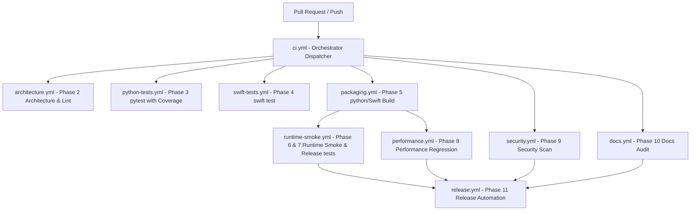

# Pipeline Architecture

This document describes the modular CI/CD pipeline architecture for the oMLX platform.

## Architecture Diagram

## Layer Layout & Reusability
The orchestrator `ci.yml` contains zero build logic and serves strictly as a dispatcher. Individual validation gates are split into dedicated, reusable workflows located under `.github/workflows/`. Common initialization steps (Python, Swift/Xcode, Dependency Caching) are extracted into composite GitHub Actions in `.github/actions/`.

## Caching Strategy
Caching is configured with lockfile hashes to guarantee consistency and avoid stale cache issues:
- **uv/pip dependencies**: Keyed by `hashFiles('pyproject.toml', 'uv.lock')`.
- **SwiftPM dependencies**: Keyed by `hashFiles('apps/omlx-mac/Package.resolved')`.
- **venvstacks layers**: Keyed by `hashFiles('pyproject.toml', 'uv.lock', 'packaging/venvstacks.toml')`.
- **Xcode DerivedData**: Keyed by build SHA.
