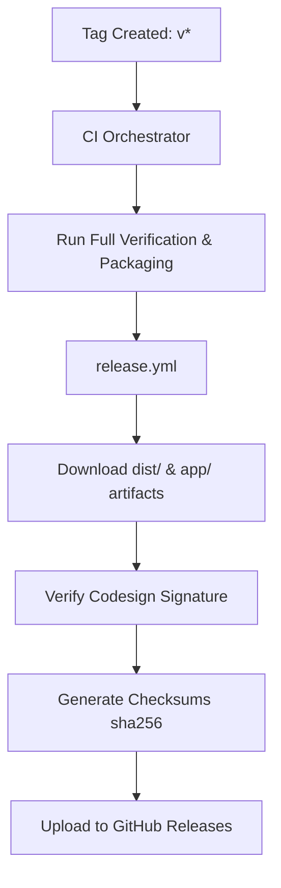

# Release Pipeline

This document outlines the tag and release delivery system for the oMLX platform.

## Orchestration Flow



## Compilation Reusability
The release workflow does not compile Python wheels or build the SwiftUI `.app` bundle from scratch. Instead, it downloads the validated sdist, wheel, and zipped `One.app` artifacts produced by the upstream `packaging` job. This prevents compilation drift and guarantees that the exact binaries validated during CI are published.

## Signature Validation
During the `release` job, the zipped `One.app` is extracted, and its ad-hoc signature is audited using:
```bash
codesign --verify --verbose One.app
```
This ensures that the app bundle signature is valid before publishing.

## Checksum Verification
The SHA256 checksums of the python sdist, wheel, and zipped `One.app` are computed and uploaded as `checksums.txt` alongside the release assets to verify download integrity.
