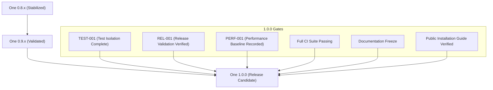

# Project Status & Release Roadmap

This document serves as the master status board and roadmap for the **One** platform, tracking milestone maturity, validation evidence, and release gates.

---

## 1. Project Maturity Matrix

| Milestone | Status | Description | Evidence / Reference |
| :--- | :--- | :--- | :--- |
| **GUI-001** | ✅ Complete | Basic window and navigation setup | [Source Tree](file:///Users/yugeshk/dev/repo/omlx/apps/omlx-mac/) |
| **GUI-002** | ✅ Complete | Component freeze and theme alignment | [`GUI_002_API_FREEZE.md`](file:///Users/yugeshk/dev/repo/omlx/GUI_002_API_FREEZE.md) |
| **GUI-008** | ✅ Complete | Settings editor & panel configurations | [AppView/Screens](file:///Users/yugeshk/dev/repo/omlx/apps/omlx-mac/Sources/AppView/Screens/) |
| **APPLE-001** | ✅ Complete | Apple Silicon core execution engine | [Engine Pool Code](file:///Users/yugeshk/dev/repo/omlx/omlx/engine_pool.py) |
| **APPLE-006** | ✅ Complete | KV Cache allocators & block management | [Scheduler Code](file:///Users/yugeshk/dev/repo/omlx/omlx/scheduler.py) |
| **RUN-004** | ✅ Complete | FastAPI backend bootstrap & routes | [Server Code](file:///Users/yugeshk/dev/repo/omlx/omlx/server.py) |
| **RUN-005** | ✅ Complete | Packaging, launch configurations & cli | [Packaging README](file:///Users/yugeshk/dev/repo/omlx/packaging/README.md) |
| **RUN-005B** | ✅ Complete | App rename migration & release stabilization | [Stabilization Report](file:///Users/yugeshk/.gemini/antigravity/brain/684f32c9-252b-477d-bdab-7e75b87ef4db/walkthrough.md) |
| **TEST-001** | 🟡 Planned | Test isolation & state leakage remediation | [`TEST_001_Test_Isolation.md`](file:///Users/yugeshk/dev/repo/omlx/TEST_001_Test_Isolation.md) |
| **REL-001** | 🟡 Planned | Install, upgrade, recovery & auto-updates | [`REL_001_Release_Validation.md`](file:///Users/yugeshk/dev/repo/omlx/REL_001_Release_Validation.md) |
| **PERF-001** | 🟡 Planned | Performance metrics & regression baseline | [`PERF_001_Performance_Baseline.md`](file:///Users/yugeshk/dev/repo/omlx/PERF_001_Performance_Baseline.md) |

---

## 2. Semantic Versioning & Release Gates

All version increments must respect the following release gates:

### Release Criteria Checklist for v1.0.0
- [ ] **TEST-001 Complete**: 100% deterministic test execution under `pytest-xdist` and randomized execution runs.
- [ ] **REL-001 Complete**: Clean machine install, upgrading, uninstalling, auto-updates, and config recovery fully certified.
- [ ] **PERF-001 Baseline Recorded**: Startup times, Metal memory peaks, TTFT, and bundle sizes logged.
- [ ] **Full CI Passing**: All PR verification builds execute and succeed in GitHub Actions/local runner environments.
- [ ] **Documentation Freeze**: User manual, settings documentation, and developer guides finalized.
- [ ] **Public Installation Guide Verified**: Fresh installs via verified package managers (e.g. Homebrew formula) run without exceptions.

---

## 3. Next Steps & Priorities

1. **TEST-001 — Test Isolation (Priority 1)**: Eliminate global mock pollution and module state mutations. Resolving this technical debt ensures deterministic checkouts and prevents regressions.
2. **REL-001 — Release Validation (Priority 2)**: Validate robust end-to-end upgrade migrations, downgrade recovery, auto-updates, and low disk/memory scenarios.
3. **PERF-001 — Performance Regression Baseline (Priority 3)**: Establish baseline records for engine memory usage, generation throughput, and bundle sizes.
4. **1.0 Release Candidate (Priority 4)**: Package and certify the first production-ready `1.0.0` installer bundle after all release criteria checklist items are met.
