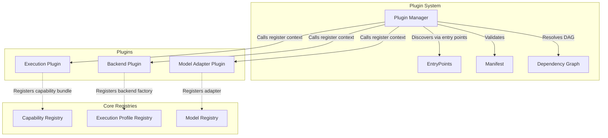
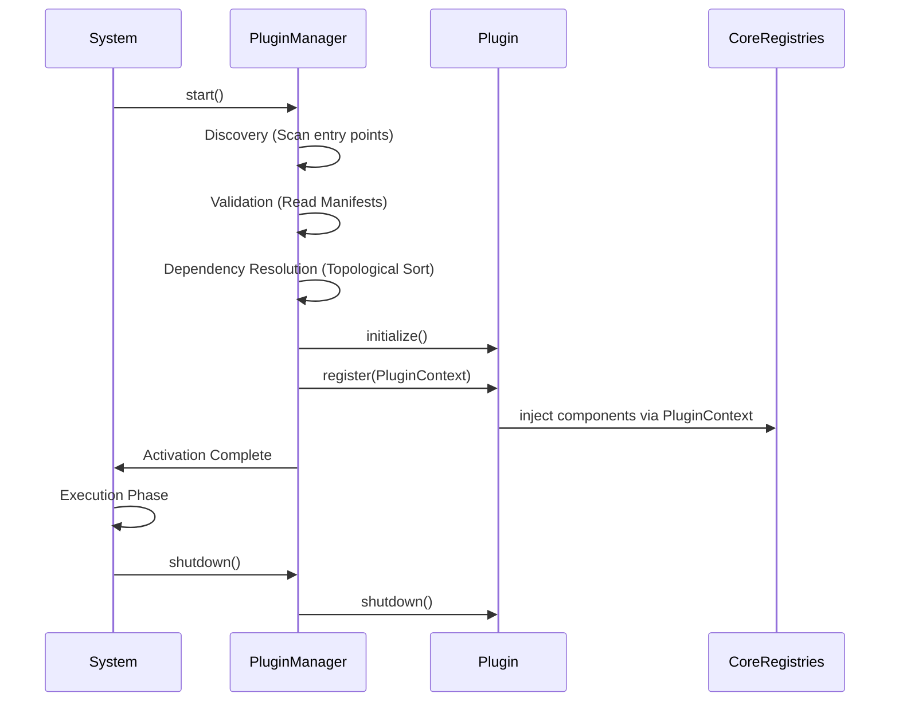
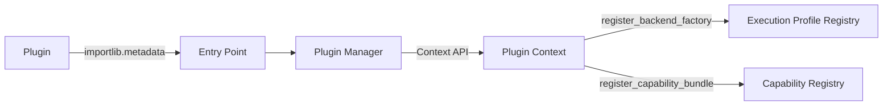
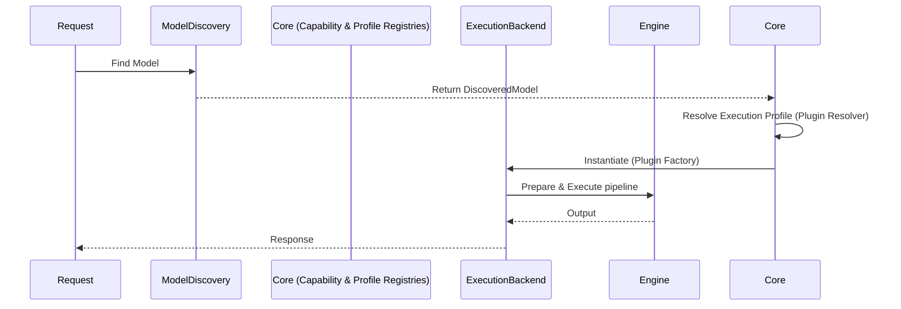
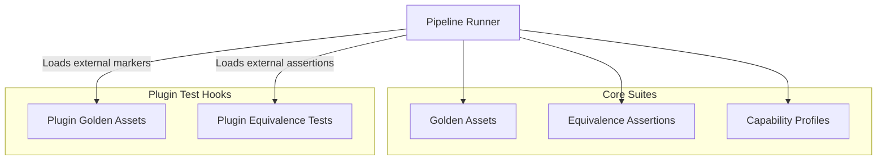
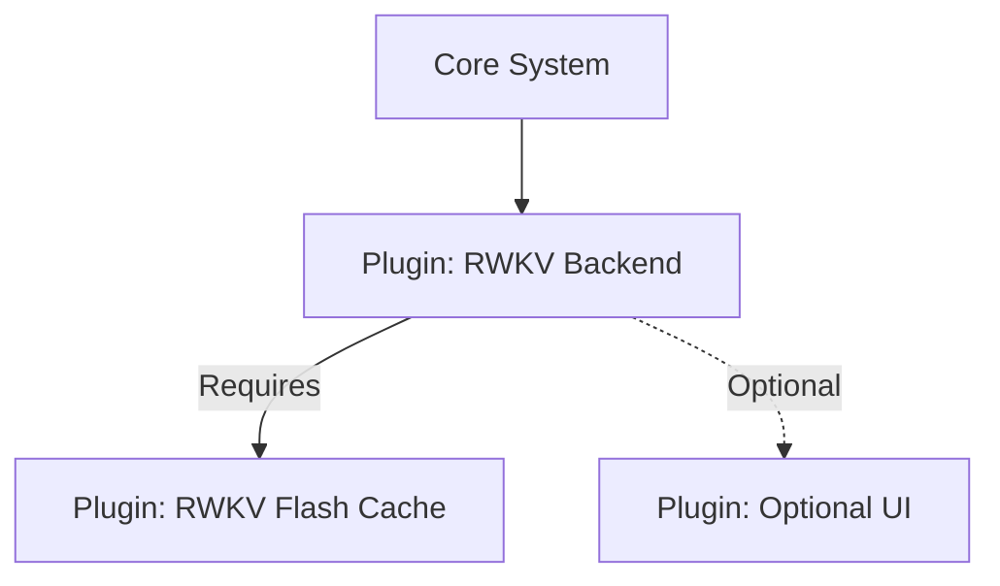

# RAES-010: Plugin & Extension Architecture

## Context

oMLX is evolving into a capability-driven execution framework with various components including Schedulers, GenerationStrategies, ExecutionBackends, ExecutionPipelines, ExecutionEngines, Capability Registries, Execution Profiles, Model Adapters, and a Verification Framework.

The next architectural milestone is to define a Plugin & Extension Architecture. The goal is to enable third-party developers to extend oMLX using plugins without modifying the core runtime, ensuring a modular and sustainable ecosystem.

---

## 1. Repository Audit

An audit of the current oMLX repository reveals several existing and potential extension points:

### Existing Registries and Extension Points
- **Capability Registry** (`omlx/registry/capability_registry.py`): Registers GenerationModes and CapabilityBundles.
- **Execution Profile Registry** (`omlx/inference/execution_profile.py`): Maps `ExecutionContext` to an `ExecutionProfile` and `BackendFactory`.
- **Model Registry** (`omlx/model_registry.py`): Tracks model ownership by engines.
- **Cache Type Registry** (`omlx/cache/type_registry.py`): Registers cache type handlers.
- **Plugin Discovery** (`omlx/registry/plugin_discovery.py`): Currently uses `importlib.metadata.entry_points()` for `omlx.strategies`.
- **Model Adapters** (`omlx/api/adapters/*` and `omlx/adapter/*`): Handlers for OpenAI, Anthropic, Gemma4, Harmony formats.
- **Backends** (`omlx/inference/backends/*`): E.g., Autoregressive, Experimental Diffusion.
- **Verification Pipeline** (`verification/scripts/pipeline_runner.py`): Stages for golden assets, equivalence, capability profiles, and performance.

### Potential Extension Points (Currently Hardcoded or Partially Extensible)
- **Model Discovery** (`omlx/model_discovery.py`): Hardcoded heuristics for detecting model types (VLM, TTS, STT, Embedding, Reranker).
- **Scheduler**: Instantiation and policies are generally static.
- **API Endpoints & CLI**: Need formal registration mechanisms.
- **Monkey Patches** (`omlx/patches/*`): Heavy usage of patches (DeepSeek, Minimax, Qwen VLM, GLM MoE) which ideally should be plugins overriding or providing new capabilities.
- **Optimizations**: Custom Metal kernels and optimizations currently live in `omlx/optimizations.py` or patches.

---

## 2. Plugin Architecture Goals & Categories

The architecture must allow external plugins to provide new functionality without modifying oMLX core.

### Plugin Taxonomy
Based on the audit, plugins fall into the following categories:

1. **Execution Plugin (Strategy)**: Provides new `GenerationStrategy` implementations (e.g., Mamba, RWKV).
2. **Backend Plugin**: Provides new `ExecutionBackend` and `ExecutionPipeline` implementations.
3. **Model Adapter Plugin**: Handles input/output translation for specific model families (e.g., specific chat templates or tool formats).
4. **Capability Plugin**: Registers new `GenerationMode` and `AttentionMode` types.
5. **Execution Profile Plugin**: Registers new logic (`BackendFactory` or resolvers) to map capabilities to backends.
6. **Cache Plugin**: Registers new cache structures (e.g., new `PagedCache` variants).
7. **Model Discovery Plugin**: Custom providers to identify and categorize models (useful for proprietary formats).
8. **Verification Plugin**: Adds custom stages, assets, or assertions to the verification pipeline.
9. **Optimization/Hardware Plugin**: Injects custom Metal kernels or compilation passes.
10. **CLI Plugin**: Registers new `click` or `argparse` commands.
11. **Server/API Plugin**: Registers new FastAPI routers/endpoints.

---

## 3. Plugin Manifest Specification

Every plugin must provide a metadata manifest (e.g., `plugin.toml` or returned via entry point metadata) to ensure safe loading and dependency resolution.

### Required Fields
- **`plugin_id`**: Unique identifier (e.g., `com.example.omlx.rwkv_backend`).
- **`version`**: Semantic versioning (e.g., `1.0.0`).
- **`author`**: Contact information or organization.
- **`description`**: Brief summary.
- **`omlx_version_req`**: Supported oMLX versions (e.g., `>=0.5.0`).

### Capability & Registration Fields
- **`provides`**: List of categories this plugin registers (e.g., `["backend", "strategy"]`).
- **`supported_capabilities`**: Execution capabilities supported.

### Dependency Fields
- **`dependencies`**: Required plugins (e.g., `{"com.example.omlx.custom_cache": ">=1.0.0"}`).
- **`optional_dependencies`**: Optional plugins for enhanced functionality.
- **`hardware_requirements`**: E.g., minimum memory, specific Apple Silicon features.

### Advanced Fields
- **`priority`**: Integer for resolution ordering (higher overrides lower).
- **`feature_flags`**: Required feature flags to activate the plugin.
- **`verification_requirements`**: Tags indicating what test suites must pass for this plugin.

---

## 4. Registration System

Plugins must register their components without introducing runtime branching in the core. The system will rely on an Event/Hook Architecture and Entry Points.

- **Entry Points**: Use Python's `importlib.metadata` (currently used in `plugin_discovery.py`) under namespaces like `omlx.plugins`.
- **Plugin Manager Interface**: The core provides a `PluginContext` to the plugin's `register(context)` function.
  - `context.register_capability_bundle(bundle)`
  - `context.register_backend_factory(name, factory)`
  - `context.register_profile_resolver(resolver)`
  - `context.register_model_discovery_provider(provider)`
  - `context.register_api_route(router)`

Runtime branching is avoided because the core iterates over registered interfaces (e.g., iterating through profile resolvers until one returns a valid profile) rather than checking for specific hardcoded plugins.

---

## 5. Plugin Lifecycle

1. **Discovery**: `PluginManager` scans `importlib.metadata` for entry points.
2. **Validation**: Reads the Plugin Manifest. Validates `omlx_version_req` and `hardware_requirements`. Rejects incompatible plugins.
3. **Dependency Resolution**: Builds a DAG of plugins. Detects circular dependencies or missing requirements. Orders plugins by dependency and `priority`.
4. **Initialization**: Calls the plugin's `initialize()` hook.
5. **Registration**: Calls the plugin's `register(context)` hook. Plugins populate core registries (Capability, Profile, Backends, etc.).
6. **Activation**: Core finalizes the registries. Plugins are now "Active".
7. **Execution**: Standard runtime flow; core utilizes the injected components via interfaces.
8. **Shutdown**: Core signals shutdown. Calls plugin `shutdown()` hooks.
9. **Cleanup**: Plugins release file handles, custom Metal memory, or cache structures.

---

## 6. Dependency Resolution

- **Resolution Engine**: Uses a topological sort on the plugin DAG.
- **Conflict Detection**: If Plugin A requires Plugin B v1.0 and Plugin C requires Plugin B v2.0, the `PluginManager` halts loading and logs a fatal error.
- **Priority Ordering**: When multiple plugins provide the same capability (e.g., a default profile resolver vs a custom one), the one with the higher `priority` manifest field is executed first.
- **Optional Dependencies**: If missing, they are ignored; if present, they influence the topological sort.
- **Lazy Loading**: While components are registered at startup, actual heavy imports (like custom Metal kernels) can be deferred until the factory/resolver is actually invoked.

---

## 7. Runtime Interaction

The runtime remains entirely generic, interacting only with protocol abstractions.

1. **Model Discovery**: Iterates through registered discovery providers. If a plugin recognizes a proprietary model structure, it returns a `DiscoveredModel`.
2. **Capability Registry**: Maps the model to required execution capabilities (e.g., identifying a model needs a plugin-provided `GenerationMode.RWKV`).
3. **Execution Profile Registry**: Evaluates the `ExecutionContext` against all registered resolvers (sorted by priority). The plugin resolver returns an `ExecutionProfile` specifying the plugin's backend.
4. **Execution Backend / Engine**: The core requests the backend from the factory. The plugin instantiates its custom `ExecutionBackend` and `ExecutionPipeline`.
5. **Execution**: The Scheduler (remaining dumb) handles batching. The plugin's pipeline executes the forward pass.
6. **Server**: API endpoints (registered via plugin) handle specific incoming formats.

---

## 8. Verification Integration

Verification should not require core framework changes for new plugins.
- **Test Discovery**: The `PipelineRunner` uses Pytest. Plugins can register custom Pytest markers or drop test scripts into a defined `tests/plugins/` directory.
- **Golden Assets**: Plugins define their own golden asset paths in their manifest for the `test_golden_assets.py` to ingest.
- **Equivalence**: Plugins providing custom backends must provide a HF reference model identifier and inputs to the `test_equivalence_runner.py`.

---

## 9. Security

- **Trust Boundaries**: Plugins run in the same process space. Strict isolation is not feasible in standard Python without heavy IPC overhead.
- **Permissions**: (Future) Manifest can declare requested permissions (e.g., network access).
- **Signature Verification**: Production deployments can verify signed wheel packages of plugins to prevent malicious tampering.
- **Sandboxing**: For Phase 1, no sandboxing. Plugins are assumed to be trusted modules installed by the user/admin.

---

## 10. Repository Changes

### NEW Files
- `omlx/plugins/manager.py`: Implements discovery, validation, and lifecycle.
- `omlx/plugins/manifest.py`: Defines the manifest schema (Pydantic/Dataclass).
- `omlx/plugins/context.py`: The context object passed to plugins for registration.
- `omlx/plugins/exceptions.py`: Exceptions for dependency conflicts, invalid manifests.

### MODIFIED Files
- `omlx/registry/plugin_discovery.py`: Deprecate/Merge into `manager.py`.
- `omlx/registry/capability_registry.py`: Expose safe registration methods.
- `omlx/inference/execution_profile.py`: Ensure `ExecutionProfileRegistry` can accept new resolvers safely.
- `omlx/model_discovery.py`: Add a hook/list of discovery providers instead of hardcoded `if model_type == "vlm"`.
- `omlx/api/main.py` (or equivalent server entry): Add hooks to register plugin routers.
- `verification/scripts/pipeline_runner.py`: Add a step to execute plugin-provided verification suites.

### UNTOUCHED Files (Must remain generic)
- `omlx/scheduler.py`
- `omlx/inference/execution_engine.py`

---

## 11. Risk Analysis

- **Dependency Hell**: Version conflicts between multiple third-party plugins. *Mitigation*: Strict semantic version checking during Validation phase.
- **API Stability**: Plugins depend on core interfaces (`ExecutionBackend`, `GenerationStrategy`). Changes to these will break plugins. *Mitigation*: Use Python `Protocol`s and deprecation cycles.
- **Startup Performance**: Scanning entry points and resolving DAGs can slow startup. *Mitigation*: Caching the resolution graph.
- **Monkey Patch Conflicts**: If two plugins attempt to monkey-patch `mlx_lm`, unpredictable behavior occurs. *Mitigation*: Discourage patching; enforce capability injection instead.

---

## 12. Verification Plan (For the Plugin System itself)

1. **Discovery & Manifest**: Create a mock plugin with a valid manifest and test if it is discovered. Create one with an invalid manifest to test rejection.
2. **Dependency Resolution**: Construct mock plugins with circular dependencies and verify the system catches the error.
3. **Registration**: Verify that a mock plugin can successfully register a dummy Profile Resolver and that the core uses it.
4. **Lifecycle**: Log messages at every lifecycle stage of a mock plugin and assert the order is strictly: Init -> Register -> Activate -> Shutdown.

---

## 13. Rollback Strategy

1. Maintain the current `importlib.metadata` entry point implementation in `plugin_discovery.py` as a fallback.
2. Develop the new `omlx/plugins/*` module alongside the existing code.
3. Introduce a feature flag `ENABLE_NEW_PLUGIN_ARCH=True`. If issues arise, toggle the flag to revert to the old hardcoded discovery paths.

---

## 14. Implementation Recommendation

1. **Checkpoint 1**: Define the `PluginManifest` and `PluginContext` data structures.
2. **Checkpoint 2**: Implement the `PluginManager` DAG resolution and lifecycle hooks.
3. **Checkpoint 3**: Refactor `ModelDiscovery` and `ExecutionProfileRegistry` to explicitly accept registrations from the `PluginManager`.
4. **Checkpoint 4**: Migrate an existing "hardcoded" feature (e.g., Experimental Diffusion) into an in-tree plugin to validate the architecture.

## 15. Diagrams

### Plugin Architecture

### Plugin Loading Lifecycle

### Registration Flow

### Runtime Interaction

### Verification Interaction

### Dependency Graph Example

