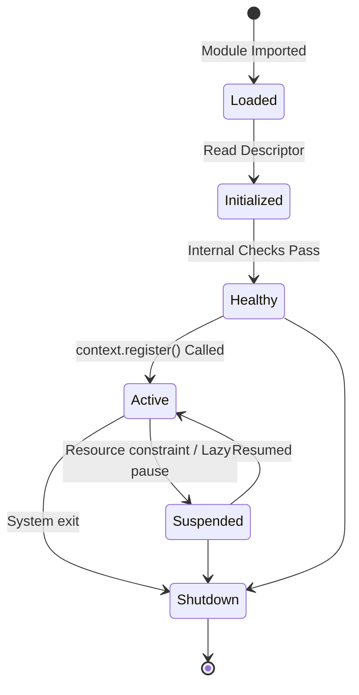
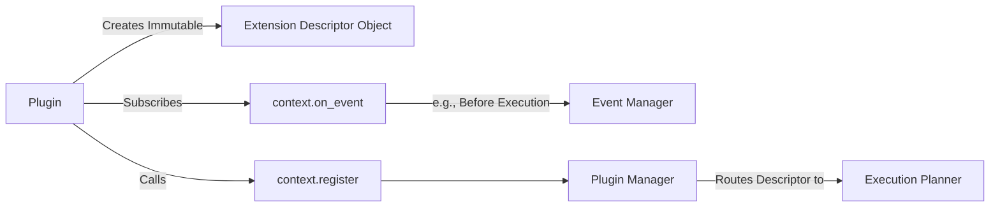
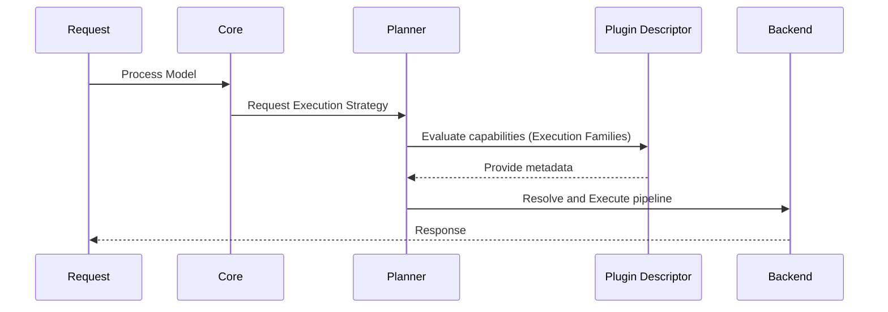
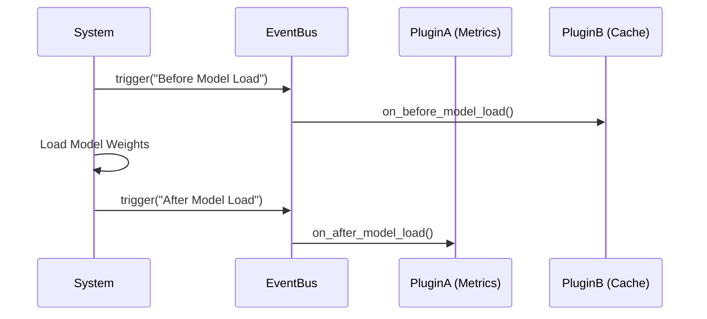

# RAES-010: Plugin & Extension Architecture

## Context

oMLX is evolving into a capability-driven execution framework with various components including Schedulers, GenerationStrategies, ExecutionBackends, ExecutionPipelines, ExecutionEngines, Capability Registries, Execution Profiles, Model Adapters, and a Verification Framework.

The next architectural milestone is to define a Plugin & Extension Architecture. The goal is to enable third-party developers to extend oMLX using plugins without modifying the core runtime, ensuring a modular and sustainable ecosystem.

---

## 1. Repository Audit

An audit of the current oMLX repository reveals several existing and potential extension points:

### Existing Registries and Extension Points
- **Capability Registry** (`omlx/registry/capability_registry.py`): Registers GenerationModes and CapabilityBundles.
- **Execution Profile Registry** (`omlx/inference/execution_profile.py`): Maps `ExecutionContext` to an `ExecutionProfile` and `BackendFactory`.
- **Model Registry** (`omlx/model_registry.py`): Tracks model ownership by engines.
- **Cache Type Registry** (`omlx/cache/type_registry.py`): Registers cache type handlers.
- **Plugin Discovery** (`omlx/registry/plugin_discovery.py`): Currently uses `importlib.metadata.entry_points()` for `omlx.strategies`.
- **Model Adapters** (`omlx/api/adapters/*` and `omlx/adapter/*`): Handlers for OpenAI, Anthropic, Gemma4, Harmony formats.
- **Backends** (`omlx/inference/backends/*`): E.g., Autoregressive, Experimental Diffusion.
- **Verification Pipeline** (`verification/scripts/pipeline_runner.py`): Stages for golden assets, equivalence, capability profiles, and performance.

### Potential Extension Points (Currently Hardcoded or Partially Extensible)
- **Model Discovery** (`omlx/model_discovery.py`): Hardcoded heuristics for detecting model types (VLM, TTS, STT, Embedding, Reranker).
- **Scheduler**: Instantiation and policies are generally static.
- **API Endpoints & CLI**: Need formal registration mechanisms.
- **Monkey Patches** (`omlx/patches/*`): Heavy usage of patches (DeepSeek, Minimax, Qwen VLM, GLM MoE) which ideally should be plugins overriding or providing new capabilities.
- **Optimizations**: Custom Metal kernels and optimizations currently live in `omlx/optimizations.py` or patches.

---

## 2. Plugin Architecture Goals & Categories

The architecture must allow external plugins to provide new functionality without modifying oMLX core.

**Crucially, the `PluginManager` must NOT know about specific plugin types.** It should not branch logic based on whether a plugin is a "Backend Plugin" or a "Model Adapter Plugin". Everything is simply a generic "Plugin" that registers components into specific Extension Points.

### Contributing Descriptors, not Implementations
Plugins should not directly provide implementation objects (e.g., `Plugin -> ExecutionBackend`). Instead, they contribute **Metadata Descriptors**.
The execution chain is abstract:
`Plugin -> Descriptor -> ExecutionPlanner -> Resolver -> ExecutionBackend`

The ExecutionPlanner remains fully in control of the runtime strategy, with the Plugin merely providing the declarative instructions (Descriptors) on how to handle specific capabilities.

### Plugin Taxonomy (Via Extension Points)
Instead of rigidly typed plugins, plugins register objects against stable Extension Points. **Once registered, Extension objects are immutable.** This guarantees deterministic registration and behavior throughout the plugin's lifecycle. Examples include:

- **ExecutionBackendExtension**: Declaratively specifies new `ExecutionBackend` mappings.
- **ModelDiscoveryExtension**: Declarative rules or providers to identify and categorize models.
- **VerificationExtension**: Declares custom stages, assets, or assertions to the verification pipeline.
- **APIExtension**: Declaratively registers new FastAPI routers/endpoints.
- **CLIExtension**: Declaratively registers new CLI commands.

---

## 3. Plugin Descriptors & Version Capabilities

Every plugin must expose a **Plugin Descriptor** (e.g., via a standard `get_descriptor()` entry point or declarative manifest).

### Descriptor Fields
- **`plugin_id`**: Unique identifier (e.g., `com.example.omlx.rwkv_backend`).
- **`dependencies`**: Required plugins (e.g., `{"com.example.omlx.custom_cache": ">=1.0.0"}`).
- **`feature_flags`**: Required feature flags to activate the plugin.
- **`verification_metadata`**: Tags indicating what test suites must pass.

### Version Capabilities (Finer-Grained than API versions)
Instead of a single `API Version`, plugins declare versions against specific granular capabilities:
- `Capability Version`: Which capability traits the plugin understands.
- `Execution Graph Version`: Which version of the execution graph specification it targets.
- `Planner Version`: Which planner iteration the plugin's descriptors map to.
- `Descriptor Version`: The schema version of the plugin's own descriptor format.

### Execution Families
Instead of specific boolean flags like `supports_diffusion=True`, plugins declare the **Execution Families** they support (aligning with RAES-008):
- `AUTOREGRESSIVE`
- `DIFFUSION`
- `TRIAGE`
- `STREAMING_MOE`
- `EMBEDDING`
- `VISION`
- `AUDIO`

---

## 4. Registration & Event System

Plugins must register their components without introducing runtime branching in the core. The system relies on an **Event/Hook Architecture** and abstract Extension Points.

### Event System
To prevent plugins from monkey-patching core lifecycle methods, the `PluginContext` exposes an explicit Event System. Plugins can subscribe to granular system events:
- `Before Model Load`
- `After Model Load`
- `Before Execution`
- `After Execution`
- `Before Verification`
- `Shutdown`

### Registration
- **Plugin Manager Interface**: The `PluginContext` abstracts away all registry internals. Plugins do NOT interact directly with `capability_registry` or `profile_registry`.
- The interface exposes a unified registration method:
  - `context.register(ExecutionBackendExtension(...))`
  - `context.register(ModelDiscoveryExtension(...))`

Runtime branching is avoided because the core simply iterates over registered immutable Extension Point objects.

---

## 5. Plugin Lifecycle

The plugin lifecycle includes state tracking and health monitoring.

1. **Loaded**: The plugin module is located and imported via entry points.
2. **Initialized**: Early startup logic and descriptor validation.
3. **Healthy**: The plugin passes internal health checks (e.g., verifies Metal compatibility).
4. **Active**: The plugin registers its Extension Points into the `PluginContext`.
5. **Suspended**: The plugin is temporarily paused (e.g., memory constraints).
6. **Shutdown**: The plugin cleans up resources before exit.

### Lazy Activation
Plugins should support **optional lazy activation**.
For example, a `Diffusion Plugin` does not initialize heavy Metal kernels at startup. Instead, it waits until the first diffusion model is loaded, triggering an `Activate` hook via the Event System (`Before Model Load`).

---

## 6. Dependency Resolution

- **Resolution Engine**: Uses a topological sort on the plugin DAG based on descriptors.
- **Conflict Detection**: If Plugin A requires Plugin B v1.0 and Plugin C requires Plugin B v2.0, the `PluginManager` halts loading and logs a fatal error.
- **Priority Ordering**: Handled implicitly through DAG dependencies.
- **Optional Dependencies**: If missing, they are ignored; if present, they influence the topological sort.

---

## 7. Runtime Interaction

The runtime remains entirely generic, interacting only with protocol abstractions.

1. **Model Discovery**: Iterates through registered `ModelDiscoveryExtension` objects.
2. **Capability Registry**: Maps the model to required Execution Families.
3. **Execution Backend / Engine**: The core queries the ExecutionPlanner, which maps the generic capabilities (via registered Plugin Descriptors) to resolve the `ExecutionBackend`.
4. **Execution**: The Scheduler (remaining dumb) handles batching. The plugin's pipeline executes the forward pass.

---

## 8. Verification Integration

Verification should not require core framework changes for new plugins.
- **VerificationExtension**: Plugins register specific golden asset paths or equivalence test overrides via this extension point.

---

## 9. Security

- **Trust Boundaries**: Plugins run in the same process space. Strict isolation is not feasible in standard Python without heavy IPC overhead.
- **Signature Verification**: Production deployments can verify signed wheel packages of plugins to prevent malicious tampering.

---

## 10. Repository Changes

### NEW Files
- `omlx/plugins/manager.py`: Implements generic discovery, lifecycle (Loaded -> Shutdown), and dependency resolution.
- `omlx/plugins/descriptor.py`: Defines the Plugin Descriptor schema and Version Capabilities.
- `omlx/plugins/context.py`: The `PluginContext` providing the generic `register()` method and Event pub/sub.
- `omlx/plugins/extensions.py`: Defines the stable, immutable ABIs for `ExecutionBackendExtension`, `ModelDiscoveryExtension`, etc.

### MODIFIED Files
- `omlx/registry/plugin_discovery.py`: Deprecate/Merge into `manager.py`.
- `omlx/registry/capability_registry.py` & `omlx/inference/execution_profile.py`: Refactor to consume generic Extension objects rather than exposing themselves.

### UNTOUCHED Files (Must remain generic)
- `omlx/scheduler.py`
- `omlx/inference/execution_engine.py`

---

## 11. Risk Analysis
- **Dependency Hell**: Version conflicts between multiple third-party plugins.
- **API Stability**: Plugins depend on core Extension ABIs. Changes here break plugins.
- **Monkey Patch Conflicts**: If two plugins attempt to monkey-patch `mlx_lm`, unpredictable behavior occurs. (Mitigated by the explicit Event System).

---

## 12. Verification Plan (For the Plugin System itself)

1. **Discovery & Descriptor**: Create a mock plugin with a valid descriptor and verify it transitions to the `Loaded` state.
2. **Dependency Resolution**: Construct mock plugins with circular dependencies and verify the system catches the error.
3. **Registration Flow**: Verify a plugin can call `context.register(DummyExtension())` without knowing about the underlying registry. Ensure the Extension object is immutable after registration.
4. **Lifecycle & Events**: Assert the full transition: Loaded -> Initialized -> Healthy -> Active -> Suspended -> Shutdown. Validate that subscribing to `Before Model Load` successfully triggers execution logic.

---

## 13. Rollback Strategy
1. Introduce a feature flag `ENABLE_NEW_PLUGIN_ARCH=True`. If issues arise, toggle the flag to revert to the old hardcoded discovery paths.

---

## 14. Implementation Recommendation
1. Define the `PluginDescriptor`, `PluginContext` (with Event bus), and immutable `Extension` base classes.
2. Implement the `PluginManager` generic lifecycle and DAG resolution.
3. Migrate an existing feature (e.g., Experimental Diffusion) into an Extension descriptor object.

---

## 15. Diagrams

### Plugin Architecture
```mermaid
graph TD
    subgraph Plugin System
        PM[Plugin Manager]
        PM --> |Discovers| EP[Entry Points]
        PM --> |Reads| PD[Plugin Descriptors]
        PM --> |Resolves DAG| DAG[Dependency Graph]
    end

    subgraph Core
        C[Plugin Context]
        R1[Internal Registries...]
        Planner[Execution Planner]
        C --> |Abstracts| R1
    end

    subgraph Plugins
        P1[Plugin A]
        P2[Plugin B]
    end

    subgraph Extension Points
        EBE[ExecutionBackendExtension <br/> (Immutable)]
        MDE[ModelDiscoveryExtension <br/> (Immutable)]
        VE[VerificationExtension <br/> (Immutable)]
    end

    PM --> |Initializes| P1
    PM --> |Initializes| P2

    P1 -.-> |Instantiates| EBE
    P1 -.-> |Calls context.register| C

    P2 -.-> |Instantiates| MDE
    P2 -.-> |Calls context.register| C

    C --> |Provides Descriptors| Planner
```

### Plugin Loading Lifecycle


### Registration Flow & Event Subscription


### Runtime Interaction


### Event System Example

