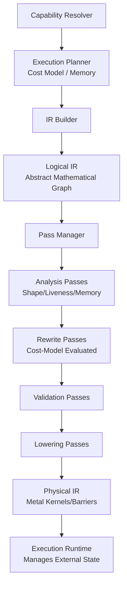
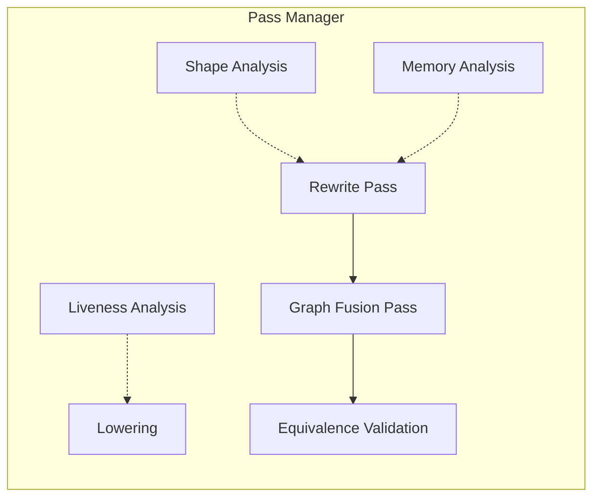
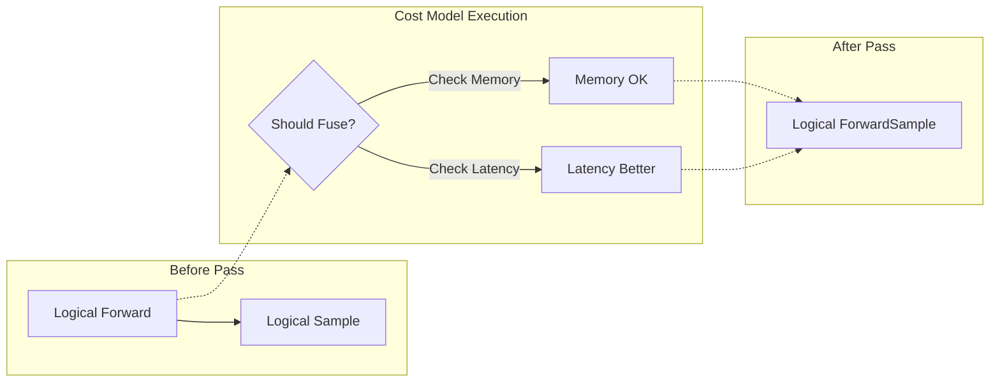
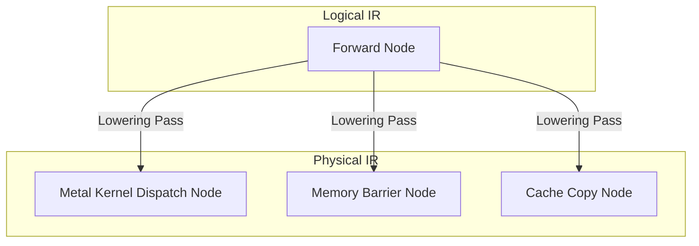
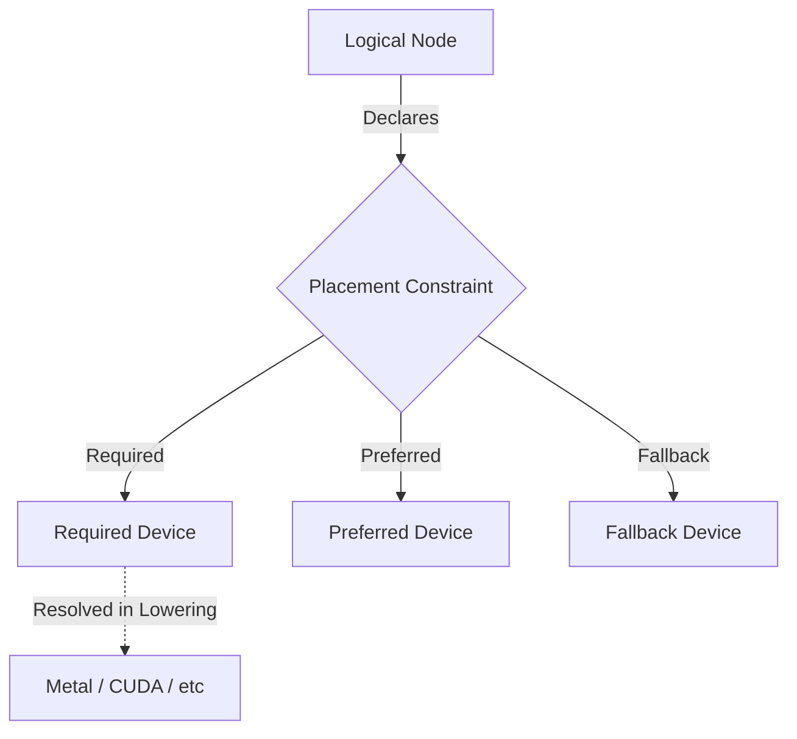

# RAES-011: Execution IR & Runtime Optimizer Architecture

## Objective
Perform a complete repository audit and design an Intermediate Representation (IR) execution architecture that allows runtime execution to be modeled exactly like a compiler (e.g., LLVM/MLIR). Execution will move through a continuous pipeline: Capability Resolver → Execution Planner → Logical IR → Optimization & Lowering Pipeline → Physical IR → Execution Runtime. The architecture must support future optimization passes, graph rewriting, and node immutability without changing Scheduler logic.

---

## 1. Repository Audit

A full repository audit locates the following execution boundaries and logic points:

*   **Execution Stages:** Found in `omlx/inference/execution_backend.py`. E.g., `PrefillStage`, `ForwardStage`, `ExtractCacheStage`. These currently map to a linear pipeline sequence.
*   **Backend Execution Flow:** Managed via `ExecutionBackend` wrappers (e.g., `AutoregressiveBackend`, `ExperimentalNemotronBackend`) that execute `ExecutionPipeline` instances state by state.
*   **Pipeline Stages:** Outlined via `PipelineState` enum: `INITIALIZED`, `PREPARED`, `RUNNING`, `SYNCING`, `FINALIZED`, `CLEANED`.
*   **Scheduler Transitions:** Found in `omlx/scheduler.py` managing state queues: Waiting → Prefilling → Running (via MLX-LM `BatchGenerator`) → Finished.
*   **Synchronization Points:** `mx.eval()` called explicitly in `omlx/inference/strategy.py` and `_sync_and_clear_cache()`, `_safe_sync_stream()` in `scheduler.py` before batch boundaries.
*   **Cache Extraction:** Managed via `store_cache()` asynchronously, and `_extract_cache_states` dict.
*   **Cache Evaluation:** Managed by `block_aware_cache` checks and policy evaluation in `omlx/inference/cache_policy.py`.
*   **Forward Execution:** Executed inside `TransformerExecutionEngine` and `NemotronExecutionEngine`, calling the MLX model or generator directly.
*   **Sampling:** Handled via `make_sampler_interface` utilizing `SamplerParams` located in `omlx/inference/sampler_interface.py` and `omlx_make_sampler`.
*   **Detokenization:** Token detokenization exists implicitly in `PostprocessStage` handling outputs.
*   **Speculative Execution:** Outlined in `omlx/inference/strategies/linear_speculation.py` via `build_linear_speculation_graph()`.
*   **Diffusion Execution:** Defined in `omlx/inference/strategies/diffusion.py` and backend `experimental_diffusion_backend.py`.
*   **VLM Execution:** Specific logic for embedding vision inputs (`request.vlm_inputs_embeds`, `rope_deltas`) exists in `scheduler.py` and `engine/vlm.py`.
*   **MoE Routing:** Evidence of custom Metal kernels for MoE DSA routing exist in `omlx/custom_kernels/glm_moe_dsa/csrc/mlx/backend`.
*   **Verification Checkpoints:** Found context clues for `omlx/eval/` directory and Golden asset comparisons that can hook into graph state outputs.

---

## 2. Current Execution Mapping

The current execution architecture acts as a strictly layered, linear abstraction:

```
Scheduler
   ↓  (Calls step(), manages queues)
GenerationStrategy
   ↓  (Autoregressive, Diffusion, LinearSpeculation)
ExecutionBackend
   ↓  (AutoregressiveRuntime mapping abstract states)
ExecutionPipeline
   ↓  (Iterates list[ExecutionStage] sequentially)
ExecutionEngine
   ↓  (TransformerExecutionEngine wrappers)
BatchGenerator / Runtime
   ↓  (mlx-lm next_generated(), mx.eval())
Response
```

**Comparison against Proposed Execution IR:**
Currently, `ExecutionGraph` (in `omlx/inference/execution_graph.py`) defines a pseudo-graph using `GraphNode` (`next_nodes`), but traversal acts strictly linearly via `linear_order()`. The proposed architecture replaces this with a compiler-like MLIR-style separation of representations.

---

## 3. Logical vs. Physical Execution IR

To support robust hardware acceleration, the IR is split structurally (modeled on MLIR).

**Logical IR:**
Represents operations mathematically/abstractly.
*   `Forward Node`, `Sample Node`, `Denoise Node`, `Emit Node`.

**Physical IR (Lowered IR):**
Represents concrete hardware operations post-lowering.
*   `Metal Kernel Execution`, `Memory Barrier Node`, `Cache Copy Node`, `Stream Sync Node`.

**Immutability Guarantee:**
*   Both Logical and Physical nodes (`ExecutionNode`, `ExecutionEdge`, `ExecutionMetadata`) are strictly immutable.
*   *Runtime state (e.g., active tensors, KV blocks) is tracked externally by the `ExecutionRuntime` during traversal.*

---

## 4. Pass Manager & Optimization Pipeline

Instead of a single optimizer, execution utilizes a `PassManager` to coordinate analysis, lowering, and rewriting across the pipeline, behaving explicitly like LLVM.

**Pass Pipeline:**
1.  **Analysis Passes:** Non-mutating passes that produce metadata.
    *   *Shape Analysis:* Predicts tensor sizes.
    *   *Memory Analysis:* Computes peak RAM pressure.
    *   *Liveness Analysis:* Determines when tensors can be freed.
    *   *Dependency Analysis:* Maps async stream requirements.
2.  **Rewrite Passes (Logical):** Modifies the Logical IR based on analysis and Cost Models.
    *   *Dead Stage Elimination:* Removes cache nodes if hot cache is valid.
    *   *Graph Rewriting:* Transforms `ForwardNode` -> `SampleNode` into fused `ForwardSampleNode`.
3.  **Lowering Passes:** Lowers Logical IR to Physical IR.
    *   Maps `ForwardNode` to specific `Metal Kernel` invocations based on hardware capabilities.
4.  **Validation Passes:** Non-mutating passes ensuring IR correctness.
    *   *Equivalence Check:* Ensures mathematical properties haven't mutated during rewrites.

---

## 5. Execution Planner & Cost Models

The Execution Planner becomes a smarter, multi-dimensional resolver evaluating constraints to produce the optimal Logical IR.

**Cost Model Integration:**
The Planner exposes a `Cost Model` to the Pass Manager. Rewrite passes query the Cost Model rather than blindly executing.
*   *Example:* A `FusionPass` doesn't just fuse; it asks `ShouldFuse(latency, memory, cache_pressure)` based on Cost Model predictions for the current hardware.

**Resolution Chain:**
`Planner → Capabilities → Cost Model → Hardware → Memory → Context Window → Model Family → Logical IR`

---

## 6. Continuous Pipeline

The systems merge into one continuous, compiler-like pipeline:

```
Capability Resolver
        │
        ▼
Execution Planner (Capabilities → Cost Model → Hardware → Memory → Model Family)
        │
        ▼
Logical IR (Abstract mathematical operations)
        │
        ▼
Pass Manager (Analysis → Cost-based Rewrite → Validation)
        │
        ▼
Lowering (Logical IR → Physical IR)
        │
        ▼
Physical IR (Metal kernels, memory barriers)
        │
        ▼
Execution Runtime (Topological traversal managing external state)
```

Because the `Scheduler` only calls `strategy.forward()` or `strategy.insert()`, it remains completely agnostic to this pipeline.

---

## 7. Memory Scheduling Design

*   **Cache Ownership:** KV cache arrays belong to graph outputs, tracked in external runtime state.
*   **Activation Lifetime:** Dictated by the *Liveness Analysis* pass; tensors drop when topological dependents complete.
*   **Garbage Collection Boundaries:** `Memory Nodes` placed via Rewrite passes trigger safe `mx.clear_cache()`.

---

## 8. Hardware Abstraction

Device placement within the IR is abstracted from specific backends (Metal, CUDA, etc.).

Instead of specifying GPU or CPU, nodes specify abstract constraints:
*   `Preferred Device`
*   `Required Device`
*   `Fallback Device`

Metal, CUDA, ROCm, and Neural Engine act strictly as implementation targets that satisfy these constraints during the Lowering Pass to the Physical IR.

---

## 9. Verification Integration

Verification seamlessly plugs into the IR logic via passes.
*   **Integration:** A validation pass injects a `Verify Node` on the output edge of a `Forward Node`.
*   **Equivalence:** Evaluates tensor outputs against Golden HF datasets in `omlx/eval/`.
*   **Cleanliness:** When verification is disabled, the pass does not run, leaving the Physical IR pristine and performant.

---

## 10. Repository Changes

**NEW FILES:**
*   `omlx/inference/execution_ir.py` (Immutable Nodes, Edges, Metadata for Logical/Physical IR).
*   `omlx/inference/ir_passes.py` (PassManager, AnalysisPass, RewritePass, LoweringPass).
*   `omlx/inference/ir_planner.py` (Smart context resolution and Cost Model).
*   `omlx/inference/ir_runtime.py` (Manages external state during Physical IR traversal).

**MODIFIED FILES:**
*   `omlx/inference/execution_graph.py` (To be deprecated/migrated to `execution_ir.py`).
*   `omlx/inference/execution_backend.py` (Refactored to trigger the PassManager).

**UNTOUCHED FILES:**
*   `omlx/scheduler.py` (Zero changes, strict requirement).
*   `omlx/engine_core.py` (Remains coordinator).

---

## 11. Risk Analysis

*   **IR Complexity:** Managing dual IR levels (Logical/Physical) and externalized state requires strict discipline.
*   **Optimization Correctness:** Graph rewriting (e.g., Forward + Sample -> ForwardSample) must preserve exact mathematical equivalence.
*   **Cost Model Accuracy:** If the cost model's predictions (latency, memory bounds) are inaccurate, the pass manager may select suboptimal physical kernels.

---

## 12. Verification Plan

*   **Pass Correctness:** Unit tests asserting that IR Before Pass A -> `RewritePass` -> IR After Pass A is mathematically deterministic.
*   **Analysis Accuracy:** Assertions ensuring *Liveness Analysis* matches empirical memory drops.
*   **Execution Equivalence:** Golden test: ensure Output(Linear) == Output(Physical IR Pipeline) for 1000 fixed seeds.

---

## 13. Rollback Strategy & Recommendation

**Rollback Strategy:** Feature flag `USE_IR_PIPELINE`. Retain the existing `ExecutionPipeline` list logic as fallback.
**Recommendation for Implementation Checkpoint:** Begin by implementing `execution_ir.py` with frozen data structures representing the Logical IR. Build a simple `PassManager` that lowers directly to Physical IR for the Autoregressive profile without rewrite optimization, verifying exact equivalence to the legacy list logic.

---

## 14. Diagrams

### 1. MLIR-Style Dual IR Pipeline


### 2. Pass Manager Subsystem


### 3. Cost-Model Driven Graph Rewriting


### 4. Logical vs. Physical Lowering


### 5. Hardware Device Placement

