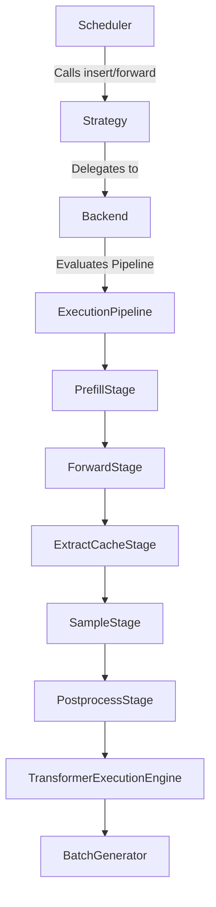
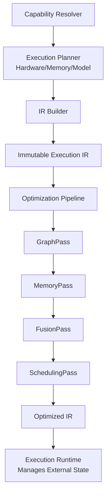
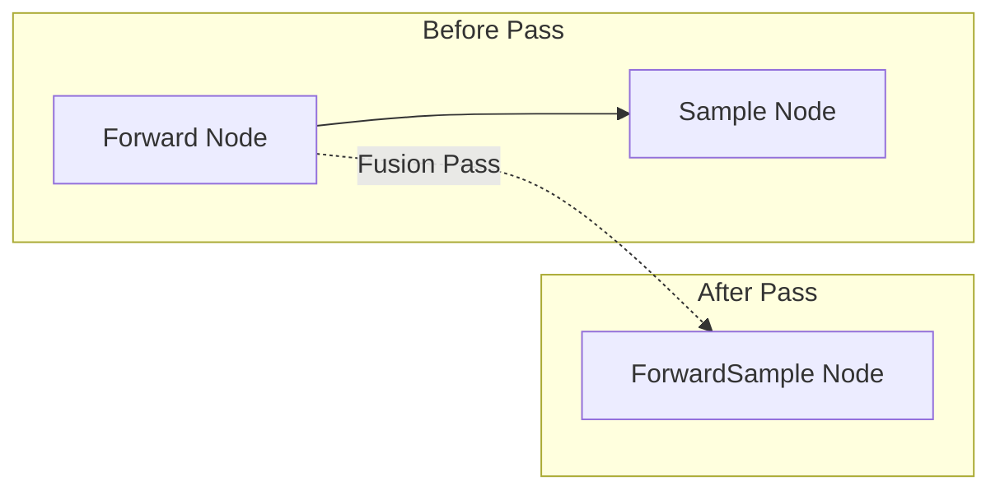
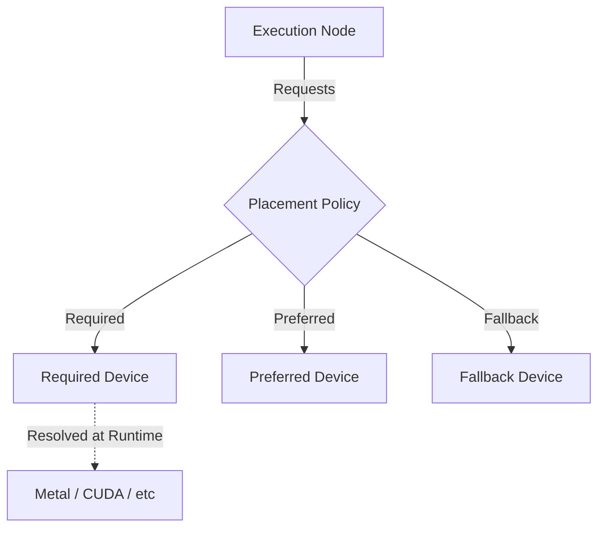

# RAES-011: Execution IR & Runtime Optimizer Architecture

## Objective
Perform a complete repository audit and design an Intermediate Representation (IR) execution architecture that allows runtime execution to be modeled exactly like a compiler (e.g., LLVM). Execution will move through a continuous pipeline: Capability Resolver → Execution Planner → Execution IR → Optimization Pipeline → Execution Runtime. The architecture must support future optimization passes, graph rewriting, and node immutability without changing Scheduler logic.

---

## 1. Repository Audit

A full repository audit locates the following execution boundaries and logic points:

*   **Execution Stages:** Found in `omlx/inference/execution_backend.py`. E.g., `PrefillStage`, `ForwardStage`, `ExtractCacheStage`. These currently map to a linear pipeline sequence.
*   **Backend Execution Flow:** Managed via `ExecutionBackend` wrappers (e.g., `AutoregressiveBackend`, `ExperimentalNemotronBackend`) that execute `ExecutionPipeline` instances state by state.
*   **Pipeline Stages:** Outlined via `PipelineState` enum: `INITIALIZED`, `PREPARED`, `RUNNING`, `SYNCING`, `FINALIZED`, `CLEANED`.
*   **Scheduler Transitions:** Found in `omlx/scheduler.py` managing state queues: Waiting → Prefilling → Running (via MLX-LM `BatchGenerator`) → Finished.
*   **Synchronization Points:** `mx.eval()` called explicitly in `omlx/inference/strategy.py` and `_sync_and_clear_cache()`, `_safe_sync_stream()` in `scheduler.py` before batch boundaries.
*   **Cache Extraction:** Managed via `store_cache()` asynchronously, and `_extract_cache_states` dict.
*   **Cache Evaluation:** Managed by `block_aware_cache` checks and policy evaluation in `omlx/inference/cache_policy.py`.
*   **Forward Execution:** Executed inside `TransformerExecutionEngine` and `NemotronExecutionEngine`, calling the MLX model or generator directly.
*   **Sampling:** Handled via `make_sampler_interface` utilizing `SamplerParams` located in `omlx/inference/sampler_interface.py` and `omlx_make_sampler`.
*   **Detokenization:** Token detokenization exists implicitly in `PostprocessStage` handling outputs.
*   **Speculative Execution:** Outlined in `omlx/inference/strategies/linear_speculation.py` via `build_linear_speculation_graph()`.
*   **Diffusion Execution:** Defined in `omlx/inference/strategies/diffusion.py` and backend `experimental_diffusion_backend.py`.
*   **VLM Execution:** Specific logic for embedding vision inputs (`request.vlm_inputs_embeds`, `rope_deltas`) exists in `scheduler.py` and `engine/vlm.py`.
*   **MoE Routing:** Evidence of custom Metal kernels for MoE DSA routing exist in `omlx/custom_kernels/glm_moe_dsa/csrc/mlx/backend`.
*   **Verification Checkpoints:** Found context clues for `omlx/eval/` directory and Golden asset comparisons that can hook into graph state outputs.

---

## 2. Current Execution Mapping

The current execution architecture acts as a strictly layered, linear abstraction:

```
Scheduler
   ↓  (Calls step(), manages queues)
GenerationStrategy
   ↓  (Autoregressive, Diffusion, LinearSpeculation)
ExecutionBackend
   ↓  (AutoregressiveRuntime mapping abstract states)
ExecutionPipeline
   ↓  (Iterates list[ExecutionStage] sequentially)
ExecutionEngine
   ↓  (TransformerExecutionEngine wrappers)
BatchGenerator / Runtime
   ↓  (mlx-lm next_generated(), mx.eval())
Response
```

**Comparison against Proposed Execution IR:**
Currently, `ExecutionGraph` (in `omlx/inference/execution_graph.py`) defines a pseudo-graph using `GraphNode` (`next_nodes`), but traversal acts strictly linearly via `linear_order()`. The proposed architecture will replace `ExecutionPipeline`'s linear stage array with an LLVM-style Intermediate Representation (IR).

---

## 3. Execution IR Architecture

The Execution IR models inference as an immutable graph. Runtime state lives entirely outside the IR nodes.

**Immutability Guarantee:**
*   `ExecutionNode`: Represents an operation (never mutates).
*   `ExecutionEdge`: Represents data or control flow dependencies (never mutates).
*   `ExecutionMetadata`: Static properties of the node (never mutates).
*   *Runtime state (e.g., active tensors, KV blocks) is tracked externally by the `ExecutionRuntime` during traversal.*

**Node Taxonomy (Derived from Repo Evidence):**
*   **Input Node (Prefill Node):** Prepares batch inputs, embedding injections (VLM).
*   **Cache Node (ExtractCache Node):** Marks KV updates.
*   **Routing Node:** Represents MoE routing kernels.
*   **Forward Node:** Standard model MLP/Attention forward pass.
*   **Sampling Node:** Logit processing and next token selection.
*   **Draft Node & Accept Node:** Speculative components.
*   **Denoise Node & Initialize Block Node:** Diffusion components.
*   **Synchronization Node:** Barrier nodes ensuring `mx.eval()` execution.
*   **Decode/Emit Node:** Emits tokens and metrics.

**IR Edges Enforcement:**
*   **Execution Dependency Edges:** Structural order.
*   **Data Flow Edges:** Explicit mapping of output tensors to input parameters.
*   **Synchronization Edges:** Forces streams to sync before cache modifications.
*   **Verification Edges:** Branches off main compute path for debug validation.

---

## 4. Graph Passes & Optimization Pipeline

Instead of a monolithic optimizer, the pipeline exposes an extensible pass system. Plugins can register passes (aligning with RAES-010).

**Pass Hierarchy:**
```
OptimizationPass
   ↓
GraphPass (e.g., Dead Stage Elimination, Graph Rewriting)
   ↓
MemoryPass (e.g., Cache Reuse, Memory Planning)
   ↓
FusionPass (e.g., Kernel Fusion, ForwardSample Fusion)
   ↓
SchedulingPass (e.g., Sync Elimination, Topological Sort)
```

**Graph Rewriting:**
The IR explicitly supports rewriting. For example, a `ForwardNode` followed by a `SampleNode` can be rewritten into a fused `ForwardSampleNode` by a `FusionPass`, completely transparently to the backend.

---

## 5. Execution Planner

The Execution Planner becomes a smarter, multi-dimensional resolver evaluating constraints to produce the optimal IR.

**Resolution Chain:**
`Planner → Capabilities → Hardware → Memory → Context Window → Model Family → Execution IR`

This depth is required for complex routing, like determining if Streaming MoE fits in memory or if VLM embeddings require chunked prefill.

---

## 6. Continuous Pipeline

The systems are merged into one continuous, compiler-like pipeline:

```
Capability Resolver
        │
        ▼
Execution Planner (Capabilities → Hardware → Memory → Model Family)
        │
        ▼
Execution IR (Builder generates immutable Nodes & Edges)
        │
        ▼
Optimization Pipeline (GraphPass → MemoryPass → FusionPass)
        │
        ▼
Execution Runtime (Topological traversal managing external state)
```

Because the `Scheduler` only calls `strategy.forward()` or `strategy.insert()`, it remains agnostic to this pipeline.

---

## 7. Memory Scheduling Design

*   **Cache Ownership:** KV cache arrays belong to graph outputs, tracked in external runtime state.
*   **Activation Lifetime:** Dictated by the IR topology; tensors drop when topological dependents complete.
*   **Garbage Collection Boundaries:** `Memory Nodes` placed via `MemoryPass` trigger safe `mx.clear_cache()`.

---

## 8. Hardware Abstraction

Device placement within the IR is abstracted from specific backends (Metal, CUDA, etc.).

Instead of specifying GPU or CPU, nodes specify:
*   `Preferred Device`
*   `Required Device`
*   `Fallback Device`

Metal, CUDA, ROCm, and Neural Engine act strictly as implementation backends that satisfy these generalized device requirements during the `SchedulingPass`.

---

## 9. Verification Integration

Verification seamlessly plugs into the IR logic via rewriting passes.
*   **Integration:** A `GraphPass` injects a `Verify Node` on the output edge of a `Forward Node`.
*   **Equivalence:** Evaluates tensor outputs against Golden HF datasets in `omlx/eval/`.
*   **Cleanliness:** When verification is disabled, the pass does not run, leaving the IR pristine and performant.

---

## 10. Repository Changes

**NEW FILES:**
*   `omlx/inference/execution_ir.py` (Immutable Nodes, Edges, Metadata).
*   `omlx/inference/ir_passes.py` (Base classes for GraphPass, MemoryPass, FusionPass).
*   `omlx/inference/ir_planner.py` (Smart context resolution to IR).
*   `omlx/inference/ir_runtime.py` (Manages external state during traversal).

**MODIFIED FILES:**
*   `omlx/inference/execution_graph.py` (To be deprecated/migrated to `execution_ir.py`).
*   `omlx/inference/execution_backend.py` (Refactored to trigger the continuous pipeline).

**UNTOUCHED FILES:**
*   `omlx/scheduler.py` (Zero changes, strict requirement).
*   `omlx/engine_core.py` (Remains coordinator).

---

## 11. Risk Analysis

*   **IR Complexity:** Managing immutable graphs and externalizing state requires strict discipline.
*   **Optimization Correctness:** Graph rewriting (e.g., Forward + Sample -> ForwardSample) must preserve exact mathematical equivalence.
*   **Plugin Safety:** Malicious or buggy third-party passes could break the IR topology.

---

## 12. Verification Plan

*   **Pass Correctness:** Unit tests asserting that IR Before Pass A -> `GraphPass` -> IR After Pass A is deterministic.
*   **Execution Equivalence:** Golden test: ensure Output(Linear) == Output(IR Pipeline) for 1000 fixed seeds.
*   **Immutability Assertions:** Strong typing and frozen dataclasses preventing runtime mutations.

---

## 13. Rollback Strategy & Recommendation

**Rollback Strategy:** Feature flag `USE_IR_PIPELINE`. Retain the existing `ExecutionPipeline` list logic as fallback.
**Recommendation for Implementation Checkpoint:** Begin by implementing `execution_ir.py` with frozen data structures. Build a single `GraphPass` that emits the IR for the Autoregressive profile, and verify the `ExecutionRuntime` can traverse it exactly like the legacy list.

---

## 14. Diagrams

### 1. Current Execution Architecture (Linear)


### 2. Continuous IR Pipeline


### 3. Graph Rewriting (Fusion Pass)


### 4. Hardware Device Placement

