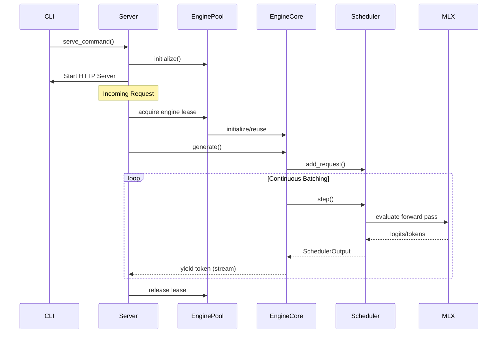
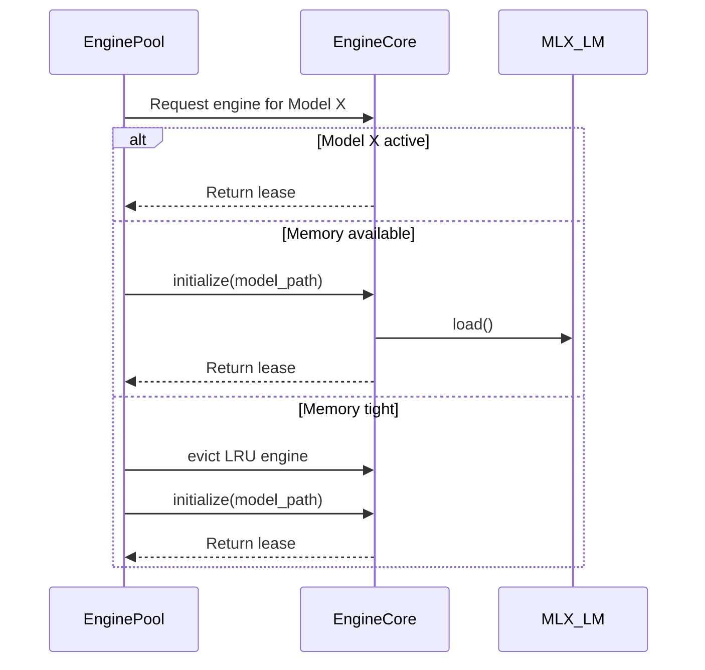
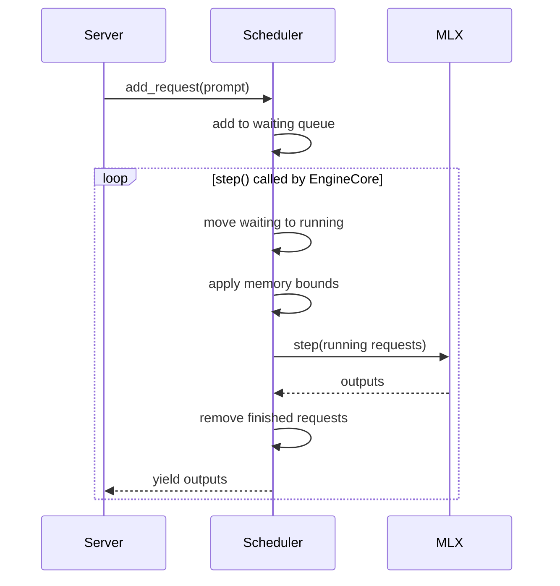

# Runtime Lifecycle

## Application Startup & CLI Lifecycle
1. `omlx/cli.py` handles the initial command parsing (`serve`, `start`, `stop`, `restart`, `launch`).
2. Arguments are processed into specific server configurations or client commands.
3. If `serve` is called, `serve_command()` initializes server-level variables.

## Configuration Lifecycle
1. Defaults are populated via `omlx/config.py` and CLI arguments.
2. `EngineConfig` and `SchedulerConfig` instances are derived from global settings and CLI inputs.

## Server Lifecycle
1. `ServerState` (`omlx/server.py`) is initialized, setting up the global environment.
2. The HTTP API via FastAPI is mounted.
3. `EnginePool` is instantiated at server startup and initialized based on the `model-dir` config.

## Engine Lifecycle
1. `EnginePool` dynamically allocates or re-uses `EngineCore` instances via `_LLMEngineLease` context managers.
2. `EngineCore` wraps mlx-lm models and delegates generation logic.

## Scheduler Lifecycle
1. The `Scheduler` (`omlx/scheduler.py`) is created during `EngineCore` initialization.
2. Requests are added to the waiting queue (`add_request`).
3. Continuous batching happens during generation loops (`step`), transitioning states from waiting -> running -> finished.

## Inference & Streaming Lifecycle
1. Handled by `ExecutionGraph` and specific generation strategies (Autoregressive, etc.).
2. The scheduler handles `step()` calls. Output collectors process `SchedulerOutput`.
3. Server routes (e.g. SSE in `api/`) stream these tokens back to clients using keepalive mechanics.

## Model Lifecycle
1. Models are discovered via `omlx/model_discovery.py`.
2. Loaded into memory as needed or eagerly via `EnginePool`.
3. Cached using hybrid caching/Paged SSD if enabled.

## Plugin Lifecycle
1. Discovered at initialization via `plugin_discovery.py` using `entry_points`.
2. Capabilities registered in `CapabilityRegistry`.

## Shutdown Lifecycle
1. Server receives a termination signal.
2. `EnginePool` clears active engines.
3. `mx.clear_cache()` is called.

## Sequence Diagram

## Engine Lifecycle Sequence Diagram

## Scheduler Lifecycle Sequence Diagram

