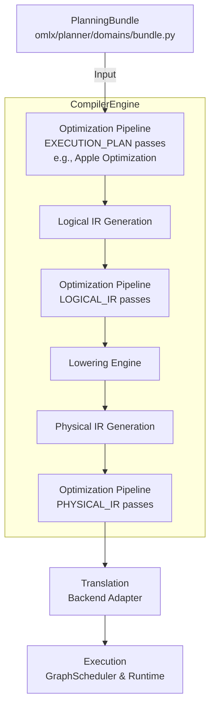

# Optimization Architecture Guide & Consolidation Report

## Canonical Optimization Pipeline
The single canonical pipeline is now `omlx/optimization/pipeline.py`.
The legacy duplicate pipeline (`omlx/planner/compiler/optimization_pipeline.py`) was removed because it bypassed the `PassManager` topological ordering, immutability validations, and diagnostic telemetries. The preserved functionality leverages `OptimizationPlanner` (Intelligence) to dynamically filter passes, and the unified `execute` loop handles all compiler stages (`LOGICAL_IR`, `PHYSICAL_IR`, `EXECUTION_PLAN`).

## Sequential vs. Parallel Correctness Guarantees
The architecture guarantees that sequential and parallel optimization paths produce **identical observable behavior**:
1. **Immutability Validation:** Only `AnalysisPass` nodes are grouped for parallel execution. The core pipeline (`pipeline.py`) runs `validate_artifact_immutability()` which strictly enforces that analysis parallelization does not mutate the `ExecutionIR`.
2. **Diagnostics & Metrics:** The `OptimizationContext.tracker` and `stats` are completely thread-safe (`IntelligenceStatisticsTracker` uses `threading.Lock()`), ensuring telemetry events emit identically regardless of thread execution order.
3. **Pass Ordering:** Parallel groups are strictly independent according to the `PassManager` topological graph.
4. **Cancellation:** A failure fast-paths gracefully into a unified `CompilerError`.

## Canonical Path Diagram

