# RAES-014: Runtime Bootstrap, Composition Root & Lifecycle Architecture

## Context
The repository has progressively evolved toward a layered execution architecture:
`Model Discovery -> Model Adapter -> Capability Resolution -> Execution Planner -> Execution IR -> Optimization Passes -> Execution Backend -> Execution Engine -> Runtime`

This document defines the **Composition Root**—the architecture that assembles all of these systems into one coherent runtime, establishing who owns each subsystem, lifecycle boundaries, and dependency injection patterns.

---

## 1. Repository Audit

An audit of the repository reveals where objects are currently instantiated and globally owned:

### Singletons & Global State
*   **`_server_state` (`omlx/server.py`)**: Acts as a massive global singleton holding `engine_pool`, `settings_manager`, `mcp_manager`, `global_settings`, etc. It bypasses formal dependency injection.
*   **`_GLOBAL_PROFILE_REGISTRY` (`omlx/inference/execution_profile.py`)**: A globally instantiated registry holding execution backend mappings. (Note: Being phased out based on prior architecture docs, but present in current codebase).
*   **Settings Initialization (`omlx/settings.py`)**: Accessed universally instead of passed down the component tree.
*   **FastAPI App (`omlx/server.py`)**: The `app = FastAPI(...)` object is declared at the module level.

### Instantiation Boundaries
*   **`EnginePool`**: Created inside `omlx/server.py` and attached to `_server_state`. It acts as the ultimate owner of memory and model lifetimes.
*   **`EngineCore`**: Instantiated dynamically by `EnginePool` (`omlx/engine_pool.py`) when a request demands a model.
*   **`Scheduler`**: Instantiated deep inside `EngineCore.__init__` (or `AsyncEngineCore`), making it tightly coupled to the engine's creation lifecycle.
*   **Registries (`CapabilityRegistry`, `PluginManager`)**: Currently loaded at module initialization or lazily during process boot, lacking a central coordinator.

### Initialization Order & Cyclic Risks
Currently, initialization happens organically as modules are imported. `omlx/cli.py` parses arguments, imports `omlx/server.py`, which initializes global state, then starts `uvicorn`. This implicit ordering makes it difficult to manage graceful degradation, plugin load failures, or verification bounds prior to taking network traffic.

---

## 2. Current Startup Flow

The existing runtime startup sequence operates as follows:

1.  **Entry Point**: `python -m omlx` -> `omlx/cli.py` (`serve_command()`).
2.  **Configuration**: `init_settings()` is called, reading files and CLI arguments.
3.  **FastAPI Construction**: Module-level `FastAPI` instance is parsed, including route registrations.
4.  **Uvicorn Launch**: CLI triggers `uvicorn.run()`.
5.  **FastAPI Lifespan Startup**:
    *   `ServerState` globals are populated.
    *   Server aliases detected.
    *   Pinned models are preloaded via `_server_state.engine_pool.preload_pinned_models()`.
    *   `ProcessMemoryEnforcer` is started and bound to the pool.
6.  **Request Execution Initiation**:
    *   A user request hits a route.
    *   `get_engine_pool()` yields the singleton pool.
    *   Pool creates an `EngineCore`.
    *   `EngineCore` creates a `Scheduler`.
    *   Scheduler runs `Scheduler.step()` loops on the MLX execution thread.

### Sequence Diagram: Current Startup

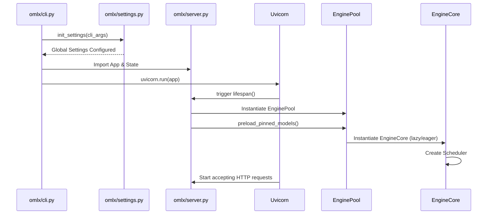

---

## 3. Runtime Composition Root

To transition away from global singletons and scattered module-level instantiation, oMLX requires a formal **Composition Root**. This is a single, deterministic bootstrapping phase responsible for wiring all dependencies *before* the application serves traffic.

Nothing outside the Composition Root should perform service construction or dependency resolution.

### Proposed Composition Flow

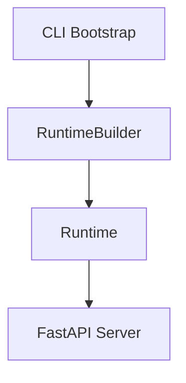

### The `Runtime` Object
The `RuntimeBuilder` constructs a single `Runtime` object. This object acts as the ultimate application boundary and owns all primary subsystems:
*   **RuntimeContext**: An aggregated state object encapsulating:
    *   Configuration
    *   Capabilities
    *   Hardware Information
    *   Plugins
    *   Metrics
    *   Execution Environment
    *   Verification state
    *   Execution Planner
*   **EventBus**: The centralized publish-subscribe system. Plugins, Metrics, Verification, and Logging communicate across the system by subscribing to the EventBus, rather than through direct method invocation.
*   **EnginePool**: Managing memory and models.

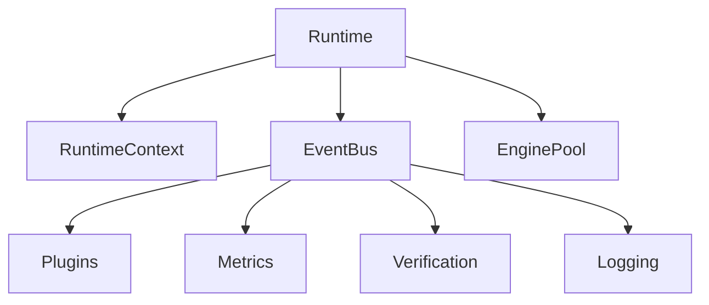

## 4. Service Lifetime Model

Every major component in the oMLX architecture operates within a specific lifecycle scope. To prevent memory leaks and ensure thread safety, components must adhere to the following lifetimes:

| Component | Lifetime | Ownership |
| :--- | :--- | :--- |
| **PluginManager** | Process | Composition Root |
| **CapabilityRegistry** | Process | Composition Root / PluginManager |
| **AdapterRegistry** | Process | Composition Root |
| **ExecutionPlanner** | Process | Composition Root |
| **ExecutionProfileRegistry** | Process | Composition Root |
| **VerificationFramework** | Process | Composition Root |
| **EnginePool** | Process | Server / FastAPI App State |
| **ExecutionEnvironment** | Process | Composition Root (Immutable snapshot) |
| **EngineCore (Worker)** | Engine | `EnginePool` |
| **Scheduler** | Engine | `EngineCore` |
| **ExecutionBackend** | Engine / Request | `EngineCore` (Reused or instantiated per batch) |
| **ModelAdapter** | Engine | `EngineCore` (Created at model load) |
| **ExecutionContext** | Request | `Server` / Request Handler |
| **ExecutionGraph / IR** | Request | `ExecutionPlanner` / `ExecutionContext` |
| **BatchGenerator** | Engine | `Scheduler` |

*   **Process Lifetime**: Instantiated once at startup, shared across all threads/workers. Must be completely stateless or utilize thread-safe locks.
*   **Engine Lifetime**: Created when a model is loaded into memory. Destroyed when the model is evicted by the `EnginePool`.
*   **Request Lifetime**: Created when an HTTP request arrives. Destroyed when the HTTP response completes. Temporary objects used for tracking context.

---

## 5. Dependency Injection Architecture

To decouple systems and enable rigorous testing without monkey patching, oMLX must enforce strict dependency injection (DI).

### Rules for Dependency Flow
1. **No Global State (`_server_state`)**: State must be passed explicitly. FastAPI's `Depends()` should be used to inject the `EnginePool` and `ExecutionPlanner` into routes.
2. **Top-Down Dependency Flow**: Higher layers (API, Routing) depend on lower layers (Execution, Scheduling). Lower layers must *never* import higher layers.
3. **No Service Locators**: Components should declare their dependencies in their constructors (`__init__`), rather than asking a global registry for a service.
4. **Immutable Registries Post-Boot**: Registries (Capabilities, Plugins) are locked after the boot sequence completes.

### Dependency Graph

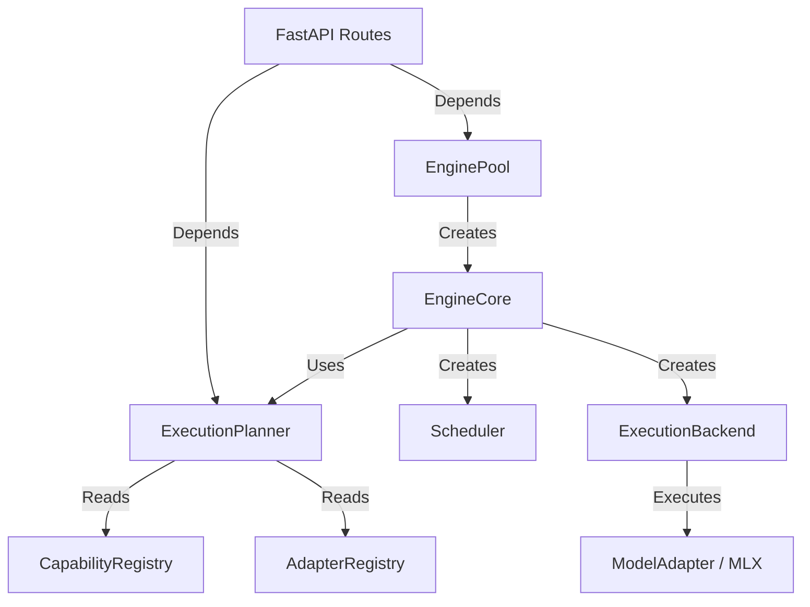

---

## 6. Worker Lifecycle

In oMLX, a "Worker" corresponds to the `EngineCore` and its associated execution thread. The lifecycle of a worker dictates how models are loaded, executed, and torn down.

### Lifecycle Phases
1.  **Worker Startup**: `EnginePool` instantiates an `EngineCore` in response to a request or pre-warming configuration.
2.  **Model Discovery & Adapter Resolution**: The `EngineCore` requests the `ModelDescriptor` from the `AdapterRegistry`. The optimal `ModelAdapter` is selected based on raw model configuration.
3.  **Model Loading**: The model weights and tokenizer are loaded into memory.
4.  **Planner Construction**: The `ExecutionPlanner` uses the `ModelDescriptor` to generate the `ExecutionGraph` and select the appropriate `ExecutionBackend`.
5.  **Runtime Creation**: The `Scheduler` is instantiated and bound to the worker thread. The `ExecutionBackend` is primed.
6.  **Execution Loop**: The `Scheduler` continuously pulls from the waiting queue, forming batches, and yielding to the MLX executor thread.
7.  **Shutdown & Cleanup**: When eviction policies trigger, the worker is signaled to halt. The `Scheduler` aborts pending requests (requeuing them if necessary), the `ExecutionBackend` flushes caches, and the MLX memory is released.

### Sequence Diagram: Worker Lifecycle

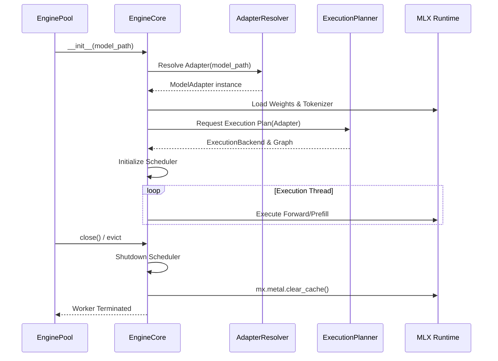

---

## 6.5 Thread Ownership

System concurrency is governed by explicit thread ownership to prevent deadlocks and data races:

1.  **HTTP Thread (FastAPI/Uvicorn)**: Handles I/O, routing, and SSE connection keep-alives. Cannot block.
2.  **Engine Thread (`EngineCore`)**: Manages the lifecycle of a specific model, runs the Scheduler loops, and triggers execution.
3.  **MLX Thread (`mlx-lm`)**: The underlying C++/Metal execution thread. Must only be invoked from the Engine Thread to prevent `Stream` context collisions.
4.  **Background Worker**: Handles asynchronous tasks like flushing SSD cache blocks and emitting telemetry.
5.  **Metrics Thread**: Dedicated to aggregating and exporting Prometheus/logging data without interrupting inference.

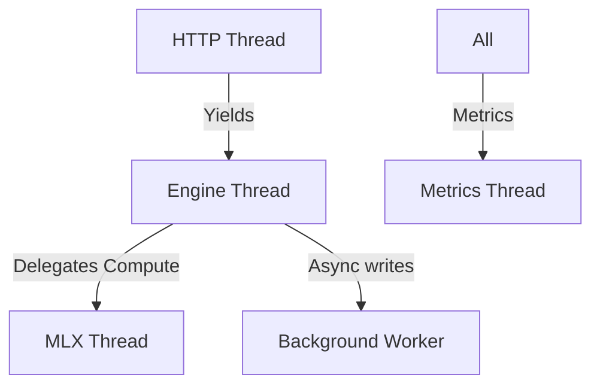

## 7. Request Lifecycle

The request lifecycle tracks a single inference request from the edge to the GPU and back.

### Ownership Chain
*   **ExecutionContext**: Owned by the API Handler (`server.py`). Tracks the request parameters, HTTP connection state, and cancellation signals.
*   **ExecutionRuntime**: Abstracted by the `ExecutionPlanner`. Used to define the logical IR sequence required for this specific request.
*   **Scheduler**: Owned by `EngineCore`. Temporarily takes ownership of the request UID while it sits in the `waiting_queue` and `active_batch`.
*   **BatchGenerator**: Owned by `Scheduler`. Consumes the raw tokens and produces generation steps.
*   **Verification / Metrics / Logging**: Hooked asynchronously via the Event System. They observe the request but do not own its state.

### Sequence Diagram: Request Lifecycle

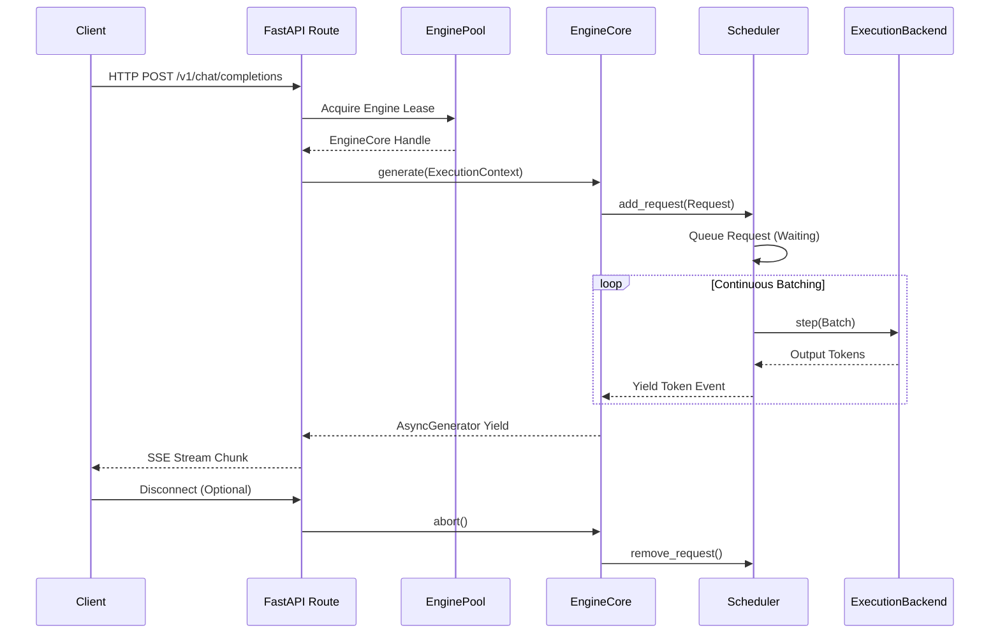

---

## 8. Startup & Shutdown Architecture

Graceful startup and shutdown are critical for ensuring state consistency (e.g., SSD caching, memory boundaries) and allowing verification.

### Runtime State Machine & Boot Phases

The Runtime operates under a strict state machine lifecycle. This provides clear health endpoints and makes debugging boot failures trivial.

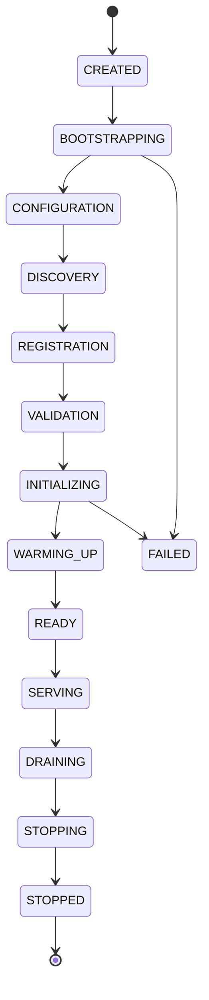

### Explicit Boot Phases
1.  **BOOTSTRAP**: Application process starts.
2.  **CONFIGURATION**: Load `.env`, CLI args, and `settings.yaml`.
3.  **DISCOVERY**: `PluginManager` discovers `.whl` or local plugins via entry points. Scan models.
4.  **REGISTRATION**: Registries are populated.
5.  **VALIDATION**: Run startup validation checks.
6.  **INITIALIZING**: Construct ExecutionPlanner, EnginePool, and Verification Framework.
7.  **WARMING_UP**: Pinned models are explicitly loaded into `EnginePool`. Cache metadata initialized.
8.  **READY**: All subsystems online.

### Startup Validation
Before transitioning from WARMING_UP to READY, the system must pass strict validation:
*   [x] Configuration is valid.
*   [x] Plugins successfully loaded.
*   [x] Registries are locked and immutable.
*   [x] Execution Planner is successfully built.
*   [x] Verification framework initialized.
*   [x] EnginePool initialized with zero zombie processes.
*   [x] All pre-flight Health Checks passed.

Only when these checks pass does the system transition to `READY` and allow Uvicorn to bind and transition to `SERVING`.

### Shutdown Sequence

1.  **Signal Trap**: SIGINT/SIGTERM intercepted by Uvicorn.
2.  **Network Drain**: Stop accepting new HTTP requests. Allow current requests N seconds to finish streaming.
3.  **Worker Cleanup**: For every active `EngineCore`, signal the `Scheduler` to halt. Abort all remaining requests with a 503 Retry-After.
4.  **Plugin Teardown**: Fire the `Shutdown` event on the `PluginContext`, allowing plugins to release external resources (e.g., closing telemetry connections).
5.  **Cache Flushing**: `paged_ssd_cache` forces an `fsync` to disk for any pending KV block writes.
6.  **Resource Release**: `mx.metal.clear_cache()` is called. Thread pools are joined.
7.  **Process Exit**.

---

## 9. Configuration Ownership

Configuration is hierarchically resolved. The Composition Root establishes this precedence:

1.  **Environment Variables**: Absolute highest priority (e.g., `OMLX_MAX_MEMORY`).
2.  **CLI Arguments**: Overrides files (e.g., `--max-memory 16`).
3.  **API Overrides**: Specific to a single request (e.g., `temperature=0.9`). Cannot override server safety limits.
4.  **Configuration Files**: User's saved settings (`~/.config/omlx/settings.yaml`).
5.  **Execution Profiles / Model Descriptors**: Defaults provided by the model adapter (e.g., `max_position_embeddings`).
6.  **Capability Overrides**: Provided by loaded plugins.

The `SettingsManager` (instantiated in the Composition Root) owns the unified view of these layers and provides it immutably to downstream components.

---

## 9.5 Hot Reload Policy

To maintain high availability without restarting the process, specific components can be hot-reloaded:

**Can Reload (Without Restart):**
*   Plugins (Dynamically registered/unregistered)
*   Capabilities (Re-evaluated upon plugin load)
*   Verification Profiles (Golden assets re-read)
*   Configuration (via Admin API / SIGHUP)

**Cannot Reload (Requires Process Restart):**
*   Execution Planner (Core wiring is static post-boot)
*   Scheduler (Queue state cannot be safely hot-swapped)
*   Execution Engine (Tied to MLX memory contexts)

## 10. Failure Domains

The system strictly formalizes failure boundaries to ensure maximum uptime and operational clarity. When a failure occurs, the blast radius is contained according to these rules:

*   **Plugin Failure** → Disable the offending plugin → Log warning → Continue boot.
*   **Verification Failure** → Abort boot process (prevents taking traffic in an unsafe state).
*   **Model Failure** (e.g., OOM on load, corrupt safetensors) → Restart Engine → Return 500 to specific HTTP request.
*   **Scheduler Failure** (e.g., queue corruption, deadlock) → Restart Engine → Requeue waiting requests if possible.
*   **Runtime Failure** (e.g., EventBus panic, catastrophic metal error) → Terminate Process (let external orchestrator like systemd/Docker restart).

## 11. Observability Architecture

Observability is initialized *first* in the Composition Root.

*   **Logging**: Owned globally by the standard `logging` module, configured strictly at startup.
*   **Metrics**: Owned by the `MetricsRegistry` (Process Lifetime). Schedulers and Engines push atomic updates to this registry.
*   **Tracing / Benchmarking**: Hooked via the Plugin Architecture's Event System (`BeforeExecution`, `AfterExecution`).
*   **Startup Diagnostics**: A dedicated health-check report is dumped to stdout immediately after the Composition Root finishes assembling dependencies, detailing active plugins, memory bounds, and metal capabilities.

---

## 12. Future Scalability

By enforcing the Composition Root and avoiding global state (like `_server_state`):
*   **Multiple Workers**: The `EnginePool` can be easily refactored to spawn multiple processes instead of threads.
*   **Multiple GPUs / Distributed**: `ExecutionEnvironment` can detect multiple devices. The `ExecutionPlanner` can issue Execution Graphs that include network-boundary nodes (e.g., tensor parallelism).
*   **Plugin Ecosystem**: Because plugins register descriptors against stable extension points, the ecosystem can grow indefinitely without requiring PRs to the core oMLX codebase.

---

## 13. Repository Impact

This architecture plan dictates future refactoring work.

### Modified Files (Future Implementation)
*   `omlx/server.py`: Removal of `_server_state` singletons. Introduction of dependency injection via `Depends()`.
*   `omlx/cli.py`: Implementation of the `RuntimeBuilder` or `OmlxApplication` Composition Root.
*   `omlx/engine_pool.py`: Update constructors to accept injected Registries and Planners.
*   `omlx/engine_core.py`: Decouple `Scheduler` instantiation to be driven by the `ExecutionPlanner`.

### New Files (Future Implementation)
*   `omlx/runtime/builder.py`: The actual Composition Root implementation.
*   `omlx/runtime/lifecycle.py`: Abstractions for Process and Engine lifetimes.

---

## 14. Verification Plan

When the Composition Root is implemented, it must pass the following verifications:
1.  **Bootstrap Order Validation**: Assert logs confirm Configuration -> Plugins -> Registries -> API boot sequence.
2.  **Dependency Graph Validation**: Static analysis (e.g., `importlib` or tools like `pydeps`) must confirm that `omlx.inference` does not import `omlx.api`.
3.  **Ownership & Shutdown Validation**: Running the server and sending a `SIGTERM` must reliably produce `mx.metal.clear_cache()` calls and a 0 exit code without dangling threads.
4.  **Worker Restart Validation**: Simulating a crash in `EngineCore.generate()` must result in the `EnginePool` recovering and successfully serving the next request.

---

## 15. Rollback Strategy

If the implementation of the Composition Root causes regressions (e.g., performance degradation or plugin instability):
1.  Revert `omlx/server.py` to use the `_server_state` singleton.
2.  Revert `omlx/cli.py` to its imperative initialization flow.
3.  Because the `Scheduler` and `ExecutionBackend` logic remains untouched, reverting the initialization wiring is safe and will immediately restore prior behavior.

---

## Appendix: Additional Architecture Diagrams

### Ownership Diagram

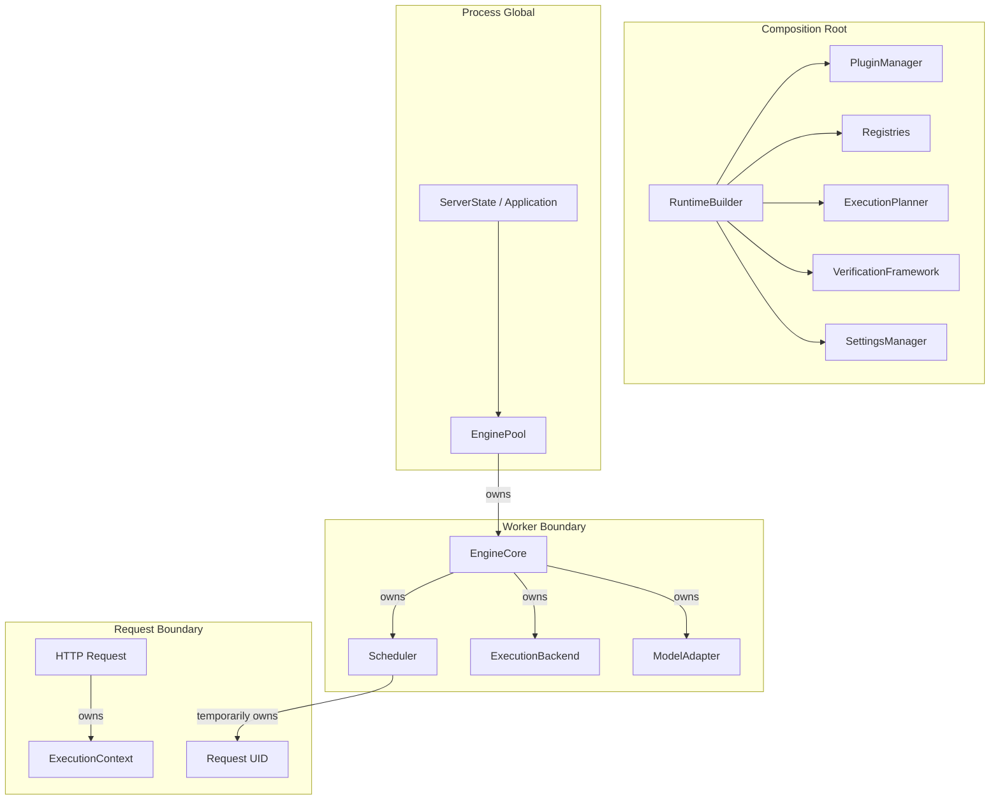

### Proposed Startup Sequence

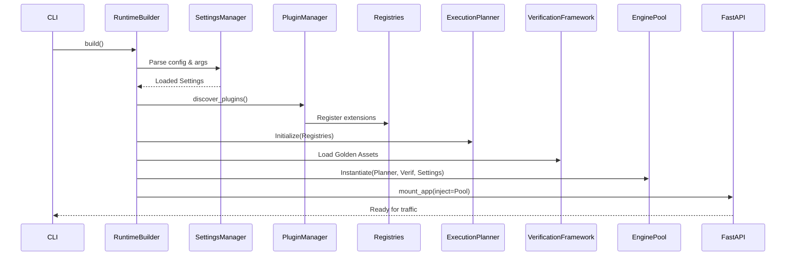

### Proposed Shutdown Sequence

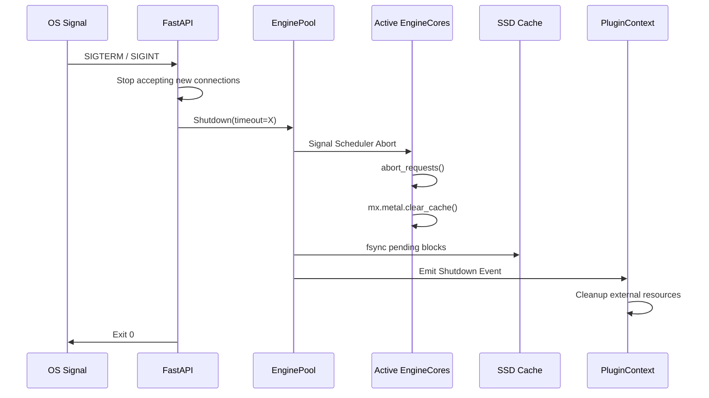
