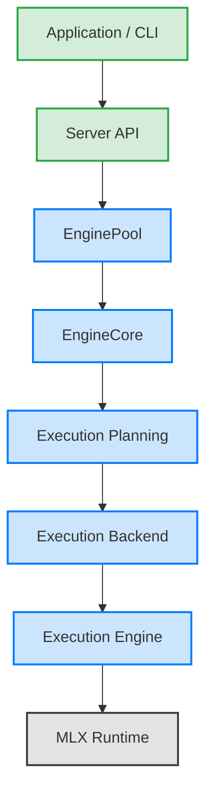
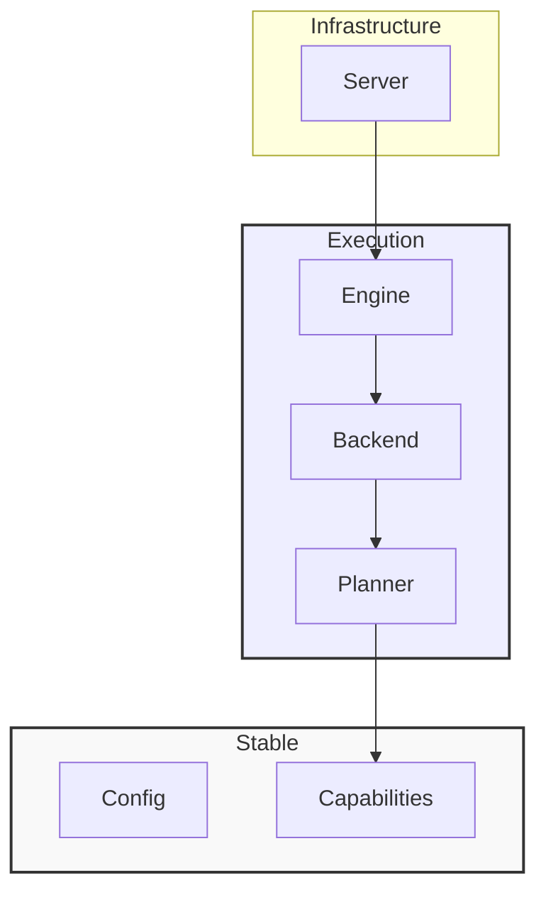
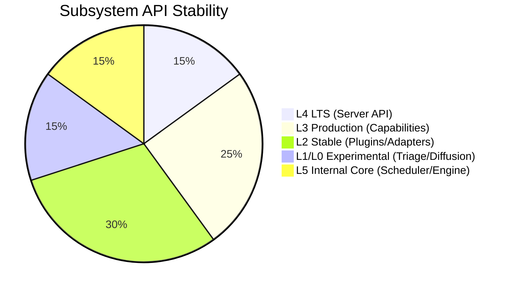
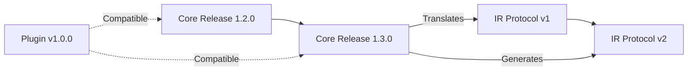
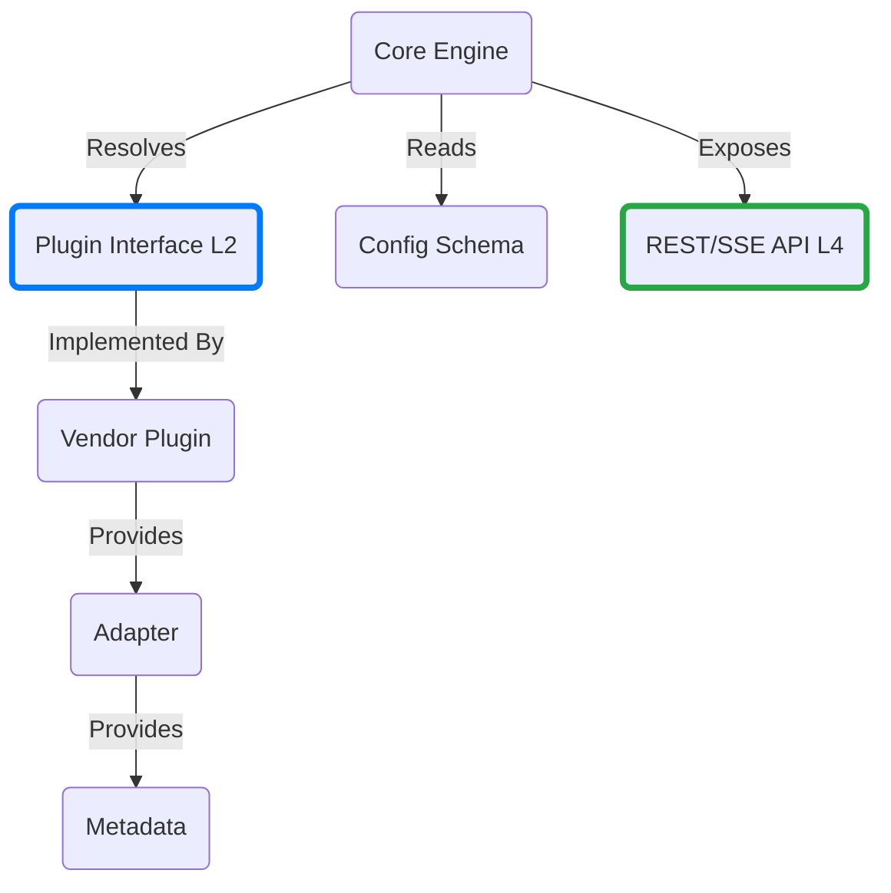
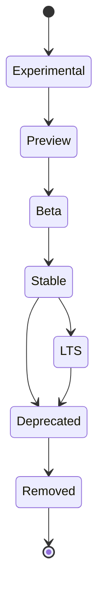
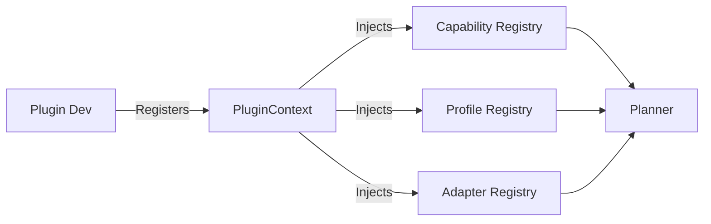
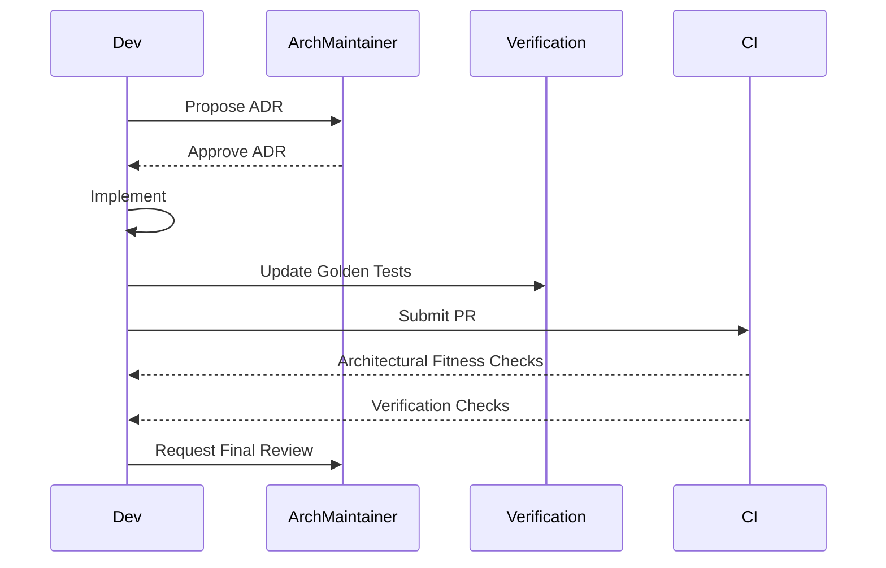

# RAES-015: Architectural Constitution, Evolution & Compatibility Framework

## 1. Context & Purpose
oMLX has established foundational runtime architectures across RAES-001 through RAES-014. The core runtime architecture is considered largely complete, encompassing the Runtime Lifecycle, Execution Ownership, Capability Registry, Execution Planner, Execution IR, Execution Backend, Execution Engine, Model Adapter Architecture, Plugin Architecture, Scientific Verification Framework, and Runtime Composition Root.

The purpose of this document (RAES-015) is to define the constitutional rules governing how the architecture evolves while preserving stability, extensibility, backward compatibility, and maintainability. This document serves as the authoritative engineering constitution for oMLX.

## 2. Architecture Decision Hierarchy

To prevent conflicting documentation and decisions, the source of truth follows a strict hierarchy. Documents higher in the hierarchy override lower ones in the event of a contradiction.

1. **RAES-015 (Architectural Constitution)** - Supreme rules and invariants.
2. **RAES Runtime Architecture (RAES-006–014)** - Broad system design specifications.
3. **Component Design Documents** - Detailed component blueprints.
4. **Implementation** - The executable codebase (`omlx/`).
5. **Tests** - The verification suite (`tests/`).

## 3. Architectural Invariants (Immutable Rules)

These rules are non-negotiable and immutable. Any modification violating these invariants requires a supreme architectural amendment.

1. **Scheduler Agnosticism:** The Scheduler never performs model execution or inference. It schedules purely based on memory, batch constraints, and timing.
2. **Execution Ownership:** `ExecutionEngine` owns the `BatchGenerator` and controls runtime execution.
3. **Backend Orchestration:** `ExecutionBackend` owns the orchestration of pipelines and execution flow.
4. **Adapter Encapsulation:** `ModelAdapter` contains model-specific behavior and provides immutable `AdapterDescriptor`s.
5. **Capability Semantics:** Capabilities describe abstract features, not concrete implementations.
6. **Plugin Boundaries:** Plugins extend behavior strictly through registered extension points and never modify the core runtime directly.
7. **Planner Supremacy:** The `ExecutionPlanner` owns `ExecutionIR` generation. No other component builds execution graphs.
8. **Verification Isolation:** Verification runs externally and never changes runtime execution behavior.
9. **IR Immutability:** Execution IR nodes, edges, and metadata remain strictly immutable once generated.
10. **State Segregation:** Runtime state remains external to the Execution IR.
11. **Registry Freezing:** The Capability Registry is strictly immutable after the Composition Root completes the bootstrap phase.
12. **Composition Root:** The Composition Root is the only place allowed to construct process-wide services and wire dependencies. Dependency injection must flow top-down.

## 4. Layering Rules & Dependency Hierarchy

The oMLX architecture enforces strict, acyclic layering. Higher layers depend on lower layers; lower layers are entirely oblivious to higher layers.

| Layer | Responsibilities | Allowed Dependencies | Forbidden Dependencies | Extension Mechanisms | Visibility |
| --- | --- | --- | --- | --- | --- |
| **Application / CLI** | Entry points, arguments parsing. | Server, Config | Inference, Scheduler | CLI Plugins | Public |
| **Server** | HTTP lifecycle, Request context. | EnginePool, Config | Execution Backend | API Middlewares | Public API |
| **EnginePool** | Leasing EngineCores. | EngineCore, Models | Scheduler internals | Pool Hooks | Internal |
| **Execution Planning** | Translating Capabilities to IR. | Capabilities, Adapters| MLX Runtime | Planner Extensions | Internal |
| **Execution Backend** | Orchestrating execution graph. | Execution Engine | Server State | Custom Backends | Plugin API |
| **Execution Engine** | Executing MLX code and batching.| MLX Runtime | Execution Planner | None | Internal |
| **MLX Runtime** | Hardware acceleration (Metal). | None | Any oMLX module | Custom Kernels | Private |

### Diagram: Layer Hierarchy

### Diagram: Dependency Rules

## 5. Architectural Maturity Levels & API Classification

Every subsystem is classified into a maturity level determining its stability guarantees.

*   **Level 0 — Experimental:** Feature flags, new research backends (e.g., Triage mode). No stability guarantees.
*   **Level 1 — Prototype:** Early integration. Subject to breaking changes without notice.
*   **Level 2 — Stable:** Plugin APIs, Adapter APIs, Verification Framework. Protected by semantic versioning. Deprecation requires 1 major version.
*   **Level 3 — Production:** Core capabilities, Execution Profiles. Deprecation requires 2 minor versions.
*   **Level 4 — LTS:** Server API, CLI `serve` commands. Extended support, rigorous backward compatibility.
*   **Level 5 — Core Architecture:** Internal APIs (`EnginePool`, `Scheduler`, `ExecutionEngine`). Strictly encapsulated, no external exposure guarantees.

### Diagram: API Stability Map

## 6. Versioning Strategy

Components evolve at different rates and require specific versioning guarantees:

*   **Capabilities & Execution Profiles:** Semantic Versioning (Major.Minor). Unknown minor fields are ignored; mismatched majors are rejected.
*   **Execution IR & Plans:** Protocol Versioning (v1, v2). Upward compatibility is maintained through IR translation passes.
*   **Plugins:** Strict SemVer. Manifests must explicitly declare compatible Core Runtime versions (e.g., `>=1.2.0, <2.0.0`).
*   **Adapters:** Semantic Versioning tied to Capability support.
*   **Configuration & Verification Schemas:** Schema Versioning (e.g., `schema_v1`). Upgraded via migration bridges.

### Diagram: Version Evolution

## 7. Expanded Compatibility Matrix

The framework must guarantee compatibility across the following vectors:

| Component | Upward Compatibility | Downward Compatibility | Breaking Change Policy |
| --- | --- | --- | --- |
| **Runtime APIs (L4)** | Supported | Supported | 2 Minor Versions Deprecation |
| **Plugins (L2)** | Manifest Enforced | No | 1 Major Version Deprecation |
| **Model Adapters (L2)** | Supported | Limited (Features Ignored) | 1 Major Version Deprecation |
| **Execution Profiles** | Supported | Supported | Fully Migrated |
| **Capability Schemas**| Supported | Ignored unknown fields | Schema V-Bump |
| **Verification Assets**| Supported | N/A | Kept as historical golden tests |
| **Configuration Files**| Supported via bridges| No | Handled by Config Parser |
| **IR Versions** | Translated to new IR | No | Protocol V-Bump |

### Diagram: Compatibility Relationships

## 8. Feature Lifecycle & Deprecation Policy

Features progress linearly through a defined lifecycle.

1.  **Experimental:** Gated by `OMLX_EXPERIMENTAL_*` flags. For maintainers/researchers. Testing required but coverage can be incomplete.
2.  **Preview:** Enabled via config. Basic docs required. Used by early adopters.
3.  **Beta:** Enabled by default with opt-out. Full docs and tests required.
4.  **Stable:** Core feature. Rigorous performance and verification tests required.
5.  **LTS:** Kept for long-term backwards compatibility.
6.  **Deprecated:** Emits warning logs, API deprecation headers. Compatibility bridges put in place. Migration docs required.
7.  **Removed:** Code deleted.

**Deprecation Process:**
Notification occurs via logs and release notes. A migration period of at least 2 minor versions applies to Stable features before actual removal.

### Diagram: Feature Lifecycle

## 9. Feature Flag Framework

Feature flags safely isolate in-flight capabilities (e.g., `OMLX_EXPERIMENTAL_STREAMING_MOE`, `OMLX_EXPERIMENTAL_DIFFUSION`).

*   **Ownership:** Flags are owned by the specific developer/ADR introducing the feature.
*   **Scope:** Flags must be evaluated *only* at the Composition Root or Capability Registry resolution phase, never inside the execution loop.
*   **Removal Strategy:** Flags are ephemeral. They must be removed when the feature transitions to Beta or Stable.
*   **Testing:** CI must run a matrix testing both `flag=True` and `flag=False`.

## 10. Extension Rules

Third-party developers and maintainers can extend the system:

*   **New Capabilities:** Requires updating Capability Schemas and registry unit tests.
*   **New Adapters:** Must provide an `AdapterDescriptor`. Cannot monkey-patch globals.
*   **New Plugins:** Must define a `PluginManifest`. Requires end-to-end load tests.
*   **New Backends:** Must implement the `ExecutionBackendExtension` interface. Must pass backend verification suites.
*   **New Execution IR Passes:** Must not mutate existing IR; must produce a new lowered IR graph.

### Diagram: Extension Flow

## 11. Architectural Decision Records (ADR) & Exceptions

**ADR Process:**
Significant architectural changes require an ADR filed under `docs/architecture/adrs/`.
*   **Template:** Title, Status, Context, Decision, Consequences, Alternatives Considered, Migration Analysis, Verification Impact, Rollback Analysis.
*   **Approval:** Must be approved by an Architecture Maintainer.

**Architectural Exceptions:**
If a temporary workaround is needed that violates an invariant, it requires an **Architectural Exception ADR**. It must include:
*   Justification.
*   Hard expiration date / version.
*   Migration plan back to constitutionality.
*   Designated Review Owner.

## 12. Repository Evolution Rules

*   **Adding Packages:** Only permitted via the Composition Root. No hidden side-effects.
*   **Adding Dependencies:** Strictly audited for bloat, compile times, and Apple Silicon compatibility.
*   **Moving Code:** Allowed if API contracts (L2-L4) are preserved via aliasing.
*   **Refactoring:** Must run full Verification suite.

## 13. Governance Process & Roles

*   **Architecture Maintainer:** Approves ADRs and changes to invariants.
*   **Runtime Maintainer:** Approves ExecutionEngine, Scheduler, Memory optimizations.
*   **Plugin Maintainer:** Reviews Extension Points, API Stability, Plugin Manifests.
*   **Verification Maintainer:** Owns Golden Prompts, Regression frameworks, metrics.
*   **Release Maintainer:** Owns feature flagging, LTS support, SemVer execution.

### Diagram: Governance Workflow

## 14. Verification Strategy & Architectural Fitness Functions

Instead of relying solely on code review, oMLX uses **Architectural Fitness Functions** integrated into the CI pipeline via static analysis (e.g., using `pytest` AST parsing).

**Automated Fitness Checks:**
1.  **Dependency Violations:** No imports from `omlx.server` inside `omlx.inference`.
2.  **Scheduler Isolation:** Scheduler must never import MLX model implementations or registries directly.
3.  **Adapter Encapsulation:** `EngineCore` cannot instantiate adapters directly (must use Adapter Resolver).
4.  **Plugin Restrictions:** Plugins cannot modify Scheduler or ExecutionEngine instances.
5.  **Registry Freezing:** Capability Registry throws an `ImmutableError` if mutated after startup.

## 15. Rollback Strategy

Architectural changes should be designed to be reverted safely:
*   **Feature Flags:** All level 0/1 features must be behind flags for instant rollback without binary redeployment.
*   **Migration Bridges:** Deprecated features maintain shim APIs to prevent breaking downstream code during the 2-version grace period.
*   **Incremental Rollout:** System upgrades route specific model execution profiles to the new code paths first, allowing isolation of failures.

## 16. Future Evolution

The defined architecture natively supports:
*   **Diffusion Models / Triage / MoE:** Handled through immutable capabilities parsed by the Planner, dynamically constructing specific IR execution graphs without modifying the engine.
*   **Hybrid / Multimodal:** Vision/Audio traits attached to Model Adapters extend configurations without inheritance bloat.
*   **Distributed Inference:** The `ExecutionBackend` abstraction can be swapped for a `DistributedBackend` extension that communicates via RPC, while the core scheduler remains identical.

## 17. Constitution Compliance Checklist

Every PR affecting the architecture must answer the following in its Code Review Checklist:

- [ ] Does it violate ownership boundaries?
- [ ] Does it introduce a new global singleton? (Forbidden)
- [ ] Does it bypass the Composition Root for initialization? (Forbidden)
- [ ] Does it modify any of the 12 Runtime Invariants?
- [ ] Does this change require an ADR?
- [ ] Does it affect compatibility guarantees mapped in the Compatibility Matrix?
- [ ] Have the Architectural Fitness Functions passed?
- [ ] Is there an established Rollback Strategy?
