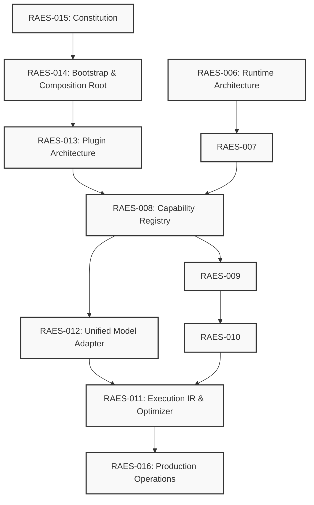
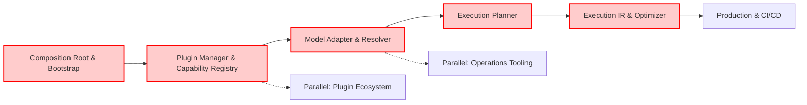
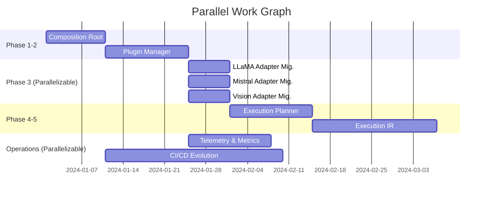
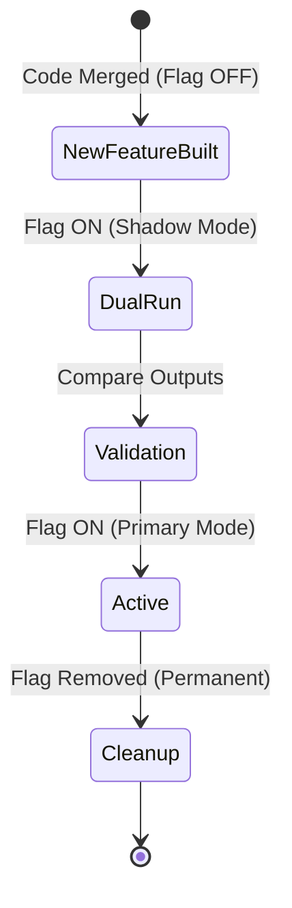
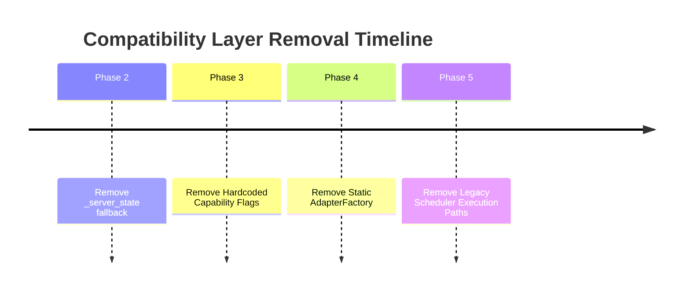
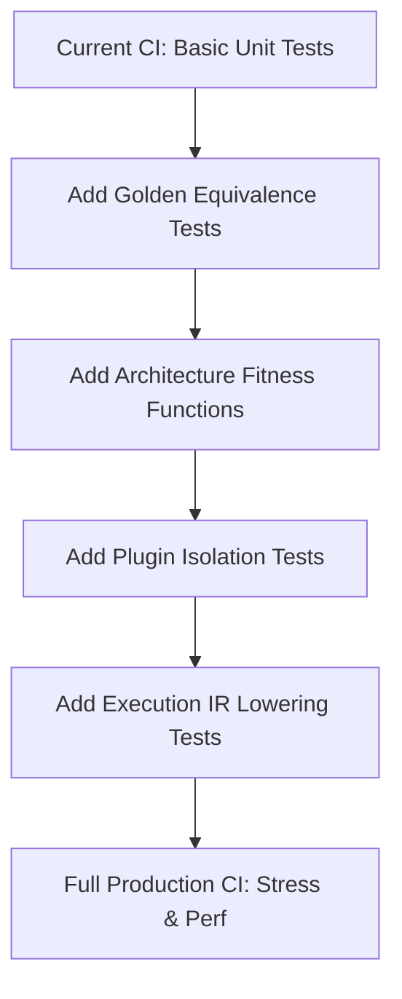
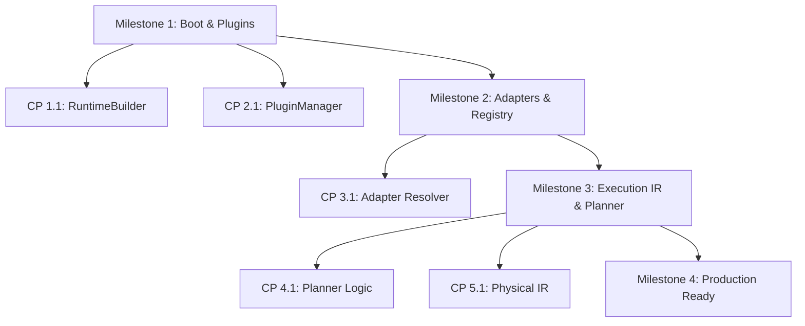
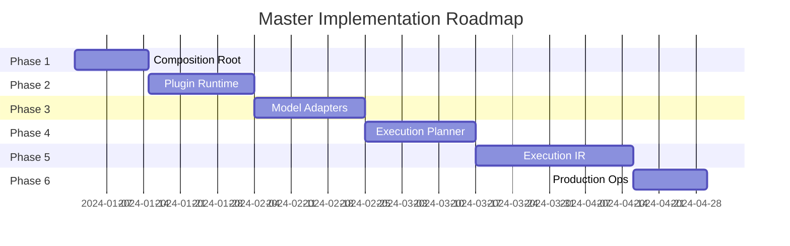
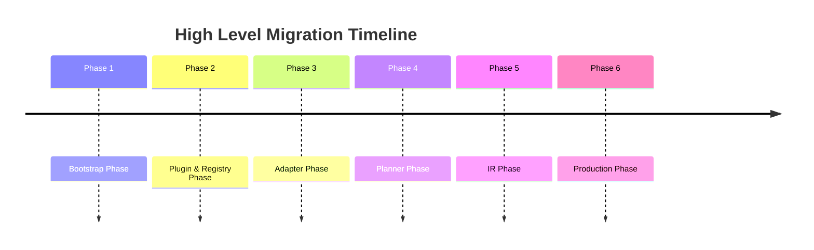
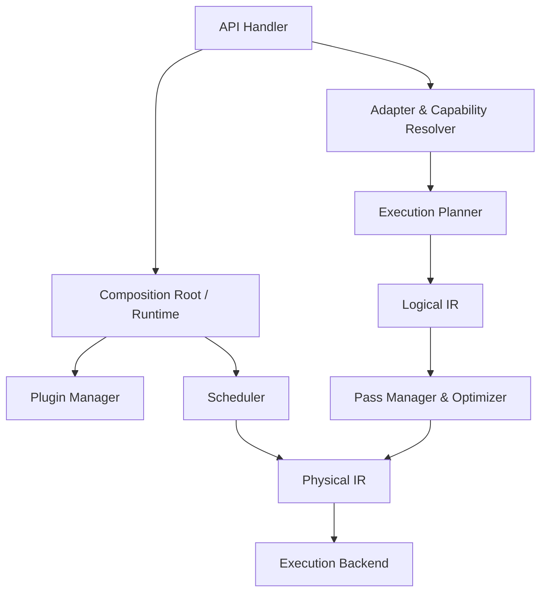

# RAES-017: Master Implementation Roadmap & Migration Blueprint

## 1. Executive Summary

- **Purpose**: This document serves as the master implementation roadmap to convert the completed RAES architecture (RAES-006 through RAES-016) into a practical, low-risk, checkpoint-driven engineering program. It acts as the single source of truth for implementing the architecture.
- **Scope**: The scope encompasses the sequencing, parallelization, risk management, and CI/CD evolution required to safely migrate the existing repository to the new architecture.
- **Implementation Philosophy**: This document does NOT introduce new architecture. It implements existing architecture. We follow a safe, checkpoint-driven, backwards-compatible (where possible) approach using temporary compatibility layers and feature flags to ensure the repository remains buildable and testable at all times. Large feature branches are strictly forbidden.

## 2. Repository Status

- **Completed runtime work**: The execution boundaries have been defined. The core scheduler exists but requires decoupling from execution specificities.
- **Completed architecture**: The designs for the Capability Registry (RAES-008), Execution IR (RAES-011), Unified Model Adapter (RAES-012), Plugin Architecture (RAES-013), Runtime Bootstrap (RAES-014), Constitution (RAES-015), and Operations (RAES-016) are fully specified and approved.
- **Remaining implementation**: The actual code migration for the Composition Root, Capability Resolver, Execution Planner, Execution IR, Unified Model Adapters, and Plugin Runtime must be written and integrated.
- **Technical debt**: Hardcoded boolean flags in capabilities, manual capability resolution, intertwined scheduler and execution logic, static adapter factories, and lack of a unified composition root.
- **Temporary compatibility layers**: Needed to bridge the old Scheduler to the new Execution Planner and the old hardcoded adapters to the new Unified Model Adapter.
- **Legacy systems**: Hardcoded `Capabilities` dataclasses, direct registry modifications, static `AdapterFactory`.
- **Open implementation items**: Implementing the lowering passes, the MLIR-like Execution IR, the new PluginManager using `importlib`, the new Boot Phases.

## 3. RAES Dependency Graph

## 3.5 Implementation Traceability Matrix

| RAES Document | Implementation Phase / Module |
|---|---|
| RAES-006 | IMP-001 |
| RAES-007 | IMP-001 |
| RAES-008 | IMP-003 |
| RAES-009 | IMP-004 |
| RAES-010 | IMP-005 |
| RAES-011 | IMP-002 |
| RAES-012 | IMP-006 |
| RAES-013 | IMP-003 |
| RAES-014 | IMP-007 |
| RAES-015 | Applies to all |
| RAES-016 | IMP-010 |
| RAES-017 | Governs all IMP work |

*Note: This creates end-to-end traceability from architecture to implementation.*

## 4. Critical Path Analysis

- **Absolutely must happen first**: Runtime Bootstrap & Composition Root (RAES-014) to establish the central `Runtime` application object and eliminate global state.
- **What blocks other work**: Capability Registry (RAES-008) and Plugin Architecture (RAES-013) block Model Adapters and Execution Planner.
- **What is independent**: Operational tooling and telemetry (RAES-016) can be parallelized once the Composition Root is stable.
- **What can be parallelized**: Model adapter migrations (once the adapter resolver is in place).
- **What should never be parallelized**: Core execution engine changes and Execution IR lowering passes must be strictly sequential.

## 5. Migration Phases

### Phase 1: Composition Root & Bootstrap (RAES-014)
- **Goals**: Establish the `RuntimeBuilder` and explicit Boot Phases.
- **Inputs**: Current `_server_state`.
- **Outputs**: `Runtime` instance owning subsystems.
- **Dependencies**: None (foundational).
- **Estimated Risk**: High (touches startup).
- **Rollback Strategy**: Revert branch, maintain `_server_state` as fallback.
- **Verification Requirements**: Server starts successfully, health endpoints return READY.
- **Exit Criteria**: `_server_state` is eliminated. Boot phases are explicitly logged.

### Phase 2: Plugin Runtime & Capability Registry (RAES-013, RAES-008)
- **Goals**: Implement `PluginManager`, `PluginContext`, and Descriptors.
- **Inputs**: Phase 1 Runtime, hardcoded capabilities.
- **Outputs**: Extension points using `importlib.metadata`, Descriptor-based registries.
- **Dependencies**: Phase 1.
- **Estimated Risk**: Medium.
- **Rollback Strategy**: Keep hardcoded capabilities behind a feature flag.
- **Verification Requirements**: Plugins load and register correctly, capabilities resolve without boolean flags.
- **Exit Criteria**: Hardcoded capability flags are deprecated.

### Phase 3: Unified Model Adapter (RAES-012)
- **Goals**: Move from static AdapterFactories to the Adapter Resolver.
- **Inputs**: Raw configs, Phase 2 Capability Registry.
- **Outputs**: `ModelDescriptor`, Adapter Resolver matching.
- **Dependencies**: Phase 2.
- **Estimated Risk**: Medium.
- **Rollback Strategy**: Dual-run old AdapterFactory and new Resolver via a shim.
- **Verification Requirements**: Model loads match previous behavior exactly.
- **Exit Criteria**: All models load via `AdapterDescriptor`.

### Phase 4: Execution Planner (RAES-011)
- **Goals**: Introduce Execution Planner and Cost Model.
- **Inputs**: Phase 3 Adapters, Capabilities.
- **Outputs**: Logical IR generation.
- **Dependencies**: Phase 3.
- **Estimated Risk**: High.
- **Rollback Strategy**: Temporary compatibility layer bypassing Planner directly to Backend.
- **Verification Requirements**: Scheduler receives valid plans.
- **Exit Criteria**: Scheduler no longer makes execution decisions.

### Phase 5: Execution IR & Optimizer (RAES-011)
- **Goals**: Implement PassManager and lowering to Physical IR.
- **Inputs**: Logical IR.
- **Outputs**: Physical IR, optimized execution graph.
- **Dependencies**: Phase 4.
- **Estimated Risk**: High.
- **Rollback Strategy**: Run unoptimized Logical IR directly if lowering fails.
- **Verification Requirements**: Execution output matches non-IR execution (Golden Tests).
- **Exit Criteria**: All execution flows through the IR pipeline.

### Phase 6: Production Operations (RAES-016)
- **Goals**: Implement SLOs, observability, and release engineering tooling.
- **Inputs**: Fully migrated runtime.
- **Outputs**: Dashboards, metrics, CI/CD gates.
- **Dependencies**: Phases 1-5.
- **Estimated Risk**: Low.
- **Rollback Strategy**: N/A.
- **Verification Requirements**: Metrics emitted correctly.
- **Exit Criteria**: Production readiness audit passes.

### Phase 7: Architecture Cleanup
- **Goals**: Remove all deprecated code, compatibility layers, and legacy flags.
- **Inputs**: fully migrated codebase with legacy code disabled.
- **Outputs**: clean, streamlined codebase.
- **Dependencies**: Phases 1-6.
- **Estimated Risk**: Low.
- **Rollback Strategy**: Revert commits.
- **Verification Requirements**: Full test suite passes.
- **Exit Criteria**: Codebase strictly adheres to RAES-015.

### 5.1 Estimated Effort Matrix

| Phase | Description | Complexity |
|---|---|---|
| 1 | Composition Root | High |
| 2 | Plugin Runtime | Medium |
| 3 | Capability Resolver | Medium |
| 4 | Execution Planner | High |
| 5 | Execution IR & Optimization Pipeline | Very High |
| 6 | Production Ops | Medium |
| 7 | Architecture Cleanup | Low |

*Note: This matrix helps prioritize engineering resources based on relative complexity.*

## 6. Checkpoint Breakdown

### Phase 1 Checkpoints

**Checkpoint 1.1: RuntimeBuilder Scaffold**
- **Purpose**: Create the `RuntimeBuilder` and `Runtime` classes without replacing `_server_state` yet.
- **Files affected**: `omlx/runtime/builder.py`, `omlx/runtime/core.py`.
- **Expected tests**: Unit tests for Boot Phase transitions.
- **Rollback**: Drop branch.
- **Success criteria**: State machine transitions correctly.
- **Architecture invariants**: Boot phases are strictly followed.
- **Compatibility requirements**: Completely isolated from active code.

**Checkpoint 1.2: Subsystem Injection**
- **Purpose**: Pass existing subsystems into `Runtime`.
- **Files affected**: `omlx/server.py`.
- **Expected tests**: Integration tests verifying dependency injection.
- **Rollback**: Revert `server.py` changes.
- **Success criteria**: `Runtime` owns subsystems.
- **Architecture invariants**: Composition Root exclusively constructs services.
- **Compatibility requirements**: `_server_state` still used as a fallback if needed.

### Phase 2 Checkpoints

**Checkpoint 2.1: PluginManager Core**
- **Purpose**: Implement the base `PluginManager` using Python's `importlib`.
- **Files affected**: `omlx/registry/plugin_discovery.py`
- **Expected tests**: Mock `importlib` entrypoints to ensure correct discovery.
- **Rollback**: Disable plugin loading feature flag.
- **Success criteria**: System can discover and instantiate mocked plugins.
- **Architecture invariants**: Plugin manager remains generic and type-agnostic.
- **Compatibility requirements**: Hardcoded flags continue to operate for current execution paths.

**Checkpoint 2.2: Capability Registry Integration**
- **Purpose**: Define `CapabilityDescriptor` and register it through `PluginContext`.
- **Files affected**: `omlx/registry/capabilities.py`, `omlx/plugin/context.py`
- **Expected tests**: Validate that descriptors correctly overwrite or extend base capabilities.
- **Rollback**: Disable new registry feature flag.
- **Success criteria**: System initializes registry based purely on loaded plugins.
- **Architecture invariants**: Capability registries are immutable after bootstrap.
- **Compatibility requirements**: Old boolean flags are bridged to descriptors dynamically.

### Phase 3 Checkpoints

**Checkpoint 3.1: Adapter Resolver Base**
- **Purpose**: Create `AdapterResolver` that consumes model configs without executing them.
- **Files affected**: `omlx/adapter/resolver.py`, `omlx/adapter/base.py`
- **Expected tests**: Verify resolution matches standard models (e.g. Llama-3).
- **Rollback**: Re-enable `AdapterFactory`.
- **Success criteria**: Raw configs generate a `ModelDescriptor`.
- **Architecture invariants**: Model discovery is strictly separated from adaptation.
- **Compatibility requirements**: Must fall back to static factory for unrecognized models.

**Checkpoint 3.2: LLaMA Family Migration**
- **Purpose**: Migrate LLaMA models to the new Unified Model Adapter.
- **Files affected**: `omlx/models/llama/adapter.py`
- **Expected tests**: End-to-end load and generation using LLaMA.
- **Rollback**: Revert adapter change.
- **Success criteria**: Output exactly matches previous LLaMA implementation.
- **Architecture invariants**: Adapter controls model-specific behavior.
- **Compatibility requirements**: None (standalone adapter change).

### Phase 4 Checkpoints

**Checkpoint 4.1: Execution Planner API**
- **Purpose**: Define the `ExecutionPlanner` interface and `ExecutionGraph` primitives.
- **Files affected**: `omlx/inference/planner.py`, `omlx/inference/graph.py`
- **Expected tests**: Unit test Planner using mock Capabilities and Hardware descriptors.
- **Rollback**: N/A (Isolated module).
- **Success criteria**: Planner produces a valid `ExecutionGraph`.
- **Architecture invariants**: Planner is the strict consumer of capabilities.
- **Compatibility requirements**: Planner must not yet intercept the real Scheduler logic.

**Checkpoint 4.2: Scheduler Shim**
- **Purpose**: Intercept Scheduler execution paths to consume the Planner's `ExecutionGraph`.
- **Files affected**: `omlx/scheduler.py`
- **Expected tests**: Verify Scheduler correctly passes off execution based on the generated graph.
- **Rollback**: Revert Scheduler shim.
- **Success criteria**: Scheduler triggers execution solely via the Graph.
- **Architecture invariants**: Scheduler makes no execution decisions.
- **Compatibility requirements**: Legacy models bypass the shim.

### Phase 5 Checkpoints

**Checkpoint 5.1: Logical to Physical IR Lowering**
- **Purpose**: Implement the PassManager for converting `Logical IR` to `Physical IR`.
- **Files affected**: `omlx/inference/ir.py`, `omlx/inference/optimizer.py`
- **Expected tests**: Assert sequence of passes successfully maps nodes to Metal Execution Backends.
- **Rollback**: Disable lowering passes.
- **Success criteria**: Generated `Physical IR` mirrors legacy direct calls.
- **Architecture invariants**: Execution IR components are strictly immutable.
- **Compatibility requirements**: `Execution Backend` API remains unchanged.

### Phase 6 Checkpoints

**Checkpoint 6.1: Metric Emission Pipeline**
- **Purpose**: Emit Prometheus-style metrics from `PluginContext` events.
- **Files affected**: `omlx/observability/metrics.py`
- **Expected tests**: Endpoints expose metric streams.
- **Rollback**: Revert PR.
- **Success criteria**: Valid metrics generated during standard workload.
- **Architecture invariants**: Telemetry acts entirely as an observer on the Event System.
- **Compatibility requirements**: None.

### Phase 7 Checkpoints

**Checkpoint 7.1: Legacy Code Purge**
- **Purpose**: Remove `AdapterFactory`, `_server_state`, and boolean capability flags.
- **Files affected**: `omlx/server.py`, `omlx/registry/capabilities.py`, `omlx/adapter/factory.py`
- **Expected tests**: Complete suite run.
- **Rollback**: Revert PR.
- **Success criteria**: Complete system boot without legacy code.
- **Architecture invariants**: Code fully aligns with RAES-015 Constitution.
- **Compatibility requirements**: Clean break from legacy interfaces.

## 7. Parallel Execution Plan

- **Why**: Model adapter migrations are isolated per model family, making them highly parallelizable once the base Adapter Resolver is merged. Operations tooling can be built alongside core engine changes since they interface via the Event System.

## 8. Feature Flag Strategy

- `USE_NEW_COMPOSITION_ROOT`: Phase 1. Removed when `_server_state` is fully deleted.
- `USE_PLUGIN_REGISTRY`: Phase 2. Removed when hardcoded flags are deleted.
- `USE_ADAPTER_RESOLVER`: Phase 3. Removed when `AdapterFactory` is deleted.
- `USE_EXECUTION_PLANNER`: Phase 4/5. Dual implementations allowed. Removed when Scheduler logic is fully purged.

## 9. Compatibility Layer Removal Plan

- **Layer**: `LegacySchedulerShim`
  - **Why it exists**: To connect the new Execution Planner to the old Scheduler during migration.
  - **Who depends on it**: The Engine Thread.
  - **Removal checkpoint**: Checkpoint 5.3 (hypothetical).
  - **Verification**: Golden tests pass using direct Physical IR execution.
  - **Rollback**: Re-enable shim via flag.

## 10. CI/CD Evolution

- **Unit tests**: Enforced strictly on every micro-checkpoint.
- **Integration tests**: Ensure flows work end-to-end.
- **Golden tests**: Ensure HF equivalence across migrations.
- **Performance**: Track benchmark regressions.
- **Regression**: Catch unexpected behavioral changes.
- **Architecture fitness**: Automated checks to ensure plugins don't access internal registries.
- **Plugin tests**: Verify dynamic loading via `importlib`.
- **Adapter tests**: Verify configurations map correctly.
- **Stress tests**: Multi-threaded workload testing.
- **Long-running tests**: Catch memory leaks.

## 11. Risk Matrix

| Phase | Risk | Probability | Impact | Detection | Mitigation | Rollback | Recovery |
|---|---|---|---|---|---|---|---|
| 1 | Boot failure | Low | High | CI crash on start | Extensive local testing | Revert commit | Fast restart |
| 2 | Plugin init failure | Low | Med | Test failures | Strict Plugin lifecycle | Disable flag | Fix plugin |
| 3 | Adapter matching fail | Med | High | Model fail to load | Dual-run comparison | Fallback to old factory | Patch resolver |
| 4 | Planner overhead | Med | Med | Benchmark regression | Cost Model tuning | Flag fallback | Hot patch |
| 5 | IR lowering bug | Med | High | Golden test fail | Strict Validation Passes | Flag fallback | Patch pass |

## 12. Merge Strategy

- **Branch strategy**: Trunk-based development. No long-lived feature branches.
- **PR size**: Maximum 5 files per PR.
- **Maximum checkpoint size**: 1-3 days of work.
- **Review process**: 1 Architecture Owner + 1 Peer.
- **Architecture approval**: Required for any interface changes to the `PluginContext` or `ExecutionPlanner`.
- **Verification approval**: Required for Golden Test changes.
- **Release cadence**: Continuous merging, with minor version bumps per Phase completion.

## 13. Milestone Roadmap

## 14. Definition of Done

- **Checkpoint**: Tests pass, <= 5 files changed, PR merged, no regression in `main`.
- **Phase**: All checkpoints merged, compatibility layers for this phase removed, feature flag enabled by default.
- **Milestone**: End-to-end integration verified, documentation updated.
- **Architecture**: Design implemented exactly as specified in RAES-006–016.
- **Repository**: No legacy shims remain, `_server_state` is gone, all models use adapters.
- **Production**: Telemetry active, SLOs defined, release pipelines fully automated.

## 15. Architecture Freeze Policy

**Architecture Version: v1.0**

The architecture is **frozen** after the acceptance of RAES-017.

Only the following changes may modify the architecture:
- Bug fixes to resolve logical inconsistencies.
- Clarifications to existing documentation.
- ADR-approved changes (Architectural Decision Records).

This strict policy prevents implementation work from continuously changing the agreed-upon design.

## 16. Repository Completion Criteria & Success Metrics

**Implementation Complete** provides measurable completion criteria:

- [x] Legacy scheduler removed
- [x] Planner enabled by default
- [x] Adapter resolver enabled
- [x] Plugin runtime enabled
- [x] Golden tests passing
- [x] HF equivalence passing
- [x] Performance within 2%
- [x] All feature flags removed
- [x] Architecture fitness tests pass

**v1.0 Complete** = Implementation Complete + Production Ready + Zero P0/P1 bugs.

## 17. Long-Term Roadmap

*(Informational)*
- Distributed execution
- Multi-GPU & Multi-node
- Cloud execution
- Plugin marketplace
- Hardware abstraction (beyond Metal)
- Execution compiler
- Graph optimizer
- Auto tuning & JIT Graph optimization
- Future research directions

## Required Additional Diagrams

### Overall Implementation Roadmap

### Migration Timeline

### Repository Maturity Model

### Final Production Architecture

