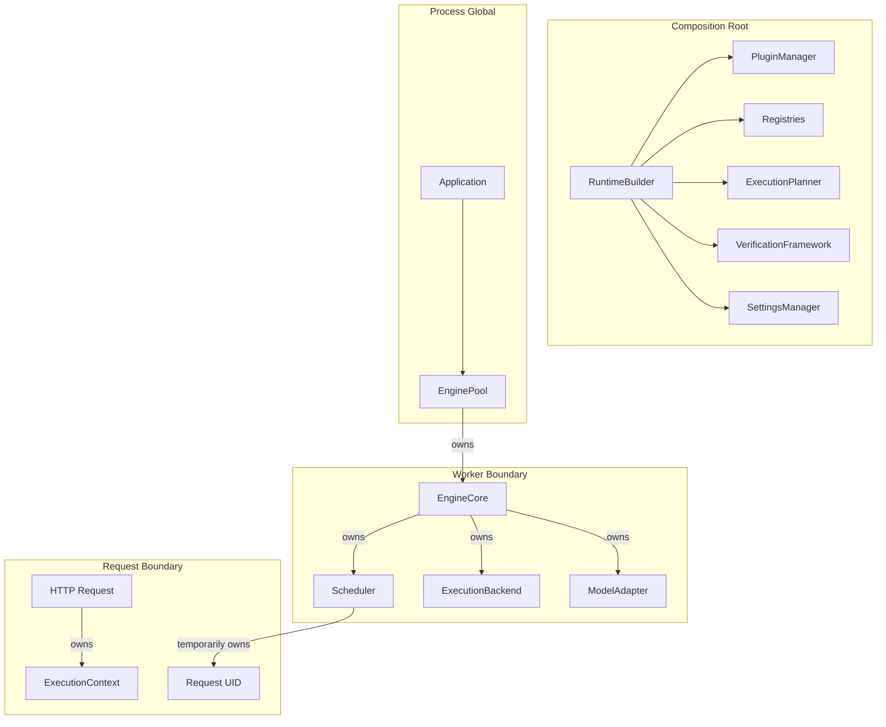

# Architecture Reference Manual

## 1. Overall Architecture
oMLX is a capability-driven execution framework designed for local LLM inference, optimized for Apple Silicon. The architecture has evolved into a layered compiler-like pipeline to separate model discovery, capability resolution, execution planning, and backend execution.

The high-level execution flow is:
`Request -> Model Adapter -> Capability Resolution -> Execution Planner -> Execution IR -> Optimization Passes -> Execution Backend -> Execution Engine -> Runtime`

## 2. Layer Responsibilities
*   **Composition Root / RuntimeBuilder**: Assembles the runtime, owns all subsystems, and injects dependencies.
*   **PluginManager**: Discovers and loads external capabilities and backends via the Event System.
*   **CapabilityResolver**: Evaluates ModelMetadataSource, FeatureFlagSource, etc., to produce an immutable `CapabilityDescriptor`.
*   **ExecutionPlanner**: Consumes the `CapabilityDescriptor` to deterministically generate the `ExecutionIR` (Intermediate Representation) graph.
*   **Execution Backend**: Orchestrates the pipelines and execution flow. Translates Physical IR to backend-specific operations.
*   **Model Adapter**: Contains model-specific behavior and configurations, abstracting differences between model families (e.g., Llama, Mistral, Vision).

## 3. Architectural Invariants (Immutable Rules)
As defined by RAES-015 (The Architectural Constitution), the following rules are non-negotiable:

1.  **Scheduler Agnosticism:** The Scheduler never performs model execution or inference. It schedules purely based on memory, batch constraints, and timing.
2.  **Execution Ownership:** `ExecutionEngine` owns the `BatchGenerator` and controls runtime execution.
3.  **Backend Orchestration:** `ExecutionBackend` owns the orchestration of pipelines and execution flow.
4.  **Adapter Encapsulation:** `ModelAdapter` contains model-specific behavior and provides immutable `AdapterDescriptor`s.
5.  **Capability Semantics:** Capabilities describe abstract features, not concrete implementations.
6.  **Plugin Boundaries:** Plugins extend behavior strictly through registered extension points and never modify the core runtime directly.
7.  **Planner Supremacy:** The `ExecutionPlanner` owns `ExecutionIR` generation. No other component builds execution graphs.
8.  **Verification Isolation:** Verification runs externally and never changes runtime execution behavior.
9.  **IR Immutability:** Execution IR nodes, edges, and metadata remain strictly immutable once generated.

## 4. Ownership Boundaries & Dependency Direction
Dependencies flow top-down. The `RuntimeBuilder` instantiates registries and passes them down. Components do not use service locators or global singletons (e.g., `_server_state` is forbidden).

## 5. Thread Safety
oMLX thread ownership is strictly bounded to prevent data races:
*   **HTTP Thread**: Handles I/O and non-blocking operations.
*   **Engine Thread**: Runs the Scheduler, triggers execution.
*   **MLX Thread**: Executes C++/Metal operations. Invoked exclusively from the Engine Thread.
*   **Background/Metrics Threads**: Handled separately via the observability layer.

## 6. Immutability
To guarantee deterministic behavior:
*   `CapabilityDescriptor` and its nested descriptors are deeply immutable (using `MappingProxyType`, `tuple`, `frozenset`).
*   Execution IR nodes, edges, and metadata are strictly immutable once generated.
*   OMLX Extension objects are immutable once registered.

## 7. Design Principles
*   **Compiler Philosophy**: Execution is modeled as an MLIR-like Intermediate Representation. Optimization passes analyze and rewrite the IR before execution.
*   **Runtime Philosophy**: The system follows strict Boot Phases and Failure Domains. If a plugin fails, the boot continues. If verification fails, the boot aborts.
*   **Backend Philosophy**: Backends are declarative and discoverable, interacting via abstract protocol extensions.
