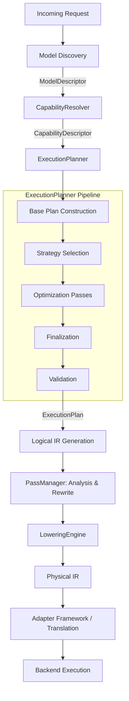

# Compiler Manual

## 1. Overview
The oMLX execution pipeline operates similarly to a modern compiler. Instead of direct static execution paths, requests are resolved into abstract capabilities, planned into a Logical Intermediate Representation (IR), lowered to a Physical IR, and then translated into backend-specific operations.

## 2. CapabilityResolver
The `CapabilityResolver` is the authoritative component for evaluating and merging capabilities.
- It consumes a normalized `ModelDescriptor` output by the Model Discovery phase.
- It resolves capabilities deterministically.
- Final outputs are encapsulated in a deeply frozen, immutable dataclass called `CapabilityDescriptor`.

### Capability Resolution Flow
The resolver evaluates inputs deterministically to prevent ambiguous execution states. Capability evaluation employs lazy evaluation for attributes that are computationally expensive to resolve (e.g., memory limits).

## 3. ExecutionPlanner
The `ExecutionPlanner` is the strict, exclusive consumer of `CapabilityDescriptor`s. It transforms them deterministically into an immutable `ExecutionPlan` dataclass without executing code or calling MLX.

### Planning Pipeline
The pipeline executes in multiple distinct phases within `ExecutionPlanner.plan()`:

1.  **Base Plan Construction**: Extracts direct mappings from the `CapabilityDescriptor` (e.g., Execution Family).
2.  **Execution Strategy Selection**: Determines the specific backend (`_select_backend`) and execution mode (`_select_mode`) based on capabilities like `supports_speculative` or `supports_streaming`.
3.  **Optimization Passes**: Iterates through the injected `PassRegistry` and applies each `PlanningPass`.
4.  **Finalization & Timing**: Records planning latency and freezes the dictionary into an `ExecutionPlan` dataclass.
5.  **Validation**: Passes the frozen plan to `validate_plan` to ensure structural integrity and logical consistency.

## 4. Intermediate Representation (IR)
The Execution Planner owns ExecutionIR generation. No other component builds execution graphs.
*   **Logical IR**: Represents the high-level semantic flow of the execution request (e.g., Prefill, Decode).
*   **Physical IR**: A backend-agnostic representation of operations ready for translation.

## 5. Optimization Pipeline & Lowering
Runtime optimization is orchestrated by a `PassManager`:
*   **Analysis Passes**: Produce metadata without mutating the IR.
*   **Rewrite Passes**: Guided by a Cost Model (evaluating latency, memory, and cache pressure) from the Planner, these passes rewrite the IR.
*   **Validation Passes**: Ensure the IR graph remains valid after optimization.

The `LoweringEngine` lowers Logical IR to generic Physical IR.

## 6. Backend Translation
The Adapter Framework handles translation from Physical IR to backend-specific operations (MLX, CUDA, Metal, etc.).

## 7. Compiler Pipeline Diagram

## 8. Compiler Ownership & Extension Points
*   **Ownership:** The `ExecutionPlanner` must be instantiated exclusively by the `RuntimeBuilder` and owned by the `Runtime`. Dependencies like `CapabilityResolver`, `FeatureFlags`, `RuntimeContext`, and Registries must be explicitly injected.
*   **Extension Points:** Plugins can provide new Compiler Passes or Optimization strategies via the `PassRegistry` and Event System, but they must adhere strictly to IR immutability rules.
