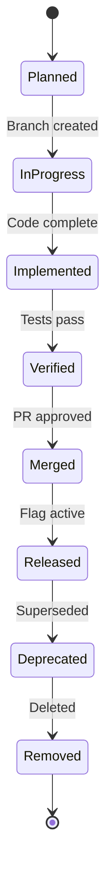
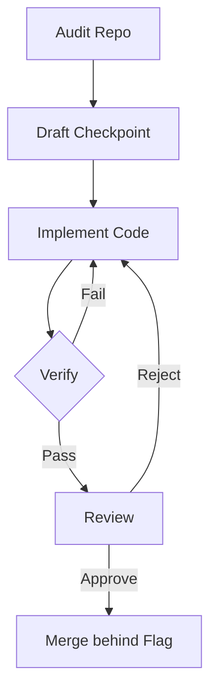
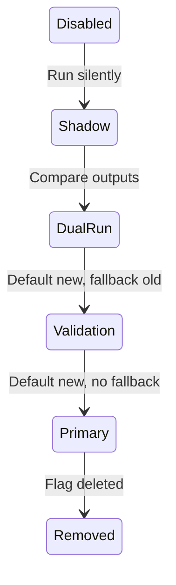
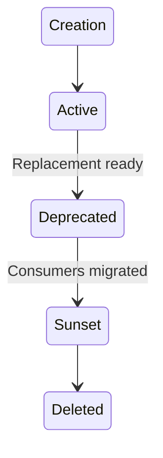
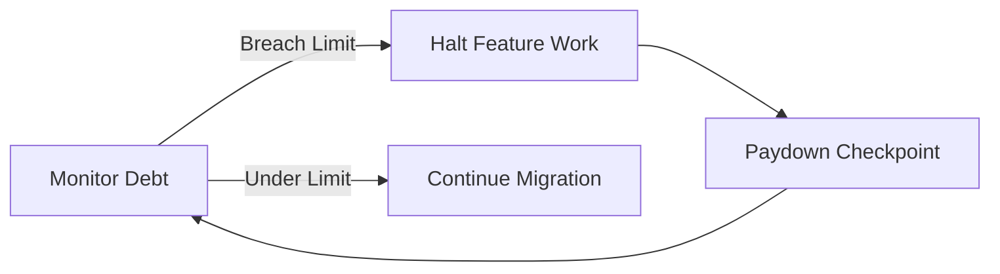
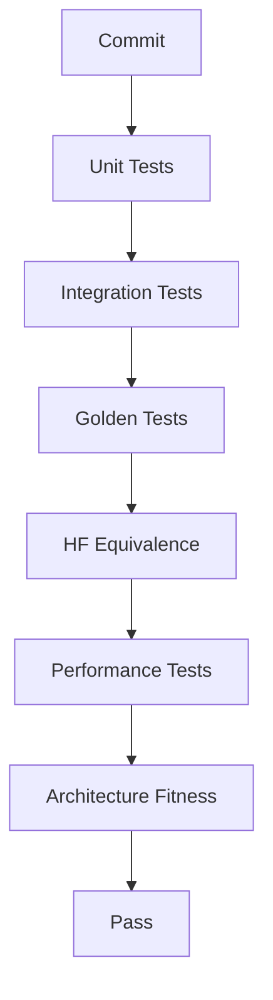
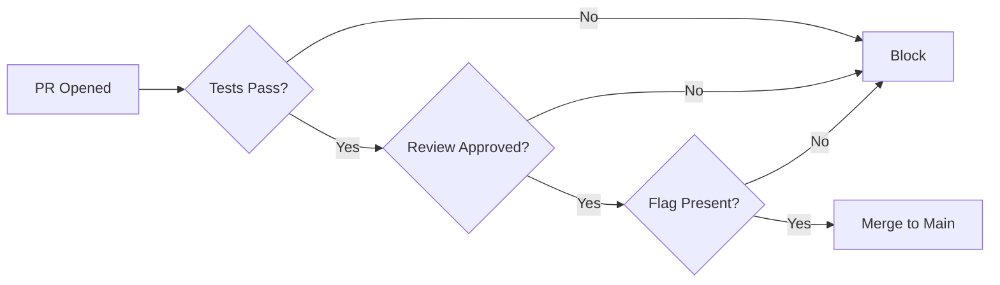
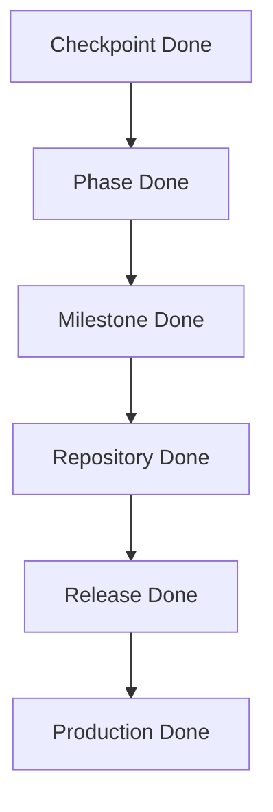
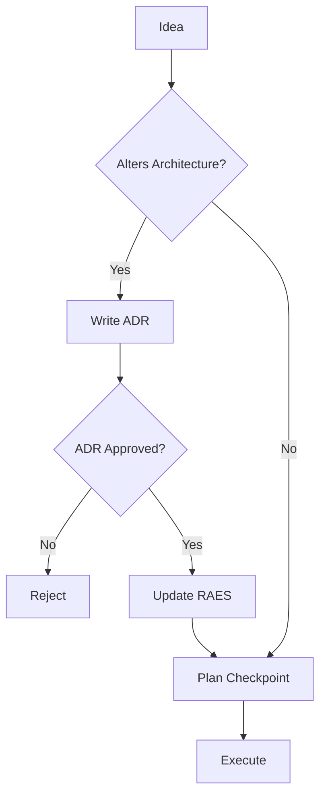
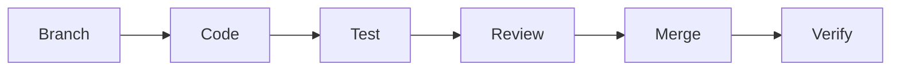

# IMP-000: Master Implementation Constitution & Engineering Playbook

## 1. Executive Summary

### Purpose
The Master Implementation Constitution defines the strict engineering, testing, and process rules required to safely migrate the oMLX repository to the target RAES architecture. It dictates *how* implementation must proceed without redefining *what* the architecture is.

### Scope
This document governs all future pull requests, feature flags, compatibility layers, and technical debt management for the oMLX repository. It applies universally to all implementation checkpoints.

### Relationship with RAES documents
This constitution explicitly assumes RAES-006 through RAES-017 as the authoritative, frozen architectural state. This document may never contradict or override those architectural blueprints; it solely defines the execution playbook to realize them.

### Relationship with verification framework
Implementation is inherently tied to the Verification Framework. No checkpoint is complete until it has demonstrably passed the prescribed verifications (unit tests, integration tests, golden tests, HF equivalence, performance tests, and architecture fitness).

### Relationship with future ADRs
Architectural changes or exceptions encountered during implementation must trigger an Architectural Decision Record (ADR). Implementation must pause or pivot until the ADR is formally approved, preventing undocumented architectural drift.

## 2. Implementation Philosophy

*   **Small checkpoints:** Engineering checkpoints must be broken down into independently testable micro-checkpoints touching a maximum of 2-5 files. No massive feature branches.
*   **Always buildable repository:** The `main` branch must remain deployable, testable, and functional at all times.
*   **Continuous verification:** Every change must be proven against regression baselines and architecture fitness tests before merging.
*   **Backward compatibility whenever possible:** Protect existing users by isolating new features behind compatibility layers until the old architecture is entirely deprecated.
*   **No architecture drift:** Implementation must strictly follow the RAES constitution. "Good ideas" that alter the architecture are rejected unless approved via an ADR.
*   **Feature flags first:** All new behaviors, especially destructive or high-risk paths, must be introduced via runtime feature flags.
*   **Delete temporary code quickly:** Compatibility shims and dual-run paths have strict expiration criteria.
*   **Scientific validation:** Performance and equivalence claims require numerical, reproducible backing (e.g., performance within 2% of baseline, identical tokens to Hugging Face).
*   **Incremental migration:** Replace the engine while the car is driving. Systems will be migrated component by component via dual-run or adapter layers.

## 3. Repository Rules

*   **Maximum files changed:** A single implementation PR must modify no more than 10 files (excluding test suites and documentation). Micro-checkpoints (2-5 files) are heavily preferred.
*   **Maximum PR size:** No PR may exceed 500 lines of modified code (additions + deletions), excluding generated code and test data.
*   **Maximum checkpoint duration:** No feature branch may live longer than 3 days without merging or rebasing.
*   **Merge frequency:** Branches must be merged to `main` incrementally.
*   **Review requirements:** All PRs require at least one approving review focusing explicitly on architectural compliance and testing.
*   **Branch strategy:** Short-lived feature branches (`feature/checkpoint-name`), merging continuously into `main` behind feature flags.
*   **Commit conventions:** Commits must be atomic, passing tests independently, with descriptive messages prefixing the related IMP or RAES code (e.g., `feat(IMP-001): implement adapter resolver`).
*   **Release cadence:** Releases are cut iteratively based on verified checkpoints and must follow semantic versioning.

### PR Template

| Section | Description |
| :--- | :--- |
| **Title** | `feat(IMP-00X): brief description` |
| **Type** | Feature / Fix / Refactor / Docs |
| **Checkpoint** | Link to IMP document/issue |
| **Verification** | Link to successful CI run and perf results |
| **Rollback** | Specific steps to revert if merged |

## 4. Checkpoint Rules

Every implementation checkpoint must include the following documented artifacts in its PR/Commit description:

*   **Purpose:** The business/engineering reason for the checkpoint.
*   **Scope:** Explicit boundaries of what is included and what is deferred.
*   **Repository audit:** Current state of affected components.
*   **Files modified:** Explicit list of targeted files.
*   **Files intentionally untouched:** Explicit list of explicitly excluded files to prevent scope creep.
*   **Architecture invariants:** Which RAES principles are being upheld.
*   **Verification plan:** How this code will be tested.
*   **Rollback plan:** Immediate actions if the code breaks production.
*   **Walkthrough:** Step-by-step logic summary.
*   **Completion report:** Final outcomes vs initial plan.
*   **Regression report:** Proof that existing tests pass.
*   **Performance report:** Impact on latency, memory, or throughput.
*   **Remaining work:** Hand-off notes for the next checkpoint.

### Checkpoint Template

| Field | Description |
| :--- | :--- |
| **Checkpoint ID** | e.g., IMP-001-Phase1 |
| **Owner** | Primary implementer |
| **Target RAES** | Associated architecture document |
| **Feature Flag** | `USE_NEW_COMPONENT` |
| **Verification** | Passed [Yes/No] |
| **Rollback Trigger** | e.g., >2% latency regression |

## 5. Coding Rules

*   **Dependency injection only:** Top-down flow, explicit state passing. No implicit global state resolution.
*   **No new globals:** Global singletons (like `_server_state`) are strictly forbidden. Use the Composition Root.
*   **No service locator:** Registries must be injected, not globally discovered at runtime.
*   **No circular imports:** Strict DAG dependency structure enforced by architecture fitness tests.
*   **No runtime magic:** `getattr` manipulation, dynamic `eval()`, and monkey-patching outside the official Patch Pipeline are forbidden.
*   **Explicit ownership:** Every component must have a clear, documented owner (e.g., ExecutionPlanner owns ExecutionIR).
*   **Small interfaces:** Interfaces (Extension Points, Traits) must be granular and strictly typed.
*   **Composition over inheritance:** Use Capabilities/Traits as metadata plugins rather than complex Python class hierarchies.
*   **Immutable descriptors:** Configurations and metadata (CapabilityDescriptor, AdapterDescriptor) must be immutable once loaded.
*   **Strong typing:** 100% type hinting required for all new code.
*   **Minimal public APIs:** Internal components must not expose internal state. Use explicit boundaries.

## 6. Temporary Compatibility Layer Rules

Temporary compatibility layers are necessary evils for incremental migration. They are subject to strict governance.

Every compatibility layer must document:
*   **Owner:** Engineer responsible for its removal.
*   **Reason:** Why a clean break isn't possible right now.
*   **Creation checkpoint:** When it was introduced.
*   **Removal checkpoint:** The explicit future checkpoint when it *must* be removed.
*   **Verification:** Tests ensuring the shim perfectly mimics old behavior.
*   **Feature flag:** The shim must be toggleable.
*   **Rollback:** Steps to revert to the unshimmed legacy path.
*   **Deletion criteria:** What conditions trigger the removal.

**Golden Rule:** Temporary layers may *never* become permanent architecture.

### Compatibility Layer Tracking

| Layer Name | Owner | Reason | Introduced | Expiration Checkpoint | Status |
| :--- | :--- | :--- | :--- | :--- | :--- |
| `LegacySchedulerShim` | - | Wrap old scheduler to generic API | IMP-001 | IMP-005 | Active |

## 7. Feature Flag Policy

All architectural changes must be protected by feature flags to ensure a safe, incremental rollout.

*   **Naming convention:** Flags must be prefixed with `OMLX_FF_`, followed by the feature name and status (e.g., `OMLX_FF_ENABLE_NEW_PLANNER`).
*   **Lifecycle:** Flags must progress linearly: `Disabled Default` -> `Shadow Mode` -> `Validation Mode` -> `Primary Mode` -> `Removed`.
*   **Shadow mode:** The new code path executes alongside the old path, but its outputs are discarded. Used to measure performance impact and catch runtime crashes without affecting state.
*   **Dual-run mode:** Both paths execute, and their results are compared. Inconsistencies trigger logs or metrics, but the old path's output is returned.
*   **Validation mode:** New path is the default, but a fallback to the old path exists if verification fails.
*   **Primary mode:** New path is the absolute default. The fallback exists only as an emergency abort.
*   **Removal:** The flag and the legacy code path are entirely deleted from the repository.
*   **Forbidden patterns:** Dynamic flag toggling mid-request is forbidden. Flags evaluate exactly once at the system boundary or composition root.

### Feature Flag Lifecycle

| Phase | Description | Output Used | Allowed Failures |
| :--- | :--- | :--- | :--- |
| Shadow | Run silently | Legacy | Ignored |
| Dual-Run | Run both, diff | Legacy | Logged |
| Validation | Run new, fallback to old | New | Fallback triggered |
| Primary | Run new only | New | Fatal |
| Removed | Flag deleted | New | N/A |

## 8. Verification Rules

Testing is non-negotiable. No checkpoint merges without absolute proof of health.

Every checkpoint must pass:
*   **Unit tests:** Isolated component logic using mocked dependencies.
*   **Integration tests:** Cross-component execution, usually via the HTTP or Engine boundary.
*   **Golden tests:** Specific prompts must yield deterministic, exact character-for-character responses.
*   **HF equivalence:** Numerical parity with standard Hugging Face implementations (logits, perplexity).
*   **Performance tests:** Latency and throughput must remain within 2% of the established baseline.
*   **Architecture fitness tests:** Automated checks enforcing dependency rules (e.g., UI cannot import Engine directly).
*   **Regression suite:** All existing bugs previously fixed must remain fixed.
*   **Memory validation:** Strict checks to ensure no process memory enforcer leaks or OOM conditions occur during steady state.
*   **Long-running tests:** The server must survive 24 hours of simulated varied load without degradation.

**Rule:** A single failing verification blocks the merge pipeline.

## 9. Documentation Rules

Code is incomplete if undocumented.

Every checkpoint must explicitly update:
*   **Architecture:** Relevant `RAES` or `docs/architecture` files if clarification is needed (no drift).
*   **Walkthrough:** Step-by-step developer guides for new pathways.
*   **Implementation report:** Summarizing what was accomplished vs the checkpoint plan.
*   **Migration status:** Updating the overall roadmap traceability matrix.
*   **Verification report:** Linking to CI/CD runs and performance benchmarks.
*   **Changelog:** User-facing and developer-facing notes.

## 10. Code Review Constitution

Reviewers act as the guardians of the Constitution.

### Review Checklist

| Category | Check | Status |
| :--- | :--- | :--- |
| **Architecture** | Does this violate any RAES invariant? | [] |
| **Performance** | Are memory or latency negatively impacted? | [] |
| **Compatibility** | Does this break existing CLI/API clients? | [] |
| **Testing** | Is there 100% test coverage for new paths? | [] |
| **Verification** | Do golden tests and HF equivalence pass? | [] |
| **Rollback** | Is there a feature flag to disable this safely? | [] |
| **Documentation**| Are descriptors, interfaces, and walkthroughs updated? | [] |
| **Public API** | Are internal methods properly hidden? | [] |
| **Security** | Does this introduce prompt injection or path traversal vulnerabilities? | [] |

## 11. Migration Rules

Migration must be safe, continuous, and explicit.

*   **Allowed:** Introducing a new interface alongside an old one. Adding adapters to wrap legacy logic. Using feature flags to slowly shift traffic.
*   **Deprecated:** Marking old components with `@deprecated`. Warning logs indicating an impending sunset.
*   **Forbidden:** Overwriting legacy code directly without a fallback. Hardcoding behavior specific to a single model family.
*   **When compatibility layers may be introduced:** Only when blocking an architectural migration, and only with a strict, written expiration date.
*   **When compatibility layers must be removed:** The instant the last consumer of the legacy API has been migrated.

## 12. Implementation Status Model

Checkpoints progress through an explicit state machine:

*   **Planned:** Documented, scoped, queued.
*   **In Progress:** Branch created, code being written.
*   **Implemented:** Code complete locally.
*   **Verified:** CI pipeline passed, performance confirmed, equivalence validated.
*   **Merged:** Code is in the `main` branch, typically behind a shadow flag.
*   **Released:** Code is active in production, flag is in validation/primary mode.
*   **Deprecated:** Code is scheduled for removal in a future checkpoint.
*   **Removed:** Dead code deleted.

### Implementation Maturity

| State | Entry Criteria | Exit Criteria |
| :--- | :--- | :--- |
| Planned | PR drafted | Work begins |
| In Progress | Work begins | Code complete |
| Implemented | Code complete | Tests pass |
| Verified | Tests pass | Approved review |
| Merged | Approved review | Released to prod |

## 13. Repository Health Rules

To prevent the migration from creating an unmaintainable state, the repository must respect specific limits on technical debt.

### Repository Health Metrics

| Metric | Limit | Action on Breach |
| :--- | :--- | :--- |
| **Maximum technical debt** | 5 known issues max | Halt feature work, fix debt |
| **Maximum compatibility layers** | 3 active max | Delete oldest before adding new |
| **Maximum feature flags** | 5 active max | Promote/remove oldest flag |
| **Maximum deprecated APIs** | 1 version window | Hard delete on next minor version |

*   **Required cleanup frequency:** Every 4th checkpoint must be exclusively dedicated to code deletion, technical debt paydown, and documentation alignment.

## 14. Definition of Done

The definition of "done" scales based on the scope of work.

*   **Checkpoint:** Code is written, tested locally, reviewed, and merged behind a feature flag. Documentation is updated.
*   **Phase:** A collection of related checkpoints (e.g., all of RAES-010 Execution Planner) is merged, the feature flag is flipped to Primary, and old code is deleted.
*   **Milestone:** A significant end-to-end user capability (e.g., Unified Model Adapters) is verified and performance-tested against baselines.
*   **Repository:** The entire RAES migration is complete, the legacy scheduler is deleted, HF equivalence is verified, and architecture fitness tests pass 100%.
*   **Release:** Code is packaged, signed, and deployed to end-users via Homebrew/macOS apps.
*   **Production:** No rollbacks occurred for 7 days post-release. Telemetry confirms expected latency.

## 15. Risk Management

Every implementation introduces risk. We manage this explicitly.

*   **Risk levels:**
    *   *Low:* UI tweaks, documentation.
    *   *Medium:* New model support, isolated plugin changes.
    *   *High:* Core engine changes, scheduler modifications, memory management.
*   **Escalation:** Any failure in a High-Risk deployment requires immediate escalation to the primary maintainer.
*   **Rollback:** If a feature flag causes a P1 bug (crash, memory leak), immediately flip the flag to False. No root-cause analysis is performed on a bleeding system. Revert first, investigate later.
*   **Hotfix:** If a rollback is impossible, a hotfix PR is created. It skips slow tests but *must* pass unit and integration tests.
*   **Emergency revert:** If `main` is broken, the offending PR is `git revert`ed immediately. Do not attempt to "fix forward" a broken `main` branch.
*   **Architecture review triggers:** Any change that requires touching >3 subsystems, alters the critical execution path, or drops performance by >5% triggers a mandatory Architecture Review Board meeting before proceeding.

### Risk Matrix

| Risk Level | Component | Review Requirement | Rollback Strategy |
| :--- | :--- | :--- | :--- |
| High | Engine/Scheduler | Dual Review + Perf | Feature Flag Flip |
| Medium | Models/API | Single Review | Revert PR |
| Low | Docs/CLI | Peer Review | Fix Forward |

## 16. Governance

Governance defines the human element of implementation.

*   **Who approves:** Only designated repository maintainers can approve architectural checkpoints.
*   **Who reviews:** Any engineer can review, but a Maintainer must stamp the final approval.
*   **Who can change architecture:** No one can unilaterally change the architecture.
*   **When ADR required:** If an implementation discovers the architecture is impossible to implement cleanly, or a significantly better path exists, an ADR is written, debated, and approved *before* code is written.
*   **When implementation may proceed:** When the checkpoint plan is approved, the PR is open, and all tests pass.

## 17. Long-Term Maintenance

*   **Repository evolution:** Post-migration, the repository enters a strict LTS (Long Term Support) phase. Major changes require new RAES documents.
*   **Cleanup policy:** "Leave the campsite cleaner than you found it." Dead code, stale comments, and unused imports must be ruthlessly pruned during every checkpoint.
*   **Documentation maintenance:** The Constitution, Architecture, and Runbooks must be treated as executable code. If they drift from reality, it is considered a P1 bug.
*   **Verification maintenance:** The Golden Test suite must be continually expanded. If a user reports a bug, a regression test must be added *before* the fix is implemented.
*   **Performance baseline maintenance:** Hardware changes over time. Baselines must be re-calibrated quarterly on standard M-series hardware to prevent "boiling frog" performance degradation.

## Required Diagrams

## 18. IMP-001 Recommendations

Before starting IMP-001 (presumably addressing the first component of RAES-017's Migration Blueprint), the following actions are strictly required:

1.  **Baseline Generation:** Ensure a comprehensive performance baseline is recorded (latency, throughput, memory usage) for the current production architecture.
2.  **Test Suite Audit:** Verify the Golden Test suite and HF equivalence tests are robust enough to catch logic drift. If they lack coverage on edge cases, IMP-001 Phase 0 must exclusively expand test coverage.
3.  **CI/CD Pipeline Freeze:** Ensure no ongoing changes are happening to the CI pipelines to prevent testing noise.
4.  **Initial Feature Flag Infrastructure:** If feature flags are currently implemented loosely via environment variables, standardizing the feature flag evaluation mechanism must be the very first step of IMP-001.
