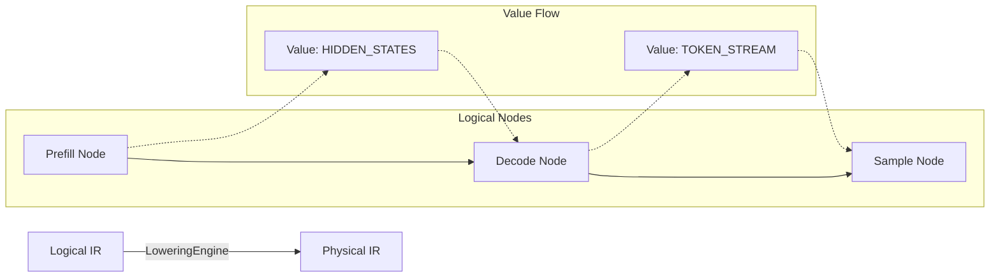

# Execution IR Manual

## 1. Overview
oMLX models execution as an MLIR-like Intermediate Representation (Execution IR). This approach decouples the complex orchestration of generation from the underlying backend implementations.

The IR is separated into two tiers:
*   **Logical IR:** Represents the high-level semantic data flow (e.g., Prefill, Sample, Output).
*   **Physical IR:** A backend-agnostic but structurally lowered representation (e.g., generic FORWARD, SAMPLING operations) ready to be mapped to a specific backend.

## 2. The Graph Model (`ExecutionIR`)
The ExecutionIR is represented as an instance of the `ExecutionIR` class, which holds:
-   `nodes`: A dictionary mapping node IDs to `IRNode` instances.
-   `roots`: A tuple of root node IDs, signifying the start of the execution graph.

## 3. Node System (`IRNode`)
Each step in the Directed Acyclic Graph (DAG) is represented by an `IRNode`.
Nodes possess the following properties:
-   `id`: A unique identifier for the node.
-   `node_type`: Sourced from the `IRNodeType` enum (e.g., Prefill, Forward, Sample, Verify, Emit).
-   `dependencies`: A tuple of node IDs that this node depends on, establishing the flow of execution.
-   `metadata`: An immutable key-value map providing diagnostics, execution hints, or debugging information.

## 4. Value System & Semantic Data Flow
Semantic Data Flow in oMLX is modeled using immutable `Value` and `ValueType` classes (e.g., `TOKEN_STREAM`, `HIDDEN_STATES`). These values "flow" between nodes, transforming the Execution IR into a semantic data-flow dependency graph. This explicit flow allows optimization passes to analyze exact data lifecycles.

## 5. Architectural Invariants
*   **Immutability:** Execution IR components (nodes, edges, metadata, Values) are strictly immutable once generated. Passes in the `PassManager` do not mutate existing IR; rewrite passes output a new, transformed IR graph.

## 6. Extensibility
Future graph node categories are simply added to the `IRNodeType` enum. The graph-based design inherently supports arbitrary topologies, allowing for speculative decoding and diffusion generation execution flows without requiring modifications to the core scheduler or engine logic.

## 7. IR Flow Diagram

