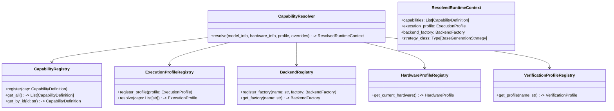
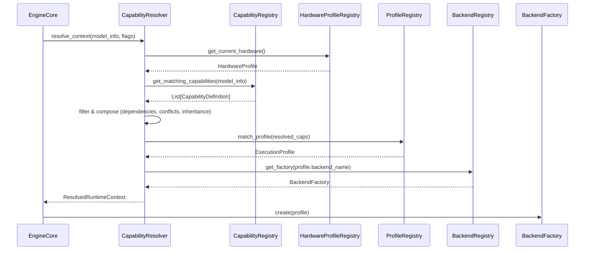

# RAES-008: Runtime Capability Registry & Capability Resolution

## 1. Repository Audit

A comprehensive audit of the codebase has been conducted to locate where execution decisions, backend selection, and capability inferences are currently hardcoded.

### Hardcoded Locations Identified
- **`omlx/runtime/capabilities.py`**:
  - `ModelCapabilities`, `EngineCapabilities`, and `ActualCapabilities` are static dataclasses with hardcoded boolean flags (`supports_diffusion`, `supports_linear_speculation`, etc.).
  - `ActualCapabilities.resolve` uses manual, hardcoded `and` combinations to intersect model, engine, and feature flags.
  - `infer_capabilities` relies on hardcoded string matching (`if "diffusion" in model_type or model_type == "nemotron_labs_diffusion":`).
- **`omlx/inference/execution_profile.py`**:
  - `_default_resolver` contains hardcoded mapping from model types to backend profiles.
  - `ExecutionProfileRegistry.resolve` contains hardcoded capability negotiation (fallback logic from diffusion/linear_speculation to autoregressive).
  - Backend factories (`_autoregressive_factory`, `_experimental_nemotron_factory`) are hardcoded at module initialization.
- **`omlx/registry/model_info.py`**:
  - `build_model_info` contains static, hardcoded logic for setting modes and attention types based on specific capability boolean flags.
- **`omlx/registry/capability_registry.py`**:
  - `GenerationStrategyRegistry.resolve_mode` applies hardcoded fallback logic (checking `capabilities.supports_diffusion` and so on).
  - `register_default_strategies` is hardcoded.
- **`omlx/engine_core.py`**:
  - Combines capabilities, configures the context, resolves the execution profile, and builds the strategy registry inline.

## 2. Architecture Review

The current architecture is highly coupled to specific generation modes (Autoregressive, Diffusion, Speculative) via boolean fields and `if/else` statements. The introduction of new modes or models requires modifications to core runtime classes.

**Goal**: Move to a declarative registry where capabilities are registered, discovered, and resolved via a generic `ResolutionEngine`. This insulates core components (like `Scheduler`, `EngineCore`) from execution logic. In the long term, this feeds into the target abstraction chain: `Capabilities -> Execution Planner -> Execution Plan -> Execution Graph -> Backend`.

## 3. Capability Registry Design

The new registry will handle dynamic registration of capabilities.

- **`CapabilityDefinition`**: Defines a capability dynamically (id, display_name, description, dependencies, conflicts, inheritance).
- **`CapabilityRegistry`**: Stores and provides lookups for all defined capabilities.

Example JSON-like structure for a capability:
```python
@dataclass
class CapabilityDefinition:
    id: str  # e.g., "transformer.autoregressive"
    display_name: str
    description: str
    supported_models: list[str]  # Architectures
    supported_backends: list[str]
    hardware_requirements: list[str] # e.g., ["metal.unified_memory"]
    dependencies: list[str] = field(default_factory=list) # e.g., ["attention.causal"]
    conflicts: list[str] = field(default_factory=list) # e.g., ["attention.diffusion"]
    priority: int = 0
    inherits_from: str | None = None  # For inheritance, e.g., "transformer.autoregressive" -> "transformer.speculative"
    default_parameters: dict[str, Any] = field(default_factory=dict)
    experimental: bool = False
    verification_profile: str | None = None
```

## 4. Resolution Engine Design

The `CapabilityResolver` (or `ResolutionEngine`) will be responsible for composing and resolving runtime components dynamically.

**Inputs**:
1. `ModelMetadata` (from `config.json` and loaded structure)
2. `HardwareCapabilities`
3. `UserOverrides` (Feature Flags, explicit selections)
4. `Execution Profile`

**Process**:
1. Query `CapabilityRegistry` to find all capabilities that match the model and inherit properly.
2. Filter capabilities against `HardwareCapabilities`, `UserOverrides`, and the `Execution Profile`.
3. Resolve dependencies and remove conflicts (using topological sort/graph resolution).
4. Compose capabilities (e.g., `Transformer` + `Streaming` + `MoE` = `Streaming MoE`) without creating custom code paths.
5. Identify the highest priority composite capability.
6. Map to a resolved `RuntimeCapability`.

## 5. Registry Relationships

```text
[CapabilityRegistry] <--- registers --- [Capability definitions (Plugins/Built-in)]
        ^
        | (queries)
[CapabilityResolver] <--- [ModelMetadata, HardwareProfiles, VerificationProfiles, UserOverrides, ExecutionProfile]
        |
        v (outputs resolved capabilities)
[ExecutionProfileRegistry] ---> matches to ---> [ExecutionProfile]
        |
        v
[ExecutionBackendRegistry] ---> produces ---> [ExecutionBackend]
        |
        v
[ExecutionEngine]
```
Note: As per architecture requirements, the `Scheduler` only receives an already-resolved strategy/backend and does not depend on the registry. The solution will incorporate existing `ExecutionProfileRegistry` while separating concerns into new Registries for Verification and Hardware. Avoid duplicating `ExecutionProfileRegistry` logic.

## 6. Class Diagrams



## 7. Sequence Diagrams

**Initialization Flow**


## 8. Files To Modify

- **NEW `omlx/runtime/capability_registry.py`**: To hold `CapabilityDefinition` and `CapabilityRegistry`.
- **NEW `omlx/runtime/resolver.py`**: To implement the `CapabilityResolver` (graph resolution, dependency/conflict checking, composition, inheritance).
- **NEW `omlx/runtime/hardware_registry.py`**: To manage hardware profiles.
- **NEW `omlx/runtime/verification_registry.py`**: To manage verification profiles for capabilities.
- **MODIFIED `omlx/runtime/capabilities.py`**: Deprecate hardcoded boolean dataclasses in favor of dynamic resolution, or retain them as typed views over the dynamic registry.
- **MODIFIED `omlx/inference/execution_profile.py`**: Move fallback logic into the `CapabilityResolver`. Clean up `_default_resolver` to use the registry.
- **MODIFIED `omlx/registry/model_info.py`**: Remove hardcoded capability checks; rely on `CapabilityResolver`.
- **MODIFIED `omlx/registry/capability_registry.py`**: Rename to `StrategyRegistry` or merge to avoid name collision with the generic `CapabilityRegistry`.
- **MODIFIED `omlx/engine_core.py`**: Update initialization to use the new `CapabilityResolver` to fetch the complete context, passing the resolved strategy/backend to the `Scheduler`.
- **UNTOUCHED `omlx/scheduler.py`**: Must remain completely unaware of execution details.

## 9. Risk Analysis

- **Cyclic Dependencies**: Capability inheritance or dependencies could create cycles (e.g., A depends on B, B depends on A). The `CapabilityResolver` must implement topological sorting and cycle detection to fail fast during resolution.
- **Startup Latency**: Dynamically resolving capabilities, loading plugins, and evaluating hardware could increase `EngineCore` initialization time. The resolver results should be cached per `model_info` configuration.
- **Registration Ordering**: If plugins or capabilities are registered in non-deterministic orders, resolution could fail. The registry must enforce lazy resolution (evaluate after all registrations are complete).
- **Plugin Loading**: External plugins could inject malformed capabilities or crash the initialization phase. The registry must implement strict validation (`pydantic` or `dataclass` type checking) on capability definitions.
- **Future Compatibility**: Modifying `EngineCore` logic might break external tools using older SDKs. The `ResolvedRuntimeContext` should expose legacy properties (like `supports_diffusion`) as computed properties to maintain backwards compatibility in the short term.
- **Verification Implications**: Testing combinatorial capabilities (Transformer + MoE + Streaming + Speculative) requires exponential test cases. We must rely on `VerificationProfiles` to test the most common composed capabilities.

## 10. Verification Plan

1. **Registry Correctness**: Unit tests to verify capabilities can be registered, retrieved, and queried.
2. **Resolution Correctness**: Unit tests to verify that given a mock model config, the correct set of capabilities is resolved.
3. **Inheritance Correctness**: Tests to verify capability inheritance (e.g., Speculative inherits from Autoregressive, Image Diffusion inherits from Diffusion).
4. **Composition Correctness**: Tests to verify capability composition (e.g., Transformer + Streaming + MoE = Streaming MoE) correctly synthesizes a `ResolvedRuntimeCapability`.
5. **Plugin Registration**: Verify that an external plugin can register a new capability and have it resolved without modifying core code.
6. **Hardware Resolution**: Verify that capabilities correctly filter based on hardware requirements (e.g., denying certain backends if unified memory is too low).
7. **Execution Profile Resolution**: Verify that the resolver produces the correct execution profile.

## 11. Rollback Plan

- **Version Control**: Work will be done in a feature branch (`feature/raes-008-capability-registry`).
- **Feature Flag**: Introduce a feature flag `OMLX_USE_NEW_RESOLVER` (default to False initially) to allow side-by-side execution if needed.
- **Reversion**: If the new resolver causes regressions, the fallback is to toggle the flag or revert the branch, returning to the static resolution logic in `omlx/engine_core.py`.

## 12. Recommendation for the Implementation Checkpoint

We recommend proceeding with **RAES-008 Checkpoint 1: Capability Registry Foundation**:
* **Goal**: Implement `CapabilityDefinition`, `CapabilityRegistry`, and basic `CapabilityResolver` without integrating them into `EngineCore`.
* **Purpose**: Establish the core data structures and ensure they can resolve dependencies, conflicts, and inheritance correctly through tests.
* **Allowed Files**: `omlx/runtime/capability_registry.py` (new), `omlx/runtime/resolver.py` (new), `tests/test_capability_registry.py` (new).
* **Forbidden Files**: `omlx/engine_core.py`, `omlx/scheduler.py`, `omlx/registry/capability_registry.py`.
* **Exit Criteria**: All registry and resolver logic is implemented and passes unit tests covering resolution, cyclic dependency catching, inheritance, and plugin loading.
