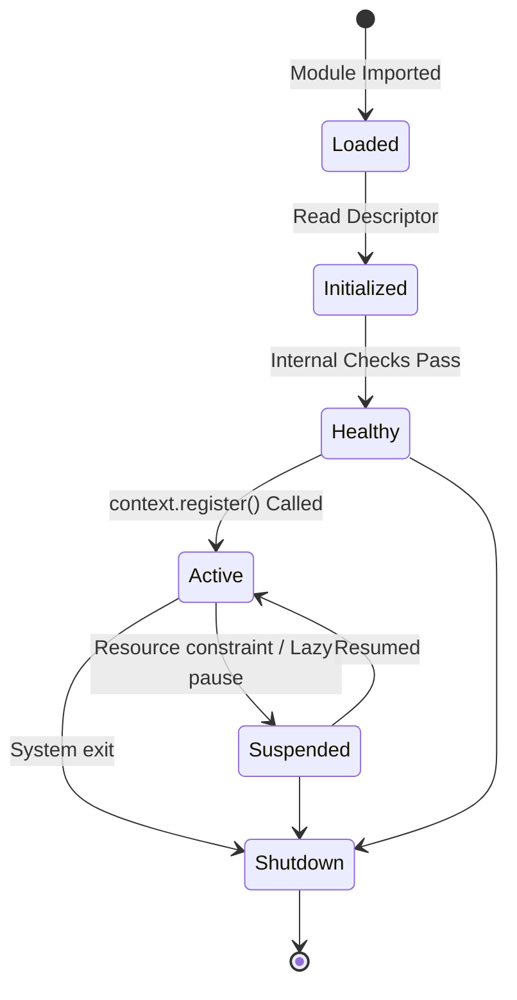

# Plugin & Extension Guide

## 1. Overview
The oMLX Plugin Architecture (RAES-010) enables third-party developers to extend oMLX without modifying the core runtime, ensuring a modular and sustainable ecosystem. Plugins interact with the runtime via an Event System and by registering metadata against abstract Extension Points.

## 2. The Plugin Context & Event System
To prevent plugins from monkey-patching core lifecycle methods, the `PluginContext` exposes an explicit Event System.

Plugins can subscribe to granular system events:
*   `Before Model Load`
*   `After Model Load`
*   `Before Execution`
*   `After Execution`
*   `Before Verification`
*   `Shutdown`

## 3. Extension Points
Plugins register their components via the `PluginContext.register()` method using immutable Extension Point objects. This avoids runtime branching in the core.

Examples of stable Extension Points include:
*   `ExecutionBackendExtension`
*   `ModelDiscoveryExtension`
*   `VerificationExtension`
*   `APIExtension`
*   `CLIExtension`

## 4. Plugin Descriptors
Plugins must expose a `PluginDescriptor` detailing:
*   `plugin_id`
*   `dependencies` (used for topological sorting by the `PluginManager`).
*   `feature_flags` required for activation.

Plugins declare version support against specific granular capabilities (Capability Version, Execution Graph Version, Planner Version, Descriptor Version) rather than a single global API version.

## 5. Plugin Lifecycle



### Lazy Activation
Plugins should support optional lazy activation. For example, a heavy Diffusion Plugin waits until the first diffusion model is loaded before initializing Metal kernels, triggering via the `Before Model Load` event.

## 6. Registry Hierarchy Integration
Plugins do not interact directly with internal registries. The `PluginManager` discovers and initializes plugins, and the `PluginContext` routes the declared descriptors to the appropriate internal consumers (like the `ExecutionPlanner`).

```mermaid
graph TD
    subgraph Plugin System
        PM[Plugin Manager]
        PM --> |Discovers| EP[Entry Points]
        PM --> |Reads| PD[Plugin Descriptors]
    end

    subgraph Core
        C[Plugin Context]
        Planner[Execution Planner]
        C --> |Abstracts| Registries
    end

    subgraph Extension Points
        EBE[ExecutionBackendExtension <br/> (Immutable)]
        MDE[ModelDiscoveryExtension <br/> (Immutable)]
    end

    PM --> |Initializes| Plugin
    Plugin -.-> |Instantiates| EBE
    Plugin -.-> |Calls context.register| C
    C --> |Provides Descriptors| Planner
```
