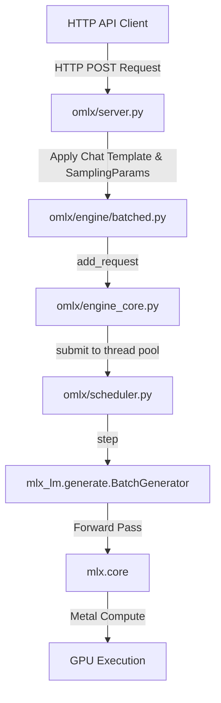
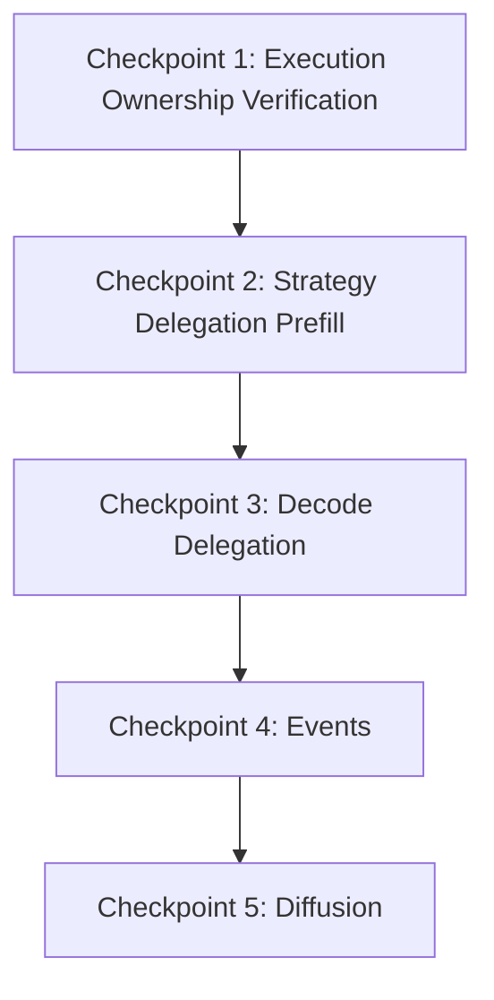

# RAES-003: oMLX Multi-Execution Paradigm Architecture Specification (Refined)

This document defines the architectural specification to support multiple execution paradigms (Autoregressive, Speculative, Diffusion, Verification, and Routing) within the oMLX local inference runtime.

---

## 1. Refined Execution Architecture

To support future paradigms such as Nemotron triage, Diffusion Gemma, and streaming MoE without modifying the Scheduler, we establish a strict separation of concerns where the **Scheduler is execution-agnostic**.

The resolution pipeline flows as follows:

```
ExecutionContext
       ↓
Capability Resolution (Registry)
       ↓
Execution Profile
       ↓
Strategy Selection & Instantiation
       ↓
Execution Backend (Pipeline Stages)
       ↓
Execution Engine (Compute)
```

### Component Responsibility & Ownership Mapping

1. **`ExecutionContext` (Owned by `EngineCore`)**
   - Encapsulates target model metadata, hardware platform capabilities, and system feature flags. Passed to resolvers.

2. **Capability Resolution (Owned by `EngineCore`)**
   - Resolves context against `ExecutionProfileRegistry` and `GenerationStrategyRegistry` to select the execution model.

3. **`ExecutionProfile` (Resolved by Registries)**
   - Declares execution requirements (attention modes, block size preferences, streaming/speculation compatibility).

4. **`BaseGenerationStrategy` (Instantiated and Bound by `EngineCore`)**
   - Implements execution logic (how prefill behaves, how decode cycles advance, how tokens are postprocessed).
   - Injected into the `Scheduler` instance at initialization.

5. **`ExecutionBackend` & `ExecutionEngine` (Owned by Strategy)**
   - Implements the concrete processing pipeline (prefill, forward, sample, verify stages) using the MLX compute engine.

6. **`Scheduler` (Strategy-Agnostic, Registry-Agnostic)**
   - Manages request queueing, memory constraints, and scheduling step timing.
   - Simply calls `self.strategy.prefill()` and `self.strategy.forward()` to execute cycles. It does not know *why* a strategy was selected, only that it has a bound strategy interface to invoke.

---

## 2. Current Execution Architecture Audit

### Request Flow Diagram


### Execution Path Audit
Here is the step-by-step trace of the execution path from a client request down to the MLX runtime:

1. **Request Intake & Preprocessing (`omlx/server.py` & `omlx/engine/batched.py`)**
   - **Responsibility**: Expose HTTP endpoints, validate JSON schemas, parse chat messages, apply Jinja templates, and wrap them in a `SamplingParams` object.
   - **Ownership**: HTTP layer (`server.py`), Engine wrapper (`batched.py`).
   - **Coupling**: High coupling to model-specific configuration (like thinking budgets, grammar, and stop tokens).
   - **Extension Mechanism**: KWARGs propagation down to the execution engine.

2. **Async Orchestration Layer (`omlx/engine_core.py` - `AsyncEngineCore` / `EngineCore`)**
   - **Responsibility**: Manages the service execution loop (`_engine_loop`) and schedules tasks on a dedicated local executor (`_mlx_executor` thread pool). This prevents concurrent scheduler and step execution races on the Metal device stream.
   - **Ownership**: Service lifecycle.
   - **Coupling**: Bound directly to the `Scheduler` instance and output queue mechanisms (`RequestOutputCollector`).
   - **Extension Mechanism**: Abstract interface methods in `EngineCore`.

3. **Scheduling & Queueing (`omlx/scheduler.py` - `Scheduler`)**
   - **Responsibility**: Schedules waiting requests (`waiting`), executes chunked prefilling, evicts caches using LRU policies via `ProcessMemoryEnforcer`, and manages continuous batching.
   - **Ownership**: Batch scheduling and memory enforcement.
   - **Coupling**: **Extremely high coupling** to `mlx_lm`'s `BatchGenerator` class (e.g., calling `self.batch_generator.insert`, `next_generated`, and expecting a `BatchGenerator.Response` object). It also has hardcoded branches for speculative decoding of VLMs (`self._step_vlm_mtp`).
   - **Extension Mechanism**: Stale/stub strategies registered in the engine but not consumed by the Scheduler step loop.

4. **Compute & Logits Extraction (`mlx_lm.generate.BatchGenerator`)**
   - **Responsibility**: Holds the physical KV cache state, calls the core PyTorch/MLX model forward pass, applies Repetition and Presence penalty logits processors, and runs the token sampler.
   - **Ownership**: Standard autoregressive execution.
   - **Coupling**: Rigidly assumes token-by-token causal generation.
   - **Extension Mechanism**: Custom logits processors and sampler injection.

---

### Execution Responsibility Matrix

| Component | Main Responsibility | State Managed | Decoupled? | Gaps / Extensibility |
| :--- | :--- | :--- | :--- | :--- |
| **`server.py`** | API request/response translation | HTTP connections, JSON payloads | Yes (API-agnostic backend) | None |
| **`EngineCore`** | Loop lifecycle & Executor thread dispatch | Thread Pool, active SSE streams | Yes (Inference-agnostic loop) | None |
| **`Scheduler`** | Batch allocation, LRU Cache eviction | Request Queues, Memory pressure, evictions | **No** (Directly calls `BatchGenerator` & model forward) | Hardcoded to Autoregressive & VLM MTP |
| **`BaseGenerationStrategy`**| Coordinate prefill/decode phases | RuntimeState metadata (stub) | Yes | Instantiated but not used to drive scheduler step |
| **`ExecutionBackend`** | Compose pipeline stages | PipelineState, execution contracts | Yes | Isolated stub; not hooked to Scheduler step |
| **`ExecutionEngine`** | Lowest-level wrapper around compute | MLX Model & Tokenizer | Yes | Currently stubs or simple adapters |

---

## 3. Capability Analysis

Below is an assessment of the capabilities already supported by the repository.

| Capability | Status | File Location | Code References | Summary & Evidence |
| :--- | :--- | :--- | :--- | :--- |
| **Capability Negotiation** | **Exists** | [capabilities.py](file:///Users/yugeshk/dev/repo/omlx/omlx/runtime/capabilities.py#L44-L82) | `ActualCapabilities.resolve()` | Intersects `ModelCapabilities`, `EngineCapabilities`, and `FeatureFlags` at engine startup to decide what can execute. |
| **Execution Graph Selection**| **Partial** | [execution_graph.py](file:///Users/yugeshk/dev/repo/omlx/omlx/inference/execution_graph.py#L44-L93) | `build_autoregressive_graph()` | Graph structures are defined (e.g. Prefill -> Forward -> Sample -> Emit), but no runtime engine uses them to orchestrate operations. |
| **Backend Resolution** | **Exists** | [execution_profile.py](file:///Users/yugeshk/dev/repo/omlx/omlx/inference/execution_profile.py#L59-L98) | `ExecutionProfileRegistry.resolve()`| Resolves a given `ExecutionContext` into a concrete `ExecutionProfile` and `BackendFactory`, falling back safely if capability checks fail. |
| **Runtime Selection** | **Partial** | [execution_backend.py](file:///Users/yugeshk/dev/repo/omlx/omlx/inference/execution_backend.py#L84-L90) | `ExecutionRuntime` protocol | Protocols exist and are implemented in `autoregressive_backend.py`, but there is no runtime engine selector. |
| **Strategy Selection** | **Partial** | [capability_registry.py](file:///Users/yugeshk/dev/repo/omlx/omlx/registry/capability_registry.py#L79-L115) | `GenerationStrategyRegistry` | Registry can register capability bundles and resolve a strategy class by mode, but the scheduler doesn't invoke it. |
| **Execution Mode Selection** | **Exists** | [modes.py](file:///Users/yugeshk/dev/repo/omlx/omlx/inference/modes.py) | `GenerationMode` enum | Explicitly lists `AUTOREGRESSIVE`, `DIFFUSION`, and `LINEAR_SPECULATION`. |

---

## 4. Architecture Gap Report

We analyze what is missing to support future execution paradigms:

### 1. Autoregressive (AR)
- **Support**: Fully supported.
- **Evidence**: `AutoregressiveBackend` wraps `mlx_lm`'s `BatchGenerator` in [autoregressive_backend.py](file:///Users/yugeshk/dev/repo/omlx/omlx/inference/backends/autoregressive_backend.py).
- **Gaps**: None.

### 2. Diffusion (Nemotron Labs / Gemma)
- **Support**: Partially supported (definition only).
- **Evidence**: `ExperimentalNemotronBackend` in [experimental_diffusion_backend.py](file:///Users/yugeshk/dev/repo/omlx/omlx/inference/backends/experimental_diffusion_backend.py) and `DiffusionStrategy` in [diffusion.py](file:///Users/yugeshk/dev/repo/omlx/omlx/inference/strategies/diffusion.py).
- **Gaps**:
  - The `Scheduler` cannot dispatch step execution to `DiffusionStrategy` or `ExperimentalNemotronBackend`.
  - The `Scheduler` step loop assumes prefill and decode outputs map precisely to `BatchGenerator.Response`.
  - The `Scheduler` does not publish execution events (like `ExecutionEvent.BEFORE_PREFILL`, `AFTER_EMIT`) to the `EventBus`, preventing the strategy from updating metrics or latents.

### 3. Speculative Decoding (Linear / MTP)
- **Support**: Partially supported (VLM MTP is implemented via scheduler bypass).
- **Evidence**: `_vlm_mtp_active` state in `scheduler.py`, `LinearSpeculationStrategy` stub in [linear_speculation.py](file:///Users/yugeshk/dev/repo/omlx/omlx/inference/strategies/linear_speculation.py).
- **Gaps**:
  - The speculative loop (`_step_vlm_mtp` and `run_vlm_mtp_decode`) is hardcoded directly inside `scheduler.py` (lines 6263-6339), violating decoupling principles.
  - No generic draft-verify pipeline exists in the execution engine backend interfaces.

### 4. Verification / Routing / MoE
- **Support**: Missing.
- **Evidence**: `GraphNodeType.VERIFY` in `execution_graph.py` is unused.
- **Gaps**: No execution backend or strategy exists to execute routing or validation checks (e.g. grading outputs without generating new tokens).

---

## 5. Existing Component Reuse Matrix

| Component | Status | Reuse Potential | Action Needed |
| :--- | :--- | :--- | :--- |
| **`ExecutionGraph`** | **Partially reusable** | Good for mapping DAG stages. | Needs an executor traversal driver to process nodes sequentially. |
| **`ExecutionBackend`** | **Requires extension** | High. Standardizes contracts and states. | Must define a standardized method to run batched steps instead of simple stubs. |
| **`ExecutionContext`** | **Reusable** | High. Holds target capability data. | No modifications required. |
| **`CapabilityRegistry`**| **Reusable** | High. Manages modes and hooks. | Handled in `EngineCore` during load-time strategy resolution. |
| **`PluginDiscovery`** | **Reusable** | High. Automatically loads modules. | No modifications required. |
| **`ExecutionProfiles`** | **Reusable** | High. Holds static configuration parameters. | No modifications required. |
| **`SchedulerHooks`** | **Partially reusable** | High. Declares callbacks. | Hook registration moved from Scheduler to Strategy class handlers. |
| **`GenerationStrategies`**| **Requires extension** | High. Encapsulates logic. | Strategies must implement actual prefill/forward execution, transferring this logic out of `scheduler.py`. |

---

## 6. Candidate Architecture Comparison

To bridge the gap and support all paradigms, we analyze three candidate designs derived from the repository.

### Candidate A: Strategy-Delegated Scheduler (Decoupled Strategy-Centric)
- **Description**: The `Scheduler` remains in charge of request admission, queueing, and memory monitoring. During scheduler step execution, it delegates the actual model forward and token extraction to an injected `BaseGenerationStrategy` class instance.
- **Responsibilities**:
  - `EngineCore`: Instantiates the `Scheduler`, resolves `ExecutionContext`, capability modes, and binds the appropriate `BaseGenerationStrategy` + `ExecutionBackend` instances, injecting them into the `Scheduler`.
  - `Scheduler`: Queue management, memory enforcement, batching metadata. Does not know *why* a strategy was chosen.
  - `BaseGenerationStrategy`: Prefill and Decode orchestration, executing pipelines on the backend.
  - `ExecutionBackend`: Runs pipeline stages (Forward, Sample, Denoise).
- **Advantages**:
  - Highly decoupled; adding a new paradigm is purely additive (adding a strategy/backend class).
  - Preserves the Scheduler's memory monitor and scheduling policies.
- **Disadvantages**:
  - Refactoring of `scheduler.py` is required to replace direct `self.batch_generator` calls.
- **Migration Complexity**: Moderate.
- **Future Compatibility**: High (fits all autoregressive, diffusion, and speculative modes).
- **Required File Changes**: `omlx/scheduler.py`, `omlx/inference/strategy.py`, `omlx/inference/strategies/autoregressive.py`.
- **Testing Impact**: Moderate (requires verifying that AR scheduler tests function identically when routed through `AutoregressiveStrategy`).

### Candidate B: Hook-Driven Scheduler (Bypass/Interceptor)
- **Description**: Retain `BatchGenerator` as the primary execution path inside the scheduler. Add prefill and decode interceptor hooks. For non-AR modes, the hook intercepts control and executes custom logic on the backend.
- **Advantages**:
  - Very low implementation footprint.
  - Zero risk of regressing the stable autoregressive path.
- **Disadvantages**:
  - Violates the invariant "Scheduler never performs inference".
  - Leads to spaghetti code in `scheduler.py` over time as speculative/diffusion hooks pile up.
- **Migration Complexity**: Low.
- **Future Compatibility**: Low.
- **Required File Changes**: `omlx/scheduler.py`.
- **Testing Impact**: Low.

### Candidate C: Execution Driver (Unified Graph Execution)
- **Description**: Add a new component, `ExecutionDriver`, that sits between `Scheduler` and `ExecutionBackend`. The scheduler outputs a batch state, the driver maps it to an `ExecutionGraph`, and traverses the graph executing nodes.
- **Advantages**:
  - Unifies speculative decoding, diffusion, and AR under a single graph-traversal execution loop.
- **Disadvantages**:
  - Violates the constraint "Do not introduce new abstractions unless the repository shows a repeated need."
  - Overly complex; high risk of performance overhead during graph traversal.
- **Migration Complexity**: High.
- **Future Compatibility**: High.
- **Required File Changes**: New module `omlx/inference/driver.py`, plus refactoring of `scheduler.py` and `engine_core.py`.
- **Testing Impact**: High.

---

## 7. Recommended Architecture

**Recommendation**: **Candidate A (Strategy-Delegated Scheduler)**

### Why it is the minimal change:
It uses the **already defined** strategy and backend classes in `omlx/inference/`. The architecture is already partially laid out in the repo; we simply need to connect the `Scheduler` to these interfaces, shifting the actual model invocation out of the scheduler.

### Why it preserves the repository conventions:
It respects the hierarchy:
`Scheduler (Scheduling/Queueing) -> Strategy (Execution Coordination) -> Backend (Execution Pipeline) -> Engine (Model Forward / Compute)`
This matches the exact invariants in `AGENTS.md`.

### Architecture Invariants Verification:
- **Scheduler never performs inference**: True. The scheduler delegates prefill and decode executions to `strategy.prefill(...)` and `strategy.forward(...)`.
- **Strategies coordinate execution**: True.
- **ExecutionBackend owns execution**: True.
- **ExecutionEngine owns compute**: True.

---

## 8. Engineering Checkpoint Roadmap

We break the migration into 5 clean, independently testable checkpoints.



---

### Checkpoint 1: Execution Ownership Verification
- **Goal**: Formally establish the strategy/backend resolution pipeline inside `EngineCore` and prove runtime ownership bounds.
- **Purpose**: Verify that `EngineCore` successfully reads `ExecutionContext`, maps capabilities to `GenerationMode`, instantiates the corresponding `BaseGenerationStrategy` and `ExecutionBackend`, and binds them to the `Scheduler` without introducing behavioral changes.
- **Allowed Files**:
  - `omlx/engine_core.py`
  - `omlx/scheduler.py` (Only for strategy property instantiation/injection)
- **Forbidden Files**:
  - Any model adapters or logic under `omlx/models/`
- **Dependencies**: None.
- **Verification**: Run unit tests asserting that `scheduler.strategy` is populated and configured correctly at engine initialization.
- **Rollback**: Remove strategy instantiation and property injection in `EngineCore`.
- **Exit Criteria**: Strategy resolution is functional and verified via test assertions without touching the default step loop.
- **Risk Level**: Low.

### Checkpoint 2: Strategy Delegation (Prefill)
- **Goal**: Refactor `Scheduler._step_prefill_chunk` to delegate prompt forward passes to the active strategy.
- **Purpose**: Moves model computation out of the Scheduler during prefilling, adhering to the "Scheduler never performs inference" invariant.
- **Allowed Files**:
  - `omlx/scheduler.py`
  - `omlx/inference/strategy.py`
  - `omlx/inference/strategies/autoregressive.py`
- **Forbidden Files**:
  - `omlx/server.py`
- **Dependencies**: Checkpoint 1.
- **Verification**: Run `pytest tests/test_vlm_specprefill.py` and verify zero regression in prefill behavior.
- **Rollback**: Revert delegation to direct `self.model(chunk, cache=cache)` call.
- **Exit Criteria**: Prefill completes successfully with prompt cache generated by the strategy.
- **Risk Level**: Moderate.

### Checkpoint 3: Decode Delegation
- **Goal**: Decouple the Scheduler step loop from `BatchGenerator` and VLM MTP decode step.
- **Purpose**: Standardize token decoding by calling `strategy.forward()` instead of direct calls to `batch_generator.next_generated()` or `self._step_vlm_mtp()`.
- **Allowed Files**:
  - `omlx/scheduler.py`
  - `omlx/inference/strategies/autoregressive.py`
- **Forbidden Files**:
  - `omlx/engine_core.py`
- **Dependencies**: Checkpoint 2.
- **Verification**: Verify that the entire test suite passes (`pytest tests/test_vlm_mtp.py`).
- **Rollback**: Restore direct `batch_generator.next_generated()` call.
- **Exit Criteria**: Causal generation runs identically, and `_step_vlm_mtp` is moved to a VLM speculative strategy class.
- **Risk Level**: High (core generation loop touched).

### Checkpoint 4: Events (Observability)
- **Goal**: Hook the `Scheduler` to the `EventBus` and publish lifecycle/execution events during scheduling steps.
- **Purpose**: Enables strategies and backends to subscribe to execution state changes (e.g. `BEFORE_PREFILL`, `AFTER_FORWARD`) for logging and metrics.
- **Allowed Files**:
  - `omlx/scheduler.py`
  - `omlx/runtime/events.py`
- **Forbidden Files**:
  - `omlx/engine_core.py`
- **Dependencies**: Checkpoint 3.
- **Verification**: Write a test verifying that when `scheduler.step()` is called, the registered callback on the event bus is fired with the correct `Event` data.
- **Rollback**: Remove event bus initialization and publish calls.
- **Exit Criteria**: All events are correctly published and registered callbacks execute successfully.
- **Risk Level**: Low.

### Checkpoint 5: Diffusion
- **Goal**: Enable running the experimental Nemotron-Labs-Diffusion model via the newly decoupled `DiffusionStrategy`.
- **Purpose**: Validate that non-autoregressive paradigms compile, load, and execute through the same scheduler loop.
- **Allowed Files**:
  - `omlx/inference/strategies/diffusion.py`
  - `omlx/inference/backends/experimental_diffusion_backend.py`
- **Forbidden Files**:
  - `omlx/scheduler.py` (Must remain untouched in this phase!)
- **Dependencies**: Checkpoint 4.
- **Verification**: Run `pytest tests/test_experimental_diffusion.py` and verify execution succeeds.
- **Rollback**: Disable diffusion strategy registration.
- **Exit Criteria**: Diffusion decoding executes and outputs refined blocks through the unified strategy loop.
- **Risk Level**: Low.

---

## 9. Verification Strategy

We outline the test suite to validate all checkpoints:

### 1. Unit Tests
- Create `tests/test_scheduler_events.py` to assert correct publishing of lifecycle events.
- Create `tests/test_strategy_delegation.py` to mock `BaseGenerationStrategy` and assert that the Scheduler calls `prefill` and `forward` methods during `step()`.

### 2. Integration & Regression Tests
- Assert that the existing test matrix (`pytest tests/test_vlm_mtp.py`, `pytest tests/test_vlm_model_adapter.py`) passes without modifying assertions.
- Verify that standard autoregressive outputs are byte-for-byte identical before and after migration.

### 3. Architecture Validation
- Use static analysis / imports checks to assert that `omlx/scheduler.py` has no imports from `mlx_lm.generate` or references to assistant models.

---

## 10. Risk Register

| Risk | Impact | Likelihood | Mitigation Strategy |
| :--- | :--- | :--- | :--- |
| **Performance Overhead** | High (tokens/sec regression) | Low | Avoid virtual call overhead inside GPU compilation blocks. Keep the strategy wrapper extremely thin. |
| **KV Cache Reference Leak** | High (Metal OOM) | Moderate | Ensure `strategy.cleanup()` and `backend.cleanup()` are called during request finalization to free Metal arrays. |
| **Mixed-Batch Scheduling Conflict**| Moderate | Low | Enforce that all active requests in the scheduler queue use the same capability mode at load time. |

---

## 11. Migration Strategy

To transition from the current state to the decoupled capability-driven architecture:
1. **Developer Workflows**: Implement the strategy and execution path changes checkpoint-by-checkpoint.
2. **Testing**: Run the existing 6,000+ unit and integration tests at the end of each checkpoint to verify zero regressions.
3. **Completion**: Release the capability-driven architecture once all stubs and backends are integrated.

---

## 12. GO / NO-GO Recommendation

### Recommendation: GO

**Justification**:
- The repository **already contains** the necessary structural designs (`ExecutionBackend`, `BaseGenerationStrategy`, `GenerationStrategyRegistry`, `ExecutionPipeline`) to decouple the scheduler.
- The `Scheduler` can be decoupled **without** requiring a redesign of the scheduling queues, memory eviction tracker, or core public APIs.
- Setting strategy resolution at the `EngineCore` level maps perfectly to existing classes and preserves the scheduler's strategy-agnostic invariant.
- Thus, a unified execution interface can be successfully established.
