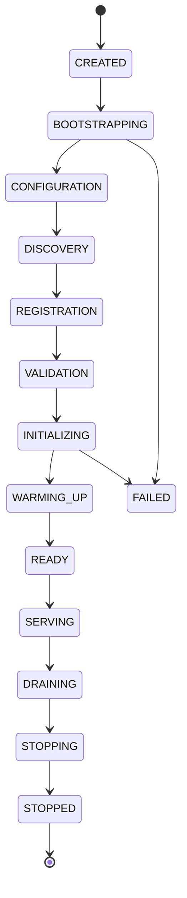

# Runtime Manual

## 1. Composition Root & RuntimeBuilder
The oMLX runtime is strictly constructed via a **Composition Root**, a design pattern that assembles all systems into one coherent runtime, establishing ownership, lifecycle boundaries, and dependency injection patterns.

The `RuntimeBuilder` produces a central `Runtime` application object. This object owns all subsystems (Configuration, PluginManager, EnginePool, etc.).
Global state singletons like `_server_state` are strictly forbidden. Registries and configuration are explicitly passed down the component tree.

## 2. Boot Phases
The boot process strictly maps to explicit phases, ensuring a defined State Machine lifecycle and making debugging boot failures trivial.

### Phase Details
1.  **BOOTSTRAP**: Application process starts.
2.  **CONFIGURATION**: Load `.env`, CLI args, and `settings.yaml`. Configuration resolution precedence is strictly: Environment Variables > CLI Arguments > API Overrides > Configuration Files > Execution Profiles > Capability Overrides.
3.  **DISCOVERY**: `PluginManager` discovers `.whl` or local plugins via entry points. Scan models.
4.  **REGISTRATION**: Registries are populated.
5.  **VALIDATION**: Run startup validation checks.
6.  **INITIALIZING**: Construct ExecutionPlanner, EnginePool, and Verification Framework.
7.  **WARMING_UP**: Pinned models are explicitly loaded into `EnginePool`. Cache metadata initialized.
8.  **READY**: All subsystems online.

## 3. Core Subsystems
*   **EnginePool**: Owns the memory and model lifetimes. Instantiated by the RuntimeBuilder.
*   **EngineCore**: Wrapping the backend, it manages execution. Owned by the `EnginePool`.
*   **Scheduler**: Manages continuous batching and delegates execution based on memory, batch constraints, and timing. The Scheduler is owned by the `EngineCore`.
*   **EventBus / PluginContext**: Extension points interact via the Event System (`PluginContext`), subscribing to hooks like Before/After Model Load.

## 4. Failure Domains
The system strictly formalizes failure boundaries to ensure maximum uptime and operational clarity:

*   **Plugin Failure** → Disable the offending plugin → Log warning → Continue boot.
*   **Verification Failure** → Abort boot process (prevents taking traffic in an unsafe state).
*   **Model Failure** → Restart Engine → Return 500 to specific HTTP request.
*   **Scheduler Failure** → Restart Engine → Requeue waiting requests if possible.
*   **Runtime Failure** → Terminate Process (let external orchestrator restart).

## 5. Dependency Injection
oMLX dependency injection mandates top-down flow, explicit state passing (e.g., using FastAPI `Depends`), avoidance of service locators, and making registries immutable post-boot.

## 6. Feature Flags
Feature flags safely isolate in-flight capabilities (`OMLX_FF_*`). They become strictly immutable once `RuntimeBuilder` starts.
